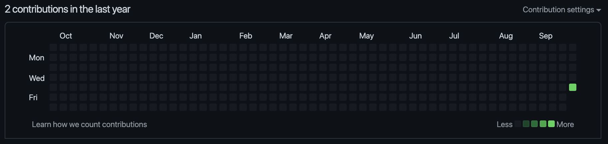
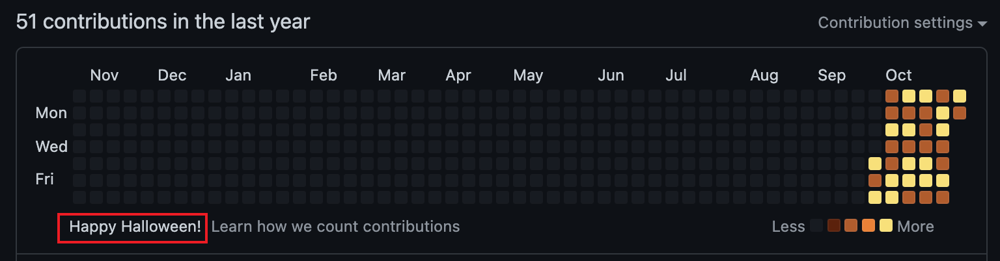
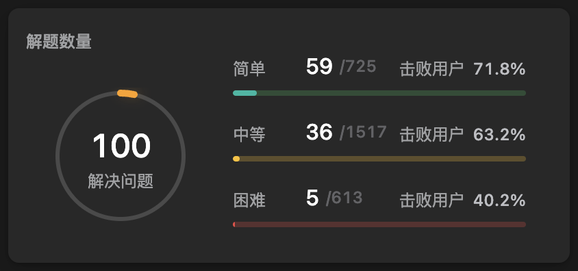
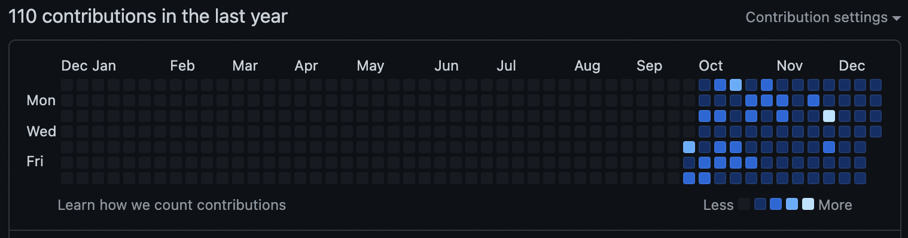
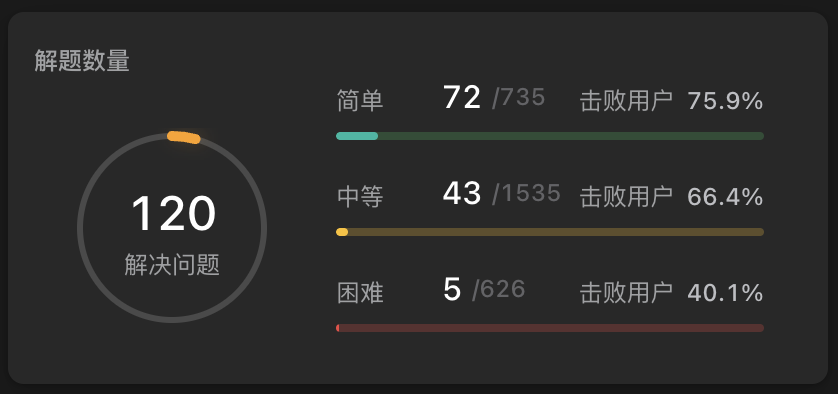
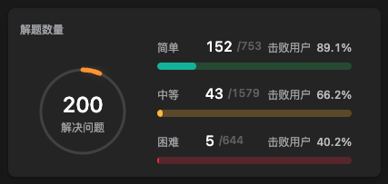

# leetcode-jsver(214)
从菜狗开始的力扣 JS 版题解

## 前言

这个仓库的开始故事是这样的，作为一个马上 28 周岁的前端程序员在几个月前被裁员后跟前 boss 吃饭时被推荐在找工作准备面试算法部分时可以刷 [labuladong 的算法小抄](https://labuladong.github.io/algo/)，体系化且深入浅出的有趣讲法刷起来又高效又不枯燥，后面就拜读了一下拉神（这个外号是我从拉神 B 站视频下面评论中「拉神，腹泻时更新」一处学来，完全没有不敬之意，反而我也很崇拜拉神如此巧夺天工的能力）的著作，但很快就遇到了第一个问题

第一个问题是这样的，因为拉神的大作中代码基本都是 Java 或 C++ 等后端语言，鄙人多年前上学时学的早都还给老师了，惭愧这些年也不上进，否则也不会快 30 岁了还没刷过力扣且作为前端也完全不试着学习后端，在看文字版幽默风趣的讲解后正准备摩拳擦掌自己也跟着写写试试时发现额看不懂。。。是真的看的一头雾水的那种跟完全没学过后端语言一样的不懂，即使对着 Java 或 C 这些现成写好的代码我也没法翻译成 JS 版，从一开始定义我就看不懂了

为了不在第一步就卡住，我尝试的方法是去到对应的力扣题目处通过在题解中筛选 JavaScript 版本对照着拉神的写法，试着翻译成 JS 版本，力扣上每个题目的题解真的很多，各种语言各种方法都有很多，很多写的也都很巧妙，一开始看的也挺痛苦，但是偶然间发现了一个小捷径，正好拉神提到的题目中的 JS 题解有位大神 [angela-x](https://leetcode.cn/u/angela-x/) 帮忙翻译了很多拉神的代码，按照这种方式和拉神推荐的从第零章开刷核心框架汇总后，我也通过记笔记的方式把第零章拉神的代码都翻译成了 JS 版本，准备这样继续学习下去，然后由于中间穿插着面试的关系，我也很快遇到了第二个问题，从小有信心到备受打击

第二个问题是这样的，在面试时让手写一些代码时我本以为刷了拉神的第零章，最起码从数组到链表、二叉树、BFS、回溯和动规都有了一点概念，想着手写代码时候简单的应该可以还算顺利地写出来吧，结果由于对自己的过于自信接连受到两次打击后发现自己原来渣到离谱，正好还有这两道原题也一并贴出来，不怕大家笑话，我写的超级费劲，每个都花了很久，面试自然也是不可能通过了

```js
// 第一题：旋转二维数组
[[1,2,3],    [[7,4,1],
 [4,5,6], ->  [8,5,2],
 [7.8.9]]     [9,6,3]]
```

```js
// 第二题：要求输入一个 json，需要输出 value 最小的那个 key
// 例子：输入：sampleJson = { "age" : 41, "name" : 13, "email" : 2, "nickname" : 101 }
// 输出："email"
```

受到打击之后回头想到 angela 大神解题数量都超过 1000 道，感觉原来还是得多刷题，看会一点不代表能实际写出那一点来，从这里我便有了一边按照拉神的目录接着学习一边着手开始从简单难度刷起的想法，哪怕我写不出来或者写的很暴力时间复杂度很高也没关系，都把自己当时的解法和简单思路记下来，差的太多就不敢奢求炫技或时间复杂度和空间复杂度多好看了，能通过就暂时很满意了

我的预想顺序是这样的，总体上按照数组 - 字符串 - 链表 - 二叉树 - BFS - DFS / 回溯 - 动态规划的拉神目录顺序以及从简单难度开始，一开始的想法是简单难度的权重更高一些，把基础数据结构的简单部分先刷一刷，然后再开始刷中等难度，也就是不追求从数组开始就死抠从简单一直刷到困难，感觉一是自己能力不够，二是这样曲线好像更陡似的，对于刷题总数的规划的话，在仓库创建的时间点我的解题数量快到 100 道了，阶段性的个人期望是能达成 700-800 道左右

回到这个仓库的创建初衷，我是有两个考虑这样，一是把自己从最菜最菜时候开始的解题思路和答不出来写的很烂的都记下来，也没那个能力追求炫技，希望能随着自己的进步慢慢补足对技巧这些更高的追求，那正好也已经记了一份 md 文件，干脆就发到 Github 上，如果真的有一天刷到七八百道了，回头看看从最开始一点点过来，虽然有句鸡汤很俗，就是那句「种一棵树最好的时间是十年前，其次是现在」，那在我看来这句话也有些无奈之举的意思，既然以前的时间都荒废了，也只能从现在开始努力，如果真的达成目标了还可以通过这个仓库帮助更多的前端打工人们的话那就更好了

第二个考虑就是借着公开的仓库逼自己不要中途放弃，这么多年一直崇拜大神们 Github 主页上漂亮的马赛克瓷砖墙也希望自己也能砌一面，在一开始先贴一张白墙的图，希望达到目标后再贴一面自己的马赛克瓷砖墙的图，到时候再来一句药水哥的名言「我行，你也行」，撅撅！

写到药水哥的卡牌突然想起 LOL 里经常有人起从零单排上大师或者上王者的直播间标题，只不过我的从零单排是真的从黑铁四开始，做不到降维打击疯狂跳段，但也抱着一步一步上分的目标，把目标这么一抽象好像就还有点意思了哈，如果把炉火纯青比作最强王者段位，那宗师 / 大师 / 钻石 / 铂金 / 黄金这些又该怎么定义呢，现在这个时间点我觉得还没资格，如果刷到量了的一天再回头想想怎么划分段位比较合理可能靠谱一些

### 22.09.29 开始

以上既然已经立下 flag，那今天的空墙如图，后面会接着更新一些时间节点作为小里程碑的



### 22.10.31 更新

今天无意发现瓷砖墙的颜色变了，一看噢原来是万圣节，这个颜色的瓷砖墙也挺好看的，正好离开始也一个月了，更新一下感受的话可能就是养成了一个强迫症。。。每天必做的事加入了刷题和写这个仓库，虽然写的磕磕绊绊，有的日子也需要写两个小时到三个小时才能写完，有的日子不想花很多时间就是想偷懒只花十分钟二十分钟就算大功告成，但总体第一个月还是坚持下来了，原来写着写着还能看到瓷砖墙换颜色也不错



### 22.11.08 更新

前两天在安神的文章中无意看到了关于拉神的争议，其中包括力扣全站排名第一的大神出来也发话了，我没有非常认真的全部看完争议部分，主要可能有几点，比如抄袭的争议，行文过于狂傲的争议，关于起名为「小抄」的争议

本来当时看完也就过了，但这两天每次写仓库的时候总觉得有些想法我也想说两句，有种不吐不快的意思（反正是自己的地方想咋写就咋写哈哈），我的看法不是说站队或者可能有些理中客的意思，我看完这些争议的第一个想法是想到了「文人相轻」这四个字，我目前本身对拉神并没有任何偏见，一些讨论中提到当刚开始刷题的时候觉得拉神就是神，随着刷题数量的增多越来越觉得也就是那么回事甚至讲的也不咋地，我觉得这种说的也比较客观，因为可能大家都是越刷越得心应手，有的解法可能会觉得不够出众不够秀，讲的也不够透彻，全站第一的大神也确实有资本出来说这件事，因为大神的刷题数量是真的恐怖，这里我就又想到另一个事情，就是说大家在写简历的时候一般都会慎用「精通」这个词，因为如果写在简历上就代表自己最起码是门清超级了解的程度，面试官看了可能会不服觉得你挺狂啊我咋这么不服呢看看能不能问倒你，这就是前文提到的「文人相轻」，大家都是吃这碗饭的，同时又都是低头做事的，大部分人都是很谦虚的可能源自职业特性的原因，这种用词可能会天然激起他人的好奇或者怀疑，觉得说你这挺狂啊我也不差，那就来比划比划，这些是我个人的见解哈

第二个想谈的就是行文过狂的这个事，这个跟第一点「文人相轻」我觉得也一脉相承，吃这碗饭的大部分人可能都是比较谦虚内向的性格，其实不管是这一行或是其他闷头做事的行业，有一部分人性格就是自信或者引用 GAI 的歌词「我太狂咯」我觉得是很正常的，这种性格不会让我个人对其产生偏见，毕竟都是靠本事吃饭的，只要真的厉害我都很佩服尊敬，当然像另一位大家都会敬仰的阮一峰老师行文风格就很平易近人，我也很喜欢，但不管哪种风格我个人觉得都是正常的，可能一些人会看不惯，但我觉得也没必要把这种上升到多高的高度，多多少少有些没必要不是吗

第三个就是关于抄袭和起名的事，这点可能是抨击最狠的地方，好像提到很多思路都是抄袭原美站的英文题解等云云，这个作为一个菜鸡我觉得是这样哈，站在巨人的肩膀上本身没错，可能问题出在你不能又借鉴别人的思路然后又以狂傲的态度声张自己写的系列文章多么牛批，这点我想拿另一个例子来比喻一下，作为一个伪铁道迷，有些朋友可能都知道咱们国家的 CRH2A 型列车是引进日本川崎重工的新干线 E2 系列车的技术作为起点的，甚至最开始有少量车是直接从日本原装进口的，但通过「引进、吸收、再创新」的策略，站在2022年现在的时间节点，我国的高铁技术已经有目共睹，甚至有可以向国外出口全套技术的能力，也被戏称为「新四大发明」之一，宣传口上的动作大家多多少少也能看得见，那再看上面的问题我觉得就不是问题了，能吸收消化再输出本身就是很厉害的能力，狂一些我个人也觉得没任何问题，这份自信也没错

另一个起名的争议好像是集中在「小抄」这两个字不够恰当，大家觉得这个词可能是贬义的，而且英文名有 f 的词汇，那我个人觉得这个也难免有些过于较真，起名这件事本身就是很主观的事情，可以把这件事看的很重，但也可以把这件事看得很无所谓，这样起名在一些人眼中觉得不妥，但讨论这件事之前是不是先忽略了不同人的性格差异这一点，有的人也可能觉得这样起名很有趣，我还是觉得大家不要强加个人意志到另一方观点的人身上是不是，不同观点应该是可以共存的

我刚开始看拉神的系列文章的出发点确实是抱着突击找工作从来没学习过算法和数据结构都忘完了的抱佛脚态度来的，从这个立场出发读「小抄」系列文章从效率的角度出发也无可厚非，但有些朋友的观点可能从来没有过这种立场，大家都是为了学习和互相探讨提高自身或从认真的学术角度的立场出发，理解不了「小抄」这个也很正常，我自己也是从第一个观点慢慢转向后一个观点，所以两种态度我都能接受，有人读这些是为了突击找工作，也有人读这些是为了提高自己不为功利，还是上面那句话，应该是可以共存的是吧

最后我还想再说一点，我跟拉神没有任何金钱和物质上的联系，目前我没花过一分钱，都是一直白嫖的看拉神的文章，不是吃人嘴短拿人手软，我可以无偿的看这些还可以用拉神开发的插件等就已经很瑞思拜了，如果这些是需要付费的那可能另说，但退一万步，开源和无偿甚至连一个 star 都不用点就可以享受这些我觉得不是每个人都能做到的，自己都会和愿意分享出去本身就不是一个 level 的是吧，我作为一个菜鸡啰里啰嗦谈论这些可能不适宜也可能有过狂之嫌，但毕竟是自己的地方嘛说出来最起码自己舒服了，否则这两天也总觉得有点疙瘩

### 22.11.21 更新

今天在力扣上的解题数量达到 100 题了，从 9.29 最开始到现在每天的解题数量慢慢稳定在每日一题，最近每天平均会分配半个小时到一个小时在这里，这 100 道题中有 60% 是简单题，最近也一直在不断提高简单题的比例，暂时准备在 200 题左右再考虑开始刷中等题，后面不出意外也会在 100 的整数倍时再来更新的



### 22.11.22 更新

看到一个知乎上的问题，[如果每天在 LeetCode 上刷一道题，一年之后会有什么变化？](https://www.zhihu.com/question/317046234)，看了一小会答案，说一点不迷茫是不可能的，刚看完感觉自己焦虑程度倍增，过一会想到自己初心就是日拱一卒，本来也没什么水平，追求多高的造诣本身也不是自己追求，每天这样坚持下来不为功利也有原来自己也可以坚持一件事的能力，而不是像自己之前的人生坚持不了任何事

其中一位大神的回答写到「统计数据显示60%的人每日一题大概只能坚持3个月不到」，如果自己能坚持3个月，那自己已经成为 Top 40% 的一部分了，[总结的文章中](https://zhuanlan.zhihu.com/p/341323903)提到坚持半年就可以成为 Top 19% 之一，从这个角度出发，也确实是想证明自己可以坚持一件事

另外很多回答提到不是无头苍蝇般乱刷，而是应该有技巧性的针对去刷，这点在我的前 100 道中就没做到，乱七八糟各处都刷了一点，昨天的想法还是专门针对简单的再刷 100 道，今天看完又感觉应该依据不同种类一段时间专攻一类强化，这里就是多少有些迷茫的地方

另外有些知乎经典抖机灵的回答写到变化就是「刷了 365 道题」，然后一年后还忘掉前面的大多数，虽然是抖机灵，自己也确实感觉几天以前看过的都记不住了，但是无论如何这不是自己放弃的理由，作为一个 28 岁高龄的菜鸡看到各种既年轻又优秀的大神一点不焦虑显然是不可能的，但怎么说，走自己的路吧，有的看看就一笑而过，有的有道理的就跟着复盘总结优化，虽然是自己给自己打鸡血，但是觉得只要还有愿意前进的动力，随之而来的焦虑应该也是合理的副作用，即使走了弯路磕磕绊绊的前进也总比弃疗了原地摆烂要强是吧，今天这些多少有点矫情了，如果未来的某一天一位优秀的读者如您有幸看到这里，还请一笑而过

### 22.11.26 更新

从最开始两个月过后的今天还是会为一道题看题解中大家都无压力直接写出来而自己还是笨比而沮丧，今天写的尤其心不在焉，心里像长草了一样，可能是因为发生了很多事情，吉祥苑的同胞 may you rest in peace in heaven

### 22.12.08 更新

今天是一个稍微有点特别的日子，对我来说可能是一个小里程碑一样的，跟生活相关，去年的12月3号因为北京的新要求第一次自费60元做了近一年以来的第一次核酸，基本上整一年过去的今天我花了半天时间从北京的东北六环跑到东四环再跑到西五环做了三次核酸，因为急需48小时的核酸，而且昨天晚上在小区核酸点做的核酸今天早上没有按时出结果，所以今天分别在两个常态化核酸点捅了两次，为了单人单管确保能出结果，通过京医通好不容易抢到上午当时看到的最后一个医院的核酸检测号再加上时间点限制必须在11点半前取号，急急忙忙横穿北京东西结果到那里外问了两圈才知道挂到的还是混管又捅了一次，一直到刚才晚上23点14分收到短信不再需要48小时核酸，改为现场抗原检测只需15分钟心态彻底爆炸，因为时间上就差了今天这一天，自己白天做的一切一瞬间就变成了无用功，当然我也理解这是最后的混乱期，每天都有新的变动，只是自己赶上这些一时间突然心态接受不了，但无论如何回头想想这一年下来到今天对我来说是一个小里程碑一样的日子吧，对整个 country 是一段特殊的过渡期，对我这样的个体今天正好经历了这些相信以后也会印象很深刻，标志着这一年终于要翻篇了大结局了，发生的这些事可能确实没什么意义了但今天这个日子对我来说多少也有点意义

### 22.12.21 更新

今天又看到一个除绿色以外新的瓷砖墙颜色，不知道是最近工作可能比较费脑的原因还是什么，近几天更新这个感觉比之前痛苦得多，感觉智商明显不如前段时间够用，有的第一眼感觉应该不是很难的东西最后写完一看时间已经过去一个小时左右了，中间也有想放弃的时候，但不管怎么说也快三个月了，要是真摆烂休息一天也不舍得，所以还是有点折磨的哈哈



### 22.12.31 更新

今天是 2022 年的最后一天，力扣上的解题数量暂时停在了 120 ，最近数字增长的比较慢的原因是花了一些时间将力扣的解题记录和这个仓库尽量保持同步，最开始的时候有一些题只是提交了但没有写到这里，因此补了一些功课



简单回想一下今年并不算是顺利的一年，踉踉跄跄地总之算是走了过来，值得欣慰的一点是这里坚持了整三个月，希望明年的这个时候解题数量可以至少达到 120 + 365 = 485 吧，这个 flag 会在明年的年末回来验证的

### 23.1.5 更新

昨天是第一次断更，原因是这样的，前天晚上睡眠时间就比较短，昨晚又加了一会班，回来进屋半躺在床上可能看了没几分钟手机直接就睡着了，等清醒过来一看时间已经 00:04 分了，就这样有了第一次断更，虽然可以通过强制自己一回来就坐在桌子前先把题做了，但这种因为精力不足断更一天我自己是能接受的，毕竟一整年一天都不断可能多少有些难度考虑到生活的不可预见性，只要以后不是故意断更我觉得自己都能接受吧，总之和自己和解的第一步已经迈出来了hhhhhh

### 23.1.21 更新

现在是 23 年大年三十的下午五点，在马上年夜饭前抢了一个时间窗口做了一道题，坐在家里总能想起大学班上的班长那时候发过 QQ 动态还是微信朋友圈大一那年大年三十在家也在弄跟代码相关的东西，当时觉得是荒唐至极的程度，甚至几年后也还是不能理解，十年整过去自己养成习惯了之后今天自然地坐在老家老人旁边的桌子上静静地写完这些，心里反而没有任何波动，可能这就是一个人的成长过程中的一瞥吧

### 23.1.26 更新

今天是兔年的正月初五，一会就要结束在家过年的几天启程回去接着当打工人了，从三十到今天每天都有喝酒，但不管怎么样在这里没耽误，还是有点欣慰，有时候当日喝得少些就醒酒了再来写，有时候感觉不对劲当日可能不会少喝就起床先写，虽然在家过年每天总是忙忙碌碌，但其实只要有心发现每天原来还是可以抽出一点时间坚持自己的事情，和各位共勉

### 23.3.26 更新



今天解题数量达到 200 题了，离去年最开始也差不多过去半年了，最近这两个月左右总体的心态回想一下也多少有一些变化，首先就是偶尔不更新的天数稍微变多了，比起不可抗力实在无法更新的，也有一整天都很累，回来晚上十一点半了实在是想当一天废物放弃最后半小时的时候，也有白天脑力感觉消耗很多，晚上回来身心俱疲坚持不下去放弃当天的时候，可能是工作上的原因，最近一段时间的做题质量也跟着下滑，有几天都只是自己想了一两种能通过的就算胜利，也不去参考题解了

另外这 200 的数量中质量也不是特别满意，后 80 道题中全部都是数组 / 字符串 / 数字类型的简单题目，总在下决心试下别的类型，但总也做不到还是待在舒适圈里面，总之踉踉跄跄坚持到今天，虽然有很多不尽如人意的地方，但毕竟还算是一个小里程碑吧，还是要记录一下，也给后面回忆时留个节点，也不怕笑话给各位看看我的心路历程

对了顺便说一句 200 道果然还是全站排名 100000 哦，下次更新希望在这个排名终于跳到 5 位数时再来

### 23.4.18 更新

今天更新是来说说最近一周摆烂的事情，上周第一次摆烂到发指，7天里只有两次提交，给自己找了各种理由混过一天算一天，总归是摆烂地非常彻底，今晚上下班回来还是一样吃完饭就躺下开睡，睁眼时候果不其然过了 12 点了，看着上周的瓷砖图属实是有点痛心疾首了，不知道是不是到了一个倦怠期还是工作的压力最近有点大还是什么，摆烂也摆烂的渐渐心安理得起来，周末要不在家加班要不就在床上无所事事刷手机或睡觉，感觉最近状态跟之前比完全烂掉，也正好记录一下这种心态的时刻，不能再摆了

### 23.5.19 更新

本来理论上今天不应该更新的，因为排名还没进前 100000，但是今天第一次阳了。。。现在有点低烧有点浑身难受，不过毕竟第四针疫苗也都吸入了，现在也没难受到起不来床，还是找个简单的糊弄一天吧。。。留个小纪念就算

### 23.5.24 更新

时隔五天才回来，是因为上次还在那嘚瑟留个小纪念，没一会就直接烧到 39.8，眼看着几次量体温从 37 -> 38 -> 39，得亏不是平时自己一个人住爸妈正好来了，否则这回都不知道啥样了，连着三晚 39+ 后直接再白送一个肺炎，可能是第一次阳相对更重的原因，在床上嗯躺了三天多，出了无数汗，也没洗澡，现在每秒钟都在嫌弃自己巨脏，果然新冠是公平的，上次没遭的罪这次一次性补齐

### 23.6.29 更新

今天终于发现全站排名不再一直都是 100000 第一次变成五位数了，今天是 99942，多少还是有一些小激动，解题数量显示 278，从之前看其他用户的经验感觉也是在 280 道左右就可以突破 6 位数了，这个很小的正反馈还是等了蛮久，最近两个月偷了不少懒，直到最近两周才又刚刚重新坚持着雷打不动每天一题，马赛克瓷砖墙都已经花了，果然感叹自己还是定力不足，坚持任何一件小事都不容易，也借此机会向力扣上和 Github 等开源仓库上各位大神表达我真挚的敬意！
