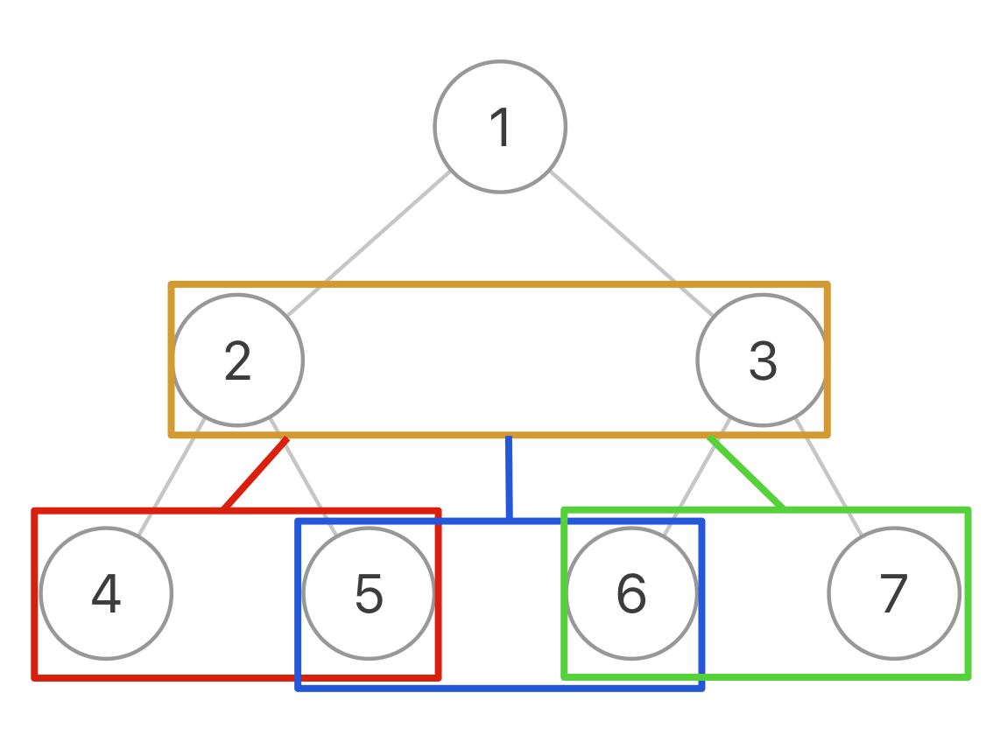

## 114. 二叉树展开为链表

第一种解法：分解问题

这个是[拉神的思路](https://labuladong.gitee.io/algo/2/21/37/)，我个人非常喜欢，如果让我面试写我就写这个，推荐给大家


对于一个节点 `x`，可以执行以下流程

* 1、先利用 `flatten(x.left)` 和 `flatten(x.right)` 将 `x` 的左右子树拉平
* 2、将 `x` 的右子树接到左子树下方，然后将整个左子树作为右子树

这样，以 `x` 为根的整棵二叉树就被拉平了，恰好完成了 `flatten(x)` 的定义，`flatten` 函数是怎么把左右子树拉平的不容易说清楚，但是只要知道 `flatten` 的定义如此并利用这个定义，让每一个节点做它该做的事情，然后 `flatten` 函数就会按照定义工作

时间复杂度超过 90.87% 提交，空间复杂度超过 59.01% 提交

```js
var flatten = function(root) {
  if (root == null) return null;
  // 利用定义，把左右子树拉平
  flatten(root.left)
  flatten(root.right)
  // 后序遍历位置
  // 1、左右子树已经被拉平成一条链表
  let left = root.left
  let right = root.right
  // 2、将左子树作为右子树
  root.left = null
  root.right = left
  // 3、将原先的右子树接到当前右子树的末端
  while (root.right != null) {
    root = root.right // 走到原左子树的末端
  }
  root.right = right // 将右子树接上去
  return root
}
```

第二种解法：前序遍历

这个解法的思路关键个人认为就是先对二叉树进行一遍前序遍历，遍历各节点的顺序就是单链表中的节点顺序，然后更新再在中间插入 null

时间复杂度超过 96.98% 提交，空间复杂度超过 31.13% 提交，但是这个不符合题目进阶要求在原地展开

```js
var flatten = function(root) {
  let res = []
  // 这个前序遍历代码几乎完全就是 #144 的答案
  const preOrderTraversal = (root, res) => {
    if (root == null) return res;
    res.push(root)
    preOrderTraversal(root.left, res)
    preOrderTraversal(root.right, res)
  }
  preOrderTraversal(root, res)
  for (let i = 1; i < res.length; i++) {
    let pre = res[i - 1]
    let cur = res[i]
    pre.left = null
    pre.right = cur
  }
  return res
}
```

## 116. 填充每个节点的下一个右侧节点指针

题目的意思就是把二叉树的每一层节点都用 `next` 指针连接起来，输入是一棵「完美二叉树」，形象地说整棵二叉树是一个正三角形，除了最右侧的节点 `next` 指针会指向 `null`，其他节点的右侧一定有相邻的节点

简单的把每个节点自己的 `next` 指针指向右侧节点的想法在这道题上是有问题的，因为它只能把相同父节点的两个节点穿起来

**传统的 `traverse` 函数是遍历二叉树的所有节点，但现在想遍历的其实是两个相邻节点之间的「空隙」**

第一种解法：遍历三叉树

借用[拉神的这个示意图](https://labuladong.gitee.io/algo/2/21/37/)一下，在二叉树的基础上进行抽象，把图中的每一个方框看做一个节点



这样，一棵二叉树被抽象成了一棵三叉树，三叉树上的每个节点就是原先二叉树的两个相邻节点

现在，只要实现一个 `traverse` 函数来遍历这棵三叉树，每个「三叉树节点」需要做的事就是把自己内部的两个二叉树节点穿起来

时间复杂度超过 55.30% 提交，空间复杂度超过 65.95% 提交

```js
var connect = function(root) {
  if (root == null) return root;
  // 三叉树遍历框架
  const traverse = (node1, node2) => {
    if (node1 == null || node2 == null) return;
    
    node1.next = node2 // 在前序位置将传入的两个节点串起来
    
    traverse(node1.left, node1.right)
    traverse(node1.right, node2.left) // 连接跨越父节点的两个子节点
    traverse(node2.left, node2.right)
  }
  traverse(root.left, root.right) // 遍历「三叉树」，连接相邻节点
  return root
}
```

第二种解法：DFS 的另一思路

这个思路是借鉴[安神](https://leetcode.cn/problems/populating-next-right-pointers-in-each-node/solution/tu-jie-liang-chong-bu-tong-de-di-gui-si-eyctg/)的，里面又套娃了另一个[题解](https://leetcode.cn/problems/populating-next-right-pointers-in-each-node/solution/shou-hua-tu-jie-dfs-di-gui-yi-yu-li-jie-by-xiao_be/)，讲的更细，一句话总结就是「只要判断当前节点是否有 next 指针，如果有的话，则当前节点的右子节点就指向它的 next 指针的左子节点」

时间复杂度超过 100.00% 提交，空间复杂度超过 97.05% 提交，非常奈斯

```js
var connect = function(root) {
  if (root == null || root.left == null) return root;
  
  
  root.left.next = root.right // 把左子节点的 next 指针指向右子节点
  // 和常规思路「把每个节点自己的 next 指针指向右侧节点」唯一区别就在于下面多加的这一行
  if (root.next) root.right.next = root.next.left
  
  connect(root.left)
  connect(root.right)
  return root
}
```

第三种解法：BFS

这个也是借鉴[安神](https://leetcode.cn/problems/populating-next-right-pointers-in-each-node/solution/tu-jie-liang-chong-bu-tong-de-di-gui-si-eyctg/)的，在广度的遍历里就顺便把 next 指针弄好了，非常简洁（待填坑）

## 752. 打开转盘锁

第一种解法：双向 BFS

这个解法根据拉神的讲解会分为三步走，可能会比较长，问题的核心就是「不能出现 `deadends`，应该如何计算出最少的转动次数」

第一步：在不管 `deadends` 和 `target` 等所有限制条件情况下，如何穷举所有可能的密码组合

如果只转一下锁，总共有 4 个位置，每个位置可以向上转，也可以向下转，也就是有 8 种可能，再以这 8 种密码作为基础，对每个密码再转一下，穷举出所有可能

仔细想想就可以抽象成一幅图，每个节点有 8 个相邻的节点，又让求最短距离，BFS 框架就可以派上用场

```js
// 初版框架：会有很多问题

// 将 s[j] 向上拨动一次
var plusOne = function(s, j) {
  let res = s[j] === '9' ? 0 : parseInt(s[j] + 1)
  return s.substr(0, j) + res + s.substr(j + 1)
}
// 将 s[j] 向下拨动一次
var minusOne = function(s, j) {
  let res = s[j] === '0' ? 9 : parseInt(s[j] - 1)
  return s.substr(0, j) + res + s.substr(j + 1)
}

// BFS 框架，打印出所有可能密码
const BFS = (target) => {
  const q = ["0000"]
  while (q.length > 0) {
    const len = q.length
    for (let i = 0; i < len; i++) { // 将当前队列中的所有节点向周围扩散
      const cur = q.shift()
      if (cur === target) return step; // 判断是否到达终点
      for (let j = 0; j < 4; j++) { // 将一个节点的相邻节点加入队列
        let up = plusOne(cur, j)
        q.push(up)
        let down = minusOne(cur, j)
        q.push(down)
      }
    }
    // 增加步数
  }
  return
}
```

第二步：以上 BFS 代码已经能够穷举所有可能的密码组合了，但还有如下问题需要解决

1、会走回头路，比如从 `"0000"` 拨到 `"1000"`，但是等从队列拿出 `"1000"` 时，还会拨出一个 `"0000"`，这样的话会产生死循环

2、没有终止条件，按照题目要求，找到 `target` 就应该结束并返回拨动的次数

3、没有对 `deadends` 的处理，按道理这些「死亡密码」是不能出现的，也就是说遇到这些密码的时候需要跳过

下面解法在实际提交会超出时间限制无法通过，因此还需要第三步，用双向 BFS 优化

```js
var openLock = function(deadends, target) {
  // 将 s[j] 向上拨动一次
  const plusOne = (s, j) => {
    let res = s[j] === '9' ? 0 : parseInt(s[j] + 1)
    return s.substr(0, j) + res + s.substr(j + 1)
  }
  // 将 s[j] 向下拨动一次
  const minusOne = (s, j) => {
    let res = s[j] === '0' ? 9 : parseInt(s[j] - 1)
    return s.substr(0, j) + res + s.substr(j + 1)
  }
  // BFS 框架，打印出所有可能的密码
  const BFS = () => {
    const q = ["0000"] // 从起点开始启动 BFS
    const visited = {
      "0000": true // 记录已经穷举过的密码，防止走回头路，解决第一个问题
    }
    let step = 0
    
    while (q.length) {
      const len = q.length
      for (let i = 0; i < len; i++) {
        const cur = q.shift()
        if (deadends.includes(cur)) continue; // 判断死亡数字，解决第三个问题
        if (cur === target) return step; // 判断是否到达终点，解决第二个问题
        for (let j = 0; j < 4; j++) {
          let up = plusOne(cur, j)
          if (visited[up] === undefined) {
            q.push(up)
            visited[up] = true // 防止走回头路
          }
          let down = minusOne(cur, j)
         	if (visited[down] === undefined) {
            q.push(down)
            visited[down] = true
          }
        }
      }
      step++ // 增加步数
    }
    return -1 // 如果穷举完都没有找到目标密码，就是找不到了
  }
  return BFS()
}
```

第三步：双向 BFS 优化

传统的 BFS 框架就是**从起点开始向四周扩散**，遇到终点时停止，而双向 BFS 则是**从起点和终点同时开始扩散，当两边有交集的时候停止**

根据拉神的讲解，从 Big O 表示法分析算法复杂度的话，无论传统还是双向，时间复杂度都是一样的，它俩的最坏复杂度都是 `O(N)`，只能说双向 BFS 是一种 trick，实际算法运行的速度会相对快一点，因此在这道题上第二步的代码过不去就需要这步优化

双向 BFS 的局限在于必须知道终点在哪里，比如二叉树最小高度的问题，一开始根本就不知道终点在哪里，也就无法使用

但是密码锁的问题，是可以使用双向 BFS 算法来提高效率的

* 双向 BFS 还是遵循 BFS 算法框架，只是**不再使用队列，而是使用 HashSet 方便快速判断两个集合是否有交集**
* 另一个技巧点就是 **while 循环的最后交换 `q1` 和 `q2` 的内容**，所以只要默认扩散 `q1` 就相当于轮流扩散 `q1` 和 `q2`
* 还有一个优化是在 while 循环开始时做一个判断，如果每次都选择一个较小的集合进行扩散，那么占用的空间增长速度就会慢一些

时间复杂度超过 99.77% 提交，空间复杂度超过 96.96% 提交，解法代码来自[安神](https://leetcode.cn/problems/open-the-lock/solution/shuang-xiang-bfs-da-kai-zhuan-pan-suo-by-hy3t/)

```js
var openLock = function(deadends, target) {
  // 旋转次数
  let step = 0;
  // 死亡结点和已访问结点共用这一个Set
  const deadSet = new Set();
  // 记录所有“死亡点”
  for (const dead of deadends) {
    deadSet.add(dead);
  }
  let q1 = new Set();
  let q2 = new Set();
  // 初始化起点和终点
  q1.add("0000");
  q2.add(target);
  // 循环直至队列为空
  while (q1.size && q2.size) {
    // 双向 BFS 的一个优化，因为按照 BFS 的逻辑，队列（集合）中的元素越多，扩散之后新的队列（集合）中的元素就越多；在双向 BFS 算法中，如果我们每次都选择一个较小的集合进行扩散，那么占用的空间增长速度就会慢一些，效率就会高一些。
    if (q1.size > q2.size) {
      // 交换 q1 和 q2
      [q1, q2] = [q2, q1];
    }
    // 在遍历的过程中不能修改哈希集合
    // 用temp存储q1的扩散结果
    let temp = new Set();
    for (let node of q1) {
      if (deadSet.has(node)) {
        continue;
      }
      if (q2.has(node)) {
        return step;
      }
      deadSet.add(node);
      // 通过遍历当前字符串，找出它的所有子节点，安排入列
      for (let j = 0; j < node.length; j++) {
        let up = plusOne(node, j)
        if (!deadSet.has(up)) {
          temp.add(up);
        }
        let down = minusOne(node, j)
        if (!deadSet.has(down)) {
          temp.add(down);
        }
      }
    }

    step++;
    q1 = q2;
    q2 = temp;
  }
  return -1;
}
```

