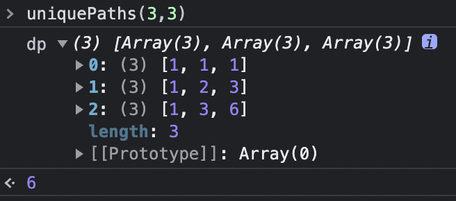
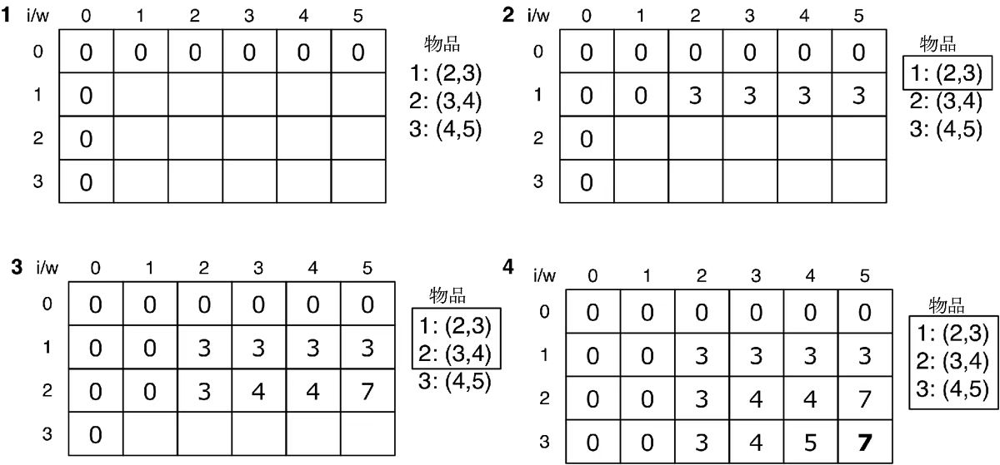
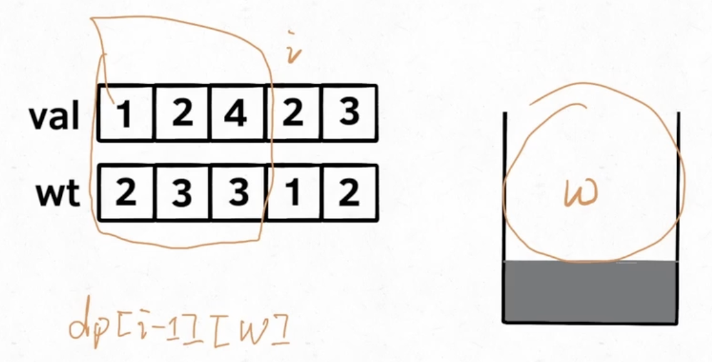
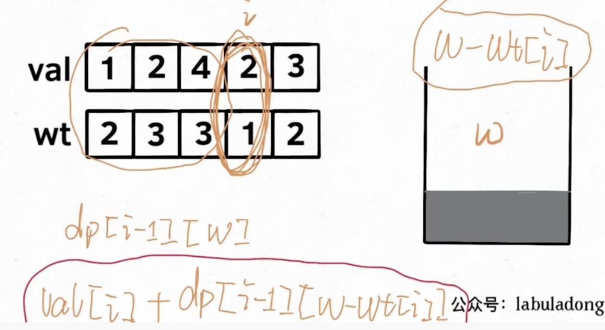
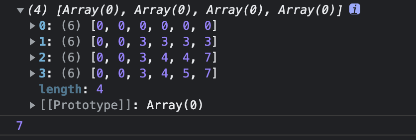

## 62. 不同路径

动规系列刷的第一题，两步走，拉神的动规框架和状态转移方程

```js
// 拉神的自底向上迭代的动态规划框架
// base case
dp[0][0]... = base case
// 进行状态转移
for (状态1 in 状态1的所有取值) {
  for (状态2 in 状态2的所有取值) {
    for (...) {
      dp[状态1][状态2][...] = 求最值(选择1，选择2...)
    }
  }
}

```

这道题的状态转移方程可以通过简单分析得出，要走到 `i,j` 点，要么从 `i-1,j` 向右，要么从 `i,j-1` 向下，由此可得路径转移方程 `f(i,j) = f(i-1,j) + f(i,j-1)`

第一种：自底向上的 dp 数组迭代递推解法，这里有几种小变种

迭代的第一个写法是我写的

时间复杂度超过 95.98% 提交，空间复杂度超过 58.50% 提交

```js
var uniquePaths = function(m, n) {
  // 这种写法直接创建后一个 m x n 的二维数组，并且把所有格子都填为 1
  // 这里的思路是二维数组的第一列和第一行都只能是 1，因为只能向下或向右移动
  const dp = new Array(m).fill(1).map(() => new Array(n).fill(1))
  // 根据状态转移方程，比如走到 [3, 3] 的路径数，就是 [2, 3] 和 [3, 2] 路径数的总和
  // 这里注意 i 和 j 都是从 1 开始，因为第一行和第一列也就是索引为 0 的都填过了
  for (let i = 1; i < m; i++) {
    for (let j = 1; j < n; j++) {
      dp[i][j] = dp[i - 1][j] + dp[i][j - 1]
    }
  }
  return dp[m - 1][n - 1] // 注意答案是 m - 1 和 n - 1，不是 m 和 n
}
```

用一个三行三列的举例，看起来比较直观



迭代的第二种写法来自双越老师，就是慕课网上前端教的特别好的那位，也是 wangEditor 的作者

时间复杂度超过 48.72% 提交，空间复杂度超过 42.85% 提交

```js
var uniquePaths = function(m, n) {
  // 分两次建立一个二维 m x n 数组
  const dp = new Array(m)
  for (let i = 0; i < m; i++) {
    dp[i] = new Array(n)
  }
  // 如果只走第一行，就只有一条路径，所以第一行所有 item 都填充 1
  dp[0].fill(1)
  // 如果只走第一列，也只有一条路径。所以第一列所有 item 都填充 1
  for (let i = 0; i < m; i++) {
    dp[i][0] = 1
  }
  // 这里开始和上面的就一样了
  for (let i = 1; i < m; i++) {
    for (let j = 1; j < n; j++) {
      dp[i][j] = dp[i - 1][j] + dp[i][j - 1]
    }
  }
  return dp[m - 1][n - 1]
}
```

迭代的第三种写法来自大安老师，这种我理解是把 base case 拿出来，感觉要更加规范，我的写法都没 base case 了

时间复杂度超过 70.54% 提交，空间复杂度超过 9.10% 提交

```js
var uniquePaths = function(m, n) {
	const dp = new Array(m).fill(0).map(() => new Array(n).fill(0))
  // 这里 i 和 j 都需要从 0 开始而不是 1 了
  for (let i = 0; i < m; i++) {
    for (let j = 0; j < n; j++) {
      if (i === 0 || j === 0) dp[i][j] = 1; // base case
      else dp[i][j] = dp[i - 1][j] + dp[i][j - 1]
    }
  }
  return dp[m - 1][n - 1]
}
```

第二种：自顶向下的备忘录递归解法，借鉴自安神

先上一个拉神的递归版动规框架

```js
// 拉神的自顶向下递归的动态规划框架
var dp = function(状态1, 状态2, ...) {
  for (选择 in 所有可能的选择) {
    // 此时的状态已经因为做了选择而改变
    result = 求最值(result, dp(状态1, 状态2, ...))
  }
  return result
}
```

时间复杂度超过 70.54% 提交，空间复杂度超过 67.06% 提交

```js
var uniquePaths = function(m, n) {
	let memo = new Array(m).fill(0).map(() => new Array(n).fill(0))
	const dp = (i, j) => {
    // 判断 i 和 j 是否等于小于 0 是因为 i 和 j 是递减的，思路得按递归的想了，我一上来这就没想通。。。
    if (i === 0 && j === 0) return 1;
    if (i < 0 || j < 0) return 0;
    if (memo[i][j] > 0) return memo[i][j];
    memo[i][j] = dp(i - 1, j) + dp(i, j - 1)
    return memo[i][j]
  }
  return dp(m - 1, n - 1)
};
```

## 70. 爬楼梯

一开始这道题说实话没想明白，知道是动规，因为明显是穷举所有可行解，那就是直接上拉神的动规框架，一个递归和一个迭代

然后就是状态转移方程是啥，这个其实就是跟斐波那契数列一样的，`f(n) = f(n - 1) + f(n - 2)`，我也真没想出来，转过来劲才明白，n = 1 那就是 1，n = 2 就是 2，n = 3 就是 3，n = 4 时候不行画一下就是 5，这样就差不多了，有纸有笔还是能帮上忙

这个时候暴力递归，带备忘录的，基础动规，状态压缩优化版的动规直接就咔咔上，但需要注意一个细节，就是在 base case 这里 n = 2 的时候爬楼梯和动态规划是不一样的

第一种：暴力递归，直接超时，所以这个要提交的话肯定不能这么写，我猜如果面试问这种大概率是要追问优化方法的

```js
var climbStairs = function (n) {
  const dp = (n) => {
    // base case
    if (n === 1) return 1;
    if (n === 2) return 2;
    return dp(n - 1) + dp(n - 2)
  }
  return dp(n)
}
```

第二种：带备忘录的递归

时间复杂度超过 81.80% 提交，空间复杂度超过 76.79% 提交，这个时间复杂度过得去，但我还是感觉面试官会接着追问动规版本的

```js
var climbStairs = function (n) {
  let memo = []
  const dp = (n) => {
    if (n === 1) return 1;
    if (n === 2) return 2;
    if (memo[n]) return memo[n]; // 已经计算过，不用再计算了
    memo[n] = dp(n - 1) + dp(n - 2)
    return memo[n]
  }
  return dp(n)
}
```

这里有个写法的区别，我感觉是个人习惯上的，把两种都对的列出来

```js
let memo = []
if (memo[n]) return memo[n];

// 另一种写法
let memo = new Array(n + 1).fill(0) // 备忘录全初始化为 0
if (memo[n] !== 0) return memo[n]
```

第三种：常规动规

时间复杂度超过 93.57% 提交，空间复杂度超过 90.64% 提交，感觉面试官有可能还会接着问都写到这了。。。。。

```js
var climbStairs = function (n) {
  let dp = new Array(n + 1).fill(0)
  // base case 不设置 dp[0] = 0 是因为 fill 默认值为 0 了
  dp[1] = 1
  dp[2] = 2
  for (let i = 3; i <= n; i++) {
    dp[i] = dp[i - 1] + dp[i - 2]
  }
  return dp[n]
}
```

第四种：状态压缩优化版动规

时间复杂度超过 98.45% 提交，空间复杂度超过 46.85% 提交

```js
var climbStairs = function (n) {
  let first = 1, second = 2
  // base case
  if (n === 1) return first;
  if (n === 2) return second;
  for (let i = 3; i <= n; i++) {
    let sum = first + second
    // 需要注意这两行的顺序不能反，否则就错了，得稍微想一想这里是吧
    first = second
    second = sum
  }
  return second
}
```

## 0-1 背包

中间插一道经典题，这个不光拉神讲过，我自己也在一本叫《JavaScript 数据结构与算法》老外写的书里看到过，感觉属于是动态规划系列里的典中典，类似于第一次去肯德基不得整个最经典的蛋挞（写到这的时候明天周四了，V我50争取站在拉神的肩膀上给你讲的明明白白的嗷）

题目是这样的，给你一个可装载重量为 `W` 的背包和 `N` 个物品，每个物品有重量和价值两个属性。其中第 `i` 个物品的重量为 `wt[i]`，价值为 `val[i]`，现在让你用这个背包装物品，最多能装的价值是多少

比如输入如 `W = 5, N = 3, wt = [2,3,4], val = [3,4,5]`，算法返回 7，选择前两件物品，总重量 5 <= `W`，可以获得最大价值 7

背包问题有两个版本

* 0 - 1 版本只能往背包里装完整的物品，以下算法处理此版本
* 分数背包问题则允许装入分数物品，动态规划对分数版本无能为力，但贪心算法可以解决

现在开始尝试解题了，第一步应该是明确「状态」和「选择」

* 状态就是「背包的容量还剩多少」和「可选择的物品」
* 选择就是「装进背包」或者「不装进背包」

第二步：明确 `dp` 数组的定义

* 「状态」有两个，也就是说需要一个二维 `dp` 数组，`dp[i][w]` 的定义如下，对于前 `i` 个物品，当前背包的容量为 `w`，这种情况下可以装的最大价值是 `dp[i][w]`
* 比如 `dp[3][5] = 7`，其含义为：对于给定的一系列物品中，若只对前 3 个物品进行选择，当背包容量为 5 时，最多可装下的价值为 7
* 想求的最终答案就是 `dp[N][W]`，base case 就是 `dp[0][..] = dp[..][0] = 0`，因为没有物品或者背包没有空间的时候，能装的最大价值就是 0



* 这张图我一开始掉进了一个小坑半天没想明白，就是右上这个为什么 w = 4 和 5 时最大价值还是 3 呢？因为第一个物品的重量是 2，价值是 3 对吧，那不是当 w 为 4 的时候就可以放两个物品 1 进去，最大价值不就是 6 了吗？
* 但是这里其实是这样，每个物品其实只有一个，放进去物品 1 之后就没有第二个物品 1 可以放了。。。

第三步：推导出状态转移方程

* `dp[i][w]` 的定义如下，对于前 `i` 个物品，当前背包的容量为 `w`，这种情况下可以装的最大价值是 `dp[i][w]`
* 怎么用代码体现出来「把物品 `i` 装进背包」和「不把物品 `i` 装进背包」
* 在 w 的约束下，**如果不把这第 `i` 个物品装入背包**，那么最大价值 `dp[i][w]` 应该等于 `dp[i-1][w]`



在 w 的约束下，**如果把这第 `i` 个物品装入了背包**

* 因为选择将第 `i` 个物品装进背包，所以一定有 `val[i]`
* 然后在目前背包的剩余容量 `w - wt[i]`限制下，也得在前 `i - 1` 个物品中挑选，这部分最大价值为 `dp[i-1][w - wt[i]]`
* 所以总价值为  `val[i] + dp[i-1][w - wt[i]]`



* 但由于函数数组索引从 0 开始，而定义中的 `i` 是从 1 开始计数的，所以存在一个索引偏移问题，因此`val[i-1]` 和 `wt[i-1]` 表示第 `i` 个物品的价值和重量，最大价值 `dp[i][w]` 应该等于 `val[i-1] + dp[i-1][w - wt[i-1]]`

第四步：把上面的 dp 数组定义和状态转移方程套入拉神的动规框架中，得到答案

```js
var knapSack = function(W, N, wt, val) {
  const dp = []
  for (let i = 0; i <= N; i++) {
    dp[i] = [] // 初始化将用于寻找解决方案的矩阵 dp[N + 1][W + 1]
  }
  // 迭代数组中每个可用的项
  for (let i = 0; i <= N; i++) {
    for (let w = 0; w <= W; w++) {
      if (i === 0 || w === 0) { // 忽略矩阵的第一列和第一行
        dp[i][w] = 0
      } else if (w - wt[i - 1] < 0) { // 物品 i 的重量必须小于约束才有可能成为解决方案的一部分
        dp[i][w] = dp[i - 1][w] // 这种情况下只能选择不装入背包
      } else {
        const a = val[i - 1] + dp[i - 1][w - wt[i - 1]] // 装入背包
        const b = dp[i - 1][w] // 不装入背包
        dp[i][w] = Math.max(a, b) // 当找到可以构成解决方案的物品时，选择价值最大的那个
      }
    }
  }
  
  return dp[N][W] // 解决方案在二维表格右下角的最后一个格子里
}

// 测试这个算法
const W = 5, N = 3, wt = [2,3,4], val = [3,4,5]
knapSack(W, N, wt, val)
```



在写法上还可以换一种，把 base case 在一开始定义二维数组时就填好，这种就有点类似我自己想的野路子了，只能野一点点。。。

```js
var knapSack = function(W, N, wt, val) {
  const dp = new Array(N + 1).fill(0).map(() => new Array(W + 1).fill(0))
  // 注意这里 i 和 w 就要从 1 开始而不是从 0 开始了
  for (let i = 1; i <= N; i++) {
    for (let w = 1; w <= W; w++) {
      if (w - wt[i - 1] < 0) {
        dp[i][w] = dp[i - 1][w]
      } else {
        const a = val[i - 1] + dp[i - 1][w - wt[i - 1]]
        const b = dp[i - 1][w]
        dp[i][w] = Math.max(a, b)
      }
    }
  }
  return dp[N][W]
}
```

## 338. 比特位计数

这道题我说实话一开始根本没看懂，二进制这块我超级弱，读题都读了好半天，直接去看安神题解了

第一种解法：遍历按位与解法

[安神的解法](https://leetcode.cn/problems/counting-bits/solution/san-chong-jie-ti-si-lu-tong-su-yi-dong-x-4v2n/)我一开始都还是没看懂，又研究了半天，最后发现自己犯了 DSB 把按位与符号看成乘法了。。。因此把[按位与的官方文档](https://developer.mozilla.org/zh-CN/docs/Web/JavaScript/Reference/Operators/Bitwise_AND)放在这方便大家回顾

时间复杂度超过 68.90% 提交，空间复杂度超过 70.01% 提交

```js
var countBits = function(n) {
  const res = new Array(n + 1).fill(0)
  for (let i = 0; i <= n; i++) { // 这里是 <= 不是 <
    let j = i
    while (j != 0) {
      j = j & (j - 1) // 注意这里不是乘法，是按位与！！！
      res[i]++
    }
  }
  return res
};
```

以上这种还有小变种，根据 `i & (i-1)` 计算 `i` 的二进制形式中 `1` 的个数，`i & (i-1)` 能将整数 `i` 的二进制形式最右边的 `1` 变为 `0`，那么 整数 `i` 的二进制中 `1` 的个数比整数 `i & (i-1)` 的二进制中 `1` 的个数多 `1`

时间复杂度超过 92.85% 提交，空间复杂度超过 68.53% 提交

```js
var countBits = function(n) {
  const res = new Array(n + 1).fill(0)
  for (let i = 1; i <= n; i++) { // 这里从 1 开始而不是从 0 开始了
    res[i] = res[i & (i - 1)] + 1
  }
  return res
};
```

根据安神的讲解，按位与解法还可以再叠加右移运算符来做（右移运算符官方文档[在这](https://developer.mozilla.org/zh-CN/docs/Web/JavaScript/Reference/Operators/Right_shift)），给我直接秀麻了。。。

1. 如果 `i` 是一个偶数，那么 `i` 相当于将 `i/2` 左移一位的结果，也就是说偶数 `i` 和 `i/2` 的二进制形式中的 `1` 的个数是相同的
2. 如果 `i` 是奇数，则 `i` 相当于将 `i/2` 左移一位之后再将最右边一位设为 `1` 的结果，因此奇数 `i` 的二进制形式中 `1` 的个数比 `i/2` 的 `1` 的个数多 `1`
3. 比方说 `3` 的二进制为 `11`，有 `2` 个 `1` ；偶数 `6` 的二进制为 `110`，有 `2` 个 `1`；奇数 `7` 的二进制为 `111`，有 `3` 个 `1`，所以可以根据 `3` 的二进制中 `1` 的个数直接求出 `6` 和 `7` 的二进制形式中 `1` 的个数

时间复杂度超过 82.98% 提交，空间复杂度超过 70.96% 提交

```js
var countBits = function(n) {
  const res = new Array(n + 1).fill(0)
  for (let i = 1; i <= n; i++) { // 这里从 1 开始而不是从 0 开始
    res[i] = res[i >> 1] + (i & 1)
  }
  return res
};
```

第二种解法：动态规划（待填坑）
