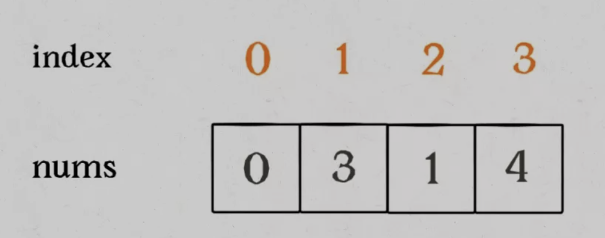
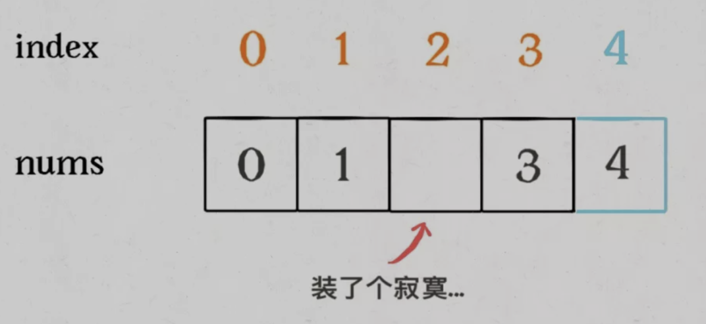

## 1. 两数之和

暴力解，遍历两次数组，时间复杂度应该在 O(n²) 以上

时间复杂度超过 24.96% 提交，空间复杂度超过 67.71% 提交（可能是最无脑的解法，就是不太好看）

```js
var twoSum = function(nums, target) {
  let res = []
  for (let i = 0; i < nums.length; i++) {
    // 这里初始化 j 的时候需要注意不能让 j = 1，否则是过不去的，只能通过 38 / 57 的测试用例
    for (let j = i + 1; j < nums.length; j++) {
      if (nums[i] + nums[j] === target) {
        res.push(i)
        res.push(j)
      }
    }
  }
  return res
};
```

HashTable 版进阶（待填坑）

## 26. 删除有序数组中的重复项

双指针解法（拉神说的**只要数组有序，就应该想到双指针技巧**），因为需要「原地」删除，所以考虑用快慢指针来解

我第一次做这道题的时候就没好好审题，违背了「不要使用额外的空间，必须在原地修改输入数组」，所以要细心好吧

这里可以参考[拉神的 GIF 图](https://labuladong.gitee.io/algo/2/20/23/)，理解起来就很直观

时间复杂度超过 48.08% 提交，空间复杂度超过 50.40% 提交

```js
var removeDuplicates = function(nums) {
  // 提示中给出了 nums.length >= 1，这里特殊处理一下
  if (nums.length === 1) return 1;
  let slow = 0, fast = 0
  while (fast < nums.length) {
    if (nums[fast] !== nums[slow]) {
      // 这两行需要注意顺序不能反过来，否则只能通过 6 / 361 的测试用例，想的时候可以脑补一下拉神的动图是吧
      slow++
      nums[slow] = nums[fast]
    }
    fast++
  }
  // 这里 nums[0 ... slow] 是最后的去重结果,数组长度为 slow + 1
  return slow + 1
}
```

但有意思的一个地方我在自己写的时候把 fast 指针初始化为 1 了，其他地方完全不变，也顺利通过了，甚至时间复杂度还超过 79.21% 提交，比 48.04% 还好（黑人问号脸）？

这个问题我的理解应该是这样，因为一开始就将 fast 指针设为 1，可以少跑一次循环，因为当 slow = fast = 0 时，两个数字肯定是一样的，在自己打 log 测试时也佐证了我的想法

## 27. 移除元素

这道题跟 26 题有些像，还是原地操作数组，还可以用快慢指针，但这里题目没说是有序数组哈

[拉神讲话了](https://labuladong.gitee.io/algo/2/20/23/)，题目要求把 `nums` 中所有值为 `val` 的元素原地删除，依然需要使用快慢指针技巧

* 如果 `fast` 遇到值为 `val` 的元素，则直接跳过
* 否则就赋值给 `slow` 指针，并让 `slow` 前进一步

注意这里和有序数组去重的解法有一个细节差异，这里是**先给 `nums[slow]` 赋值然后再给 `slow++`**，这样可以保证 `nums[0..slow-1]` 是不包含值为 `val` 的元素的，最后的结果数组长度就是 `slow`

时间复杂度超过 71.80% 提交，空间复杂度超过 51.39% 提交

```js
var removeElement = function(nums, val) {
  // 提示中给出了 nums.length >= 0
  if (nums.length === 0) return 0;
  let slow = 0, fast = 0
  while (fast < nums.length) {
    if (nums[fast] !== val) {
      // 这两行注意顺序跟 26 题反过来了，稍微脑筋急转弯一下如果是连着做这两道题是吧
      nums[slow] = nums[fast]
      slow++
    }
    fast++
  }
  // 这里 nums[0 ... slow - 1] 是最后移除完 val 的结果，不包含值为 val 的元素，因此数组长度是 slow - 1 + 1 = slow
  return slow
}
```

这道题把 fast 初始化为 1 就不行了，因为直接跳过判断第一个元素了那肯定不对啊

## 35. 搜索插入位置

题目要求说必须使用时间复杂度为 `O(log n)` 的算法，按理说应该直接想到二分法，但是我看提示中 nums 为 **无重复元素** 的 **升序** 排列数组，一看「数组」「有序」，我的第一次尝试居然就用了快慢指针。。。

时间复杂度超过 85.41% 提交，空间复杂度超过 48.33% 提交

```js
var searchInsert = function(nums, target) {
  let slow = 0, fast = 0
  while (fast < nums.length) {
    if (nums[fast] === target) {
      return fast
    } else if (nums[fast] > target) {
      return slow
    } else if (nums[fast] < target) {
      slow = fast + 1
    }
    fast++
  }
  return slow
}
```

二分法这题参考 angela 大神，应该可以分为左闭右闭，左闭右开和左闭右开简化版，左闭右开就暂时留坑。。。

我的无脑版左闭右闭解法（框架直接套拉神的二分框架）

时间复杂度超过 42.82% 提交，空间复杂度超过 60.46% 提交

```js
var searchInsert = function(nums, target) {
  let left = 0, right = nums.length - 1
  while (left <= right) {
    // 这里这样写是有说法的，你看无脑取 mid 就直接 Math.floor((left + right) / 2) 对吧
    // 但是不管是 JS 语言或其他语言在计算 mid 时都需要防止溢出，所以就优化为 Math.floor(left + (right - left) / 2)，避免 left 和 right 太大直接相加溢出，撅撅了
    // 再因为 JS 中 >> 移位运算比除法操作性能好很多，所以就最终优化为 left + ((right - left) >> 1)，这种还不用套一层 Math.floor 处理
    let mid = left + ((right - left) >> 1)
    if (nums[mid] === target) {
      return mid
    } else if (nums[mid] < target) {
      left = mid + 1 // 这里 < 和 > 下面改变边界要仔细想一下不要混淆，我第一次就糊涂了
    } else if (nums[mid] > target) {
      right = mid - 1
    }
  }
  return left
}
```

## 88. 合并两个有序数组

### 题外话

在写这道题前先插一道题作为引子吧，因为也是常见的面试题我感觉，可能比这道题还常考一些，题目很简单，就八个字，「合并两个递增数组」，也就是说没有「合并 `nums2` 到 `nums1` 中的限制」

第一种：使用 concat + 排序，一行就可以解决，时间复杂度高一些，因为有排序，时间复杂度至少是 O(mlogm + nlogn)，m 和 n 是两个数组的长度

```js
var merge = function(arr1, arr2) {
  return arr1.concat(arr2).sort((a, b) => a - b)
}
```

第二种：使用双指针拉拉链，时间复杂度是 O(m + n)，m 和 n 是两个数组的长度，这种还有变种，比如可以用 && 来做

```js
var merge = function(arr1, arr2) {
  const res = []
  let i = 0, j = 0
  while (i < arr1.length || j < arr2.length) {
    if (i === arr1.length) {
      // 说明 arr1 的指针走到最后了，arr2 剩下的数字都更大，把 arr2 剩下的推进结果数组
      res.push(arr2[j])
      j++
    } else if (j === arr2.length) {
      res.push(arr1[i])
      i++
    } else if (arr1[i] < arr2[j]) {
      res.push(arr1[i])
      i++
    } else {
      res.push(arr2[j])
      j++
    }
  }
  return res
}
```

### 正题

回到本题上，这道题跟上面不同就在于结果要**存储在数组 `nums1` 中**，**且 `nums1` 的初始长度为 `m + n`，后 `n` 个元素为 `0`**

这样一来哪怕按照常规思路用一个新数组来做，最后还要再拷贝给 `nums1`，所以对于这道题来说先看好题目要求我觉得很重要，一开始我就没好好读题做错了

第一种：使用 splice + sort 来做，思路就是先用 splice 去掉 nums1 中多余的 0 再插入 nums2，然后排序，只需两行

时间复杂度超过 48.62% 提交，空间复杂度超过 23.25% 提交

```js
var merge = function(nums1, m, nums2, n) {
  nums1.splice(m, nums1.length - m, ...nums2)
  nums1.sort((a, b) => a - b)
}
```

第二种：使用双指针从前向后拉拉链

这个的原理就是拉神在讲 [链表双指针技巧](https://labuladong.gitee.io/algo/2/19/18/) 时讲第21题「合并两个有序链表」时提到的，配合精美动图非常直观，所以这里不再赘述，链表和指针都是同理对吧

在这道题上可以用两种方式来做，一种是用 `&&` 先拉完再将剩下一个后面的接过来再复制回 `nums1` 数组

时间复杂度超过 99.01% 提交，空间复杂度超过 20.68% 提交

```js
var merge = function(nums1, m, nums2, n) {
  // 在两个数组的拷贝上进行操作
  let copy1 = nums1.slice(0, m) // 将原数组后面的 0 去掉
  let copy2 = nums2.slice()
  const res = []
  let i = 0, j = 0
  while (i < copy1.length && j < copy2.length) {
    if (copy1[i] < copy2[j]) {
      res.push(copy1[i])
      i++
    } else {
      res.push(copy2[j])
      j++
    }
  }
  
  let tmp = res.concat(copy1.slice(i)).concat(copy2.slice(j)) // 把后面的接上来
  // 接上来这里还有另一种相对更容易理解的写法
  // let tmp
  // if (i < copy1.length) tmp = res.concat(copy1.slice(i));
  // if (j < copy2.length) tmp = res.concat(copy2.slice(j));
  
  for (let i = 0; i < tmp.length; i++) {
    nums1[i] = tmp[i] // 复制回 nums1 数组
  }
}
```

另一种是用 `||` 判断，思路跟最上面一样，跟 `&&` 相比就完全这是写法上的不同，最后还是再复制回 `nums1` 数组

时间复杂度超过 71.91% 提交，空间复杂度超过 98.12% 提交

```js
var merge = function(nums1, m, nums2, n) {
  const res = []
  let i = 0, j = 0
  while (i < m || j < n) {
    if (i === m) {
      res.push(nums2[j])
      j++
    } else if (j === n) {
      res.push(nums1[i])
      i++
    } else if (nums1[i] < nums2[j]) {
      res.push(nums1[i])
      i++
    } else {
      res.push(nums2[j])
      j++
    }
  }
  
  for (let i = 0; i < res.length; i++) {
    nums1[i] = res[i]
  }
}
```

第三种：从后向前三指针

这种是借鉴来的，除了使用 `&&` 和 `||` 两种思路，甚至还有只用判断一个指针的解法，哇哦

第一种三指针可以用 `||`，这也是大安老师的解法，不开辟新的数组，第三个指针 k 用来安排新数

先比较大的数，把大的数字放在 nums1 数组的最后

如果先从前向后比较，num1 的大部分元素都要移位向后挪，时间复杂度比从后向前高很多

时间复杂度超过 71.91% 提交，空间复杂度超过 87.53% 提交

```js
var merge = function(nums1, m, nums2, n) {
  let k = nums1.length - 1 // 新数组元素起始的索引位置
  m-- // m 和 n 都要先 -- 是因为 m 和 n 代表对应的索引位置
  n--
  while (m >= 0 || n >= 0) {
    if (m < 0) { // 当 m < 0 或 n < 0 表示一个数组已经拷贝完了，将另一个数组剩下的从后到前推进数组
      nums1[k] = nums2[n]
      n--
    } else if (n < 0) {
      nums1[k] = nums1[m]
      m--
    } else if (nums1[m] <= nums2[n]) { // 由于是从后到前，所以在 k 指针上放更大的数字
      nums1[k] = nums2[n]
      n--
    } else {
      nums1[k] = nums1[m]
      m--
    }
    k--
  }
};
```

```js
// while 循环内还可以简化写成如下
while (m >= 0 || n >= 0) {
  if (m < 0) nums1[k--] = nums2[n--];
  else if (n < 0) nums1[k--] = nums1[m--];
  else if (nums1[m] <= nums2[n]) nums1[k--] = nums2[n--];
  else nums1[k--] = nums1[m--]
}
```

第二种三指针可以用 `&& `

时间复杂度超过 88.34% 提交，空间复杂度超过 83.40% 提交

```js
var merge = function(nums1, m, nums2, n) {
  let k = nums1.length - 1
  while (m > 0 && n > 0) { // 这里对自减运算符要足够熟练才能写对，我觉得是非常细节的地方
    nums1[k--] = nums1[m - 1] < nums2[n - 1] ? nums2[--n] : nums1[--m]
  }
  if (n > 0) {
    nums1.splice(0, n, ...nums2.slice(0, n))
  }
};
```

```js
// 在这里我觉得正好可以补充一下自减运算符的定义，方便有需要的朋友回顾一下
// 如果使用后缀式，即将操作符放在操作数的后面 (如，x--)，运算会减一，然后返回「减一之前的值」
// 如果使用前缀式，即将操作符放在操作数的前面 (如，--x)，运算会减一，然后返回「减一之后的值」

let x = 3
const y = x--
// x = 2  y = 3

let x = 3
const y = --x
// x = 2  y = 2
```

```js
// while 循环可以改写为如下稍微方便一点理解
while (m > 0 && n > 0) {
  if (nums1[m - 1] < nums2[n - 1]) {
    n--
    nums1[k] = nums2[n]
  } else {
    m--
    nums1[k] = nums1[m]
  }
  k--
}
```

第三种只需判断一个指针

`while` 的条件是 `n >= 0`，如果 `n = -1` 说明 nums2 数组已经全部合并到 nums1 中

如果 `m = -1` ，则 `m[-1] = undefined` ，`undefined` 跟数字比较时会转换成 `NaN`，由于 `NaN` 跟任何数字比较都会得到一个 `false`，刚好进入 else 代码块中，所以不需做其他处理

时间复杂度超过 71.91% 提交，空间复杂度超过 66.89% 提交

```js
var merge = function(nums1, m, nums2, n) {
  let k = nums1.length - 1
  m--
  n--
  while (n >= 0) {
    // 注意这里必须先判断 nums1[m] > nums2[n]，反过来写就过不去
    if (nums1[m] > nums2[n]) {
      nums1[k] = nums1[m]
      m--
    } else {
      nums1[k] = nums2[n]
      n--
    }
    k--
  }
};
```

## 121. 买卖股票的最佳时机

如果翻译一下这个股票啥的其实就是求数组中最大值和最小值的差，我的第一个想法就是遍历两次配合快慢指针，没错我又只能想到快慢指针。。。

但这种做法会超出时间限制，只能通过 206 / 211 的测试用例，所以时间复杂度 O(n²) 以上，也通过不了

```js
var maxProfit = function(prices) {
  // 提示中给出了 prices.length >= 1
  if (prices.length === 1) return 0;
  let max = 0
  for (let slow = 0; slow < prices.length - 1; slow++) {
    for (let fast = slow + 1; fast < prices.length; fast++) {
      max = Math.max(max, prices[fast] - prices[slow])
      // 这里还有个没什么卵用的另一种写法，也过不去，只是写法不同，换成三元表达式
      let profit = prices[fast] - prices[slow]
      max = max > profit ? max : profit
    }
  }
  return max
};
```

因此思路得先降低时间复杂度，借鉴的是只用一次遍历就做到，先以第一项为最小值计算，在遍历时重新给最小值赋值

时间复杂度超过 81.97% 提交，空间复杂度超过 92.55% 提交

```js
var maxProfit = function(prices) {
  if (prices.length === 1) return 0;
  let res = 0
  let min = prices[0]
  for (let i = 1; i < prices.length; i++) {
    if (prices[i] < min) {
      min = prices[i]
    }
    if (prices[i] - min > res) {
      res = prices[i] - min
    }
  }
  return res
}
```

## 136. 只出现一次的数字

题目说明提出了「算法应该具有线性时间复杂度」+「不使用额外空间来实现」的额外要求，作为菜狗当然第一次做先忽略这个只追求通过就得

按照「遇事不决，迭代玄学」的菜狗想法，我想用两次遍历来硬解，尝试后写不出来。。。于是换一次遍历

第一种：遍历硬解，利用数组的 indexOf 和 lastIndexOf 方法，对比第一次出现的索引和最后一次出现的索引

比如一个数组 [2, 1, 2]，`nums.indexOf(2)` 就是 0，`nums.lastIndexOf(2)` 就是 2，这样找相同的

时间复杂度超过 5.5% 提交，空间复杂度超过 93.81% 提交，硬解就是时间复杂度不好看

```js
var singleNumber = function(nums) {
  for (let i = 0; i < nums.length; i++) {
    if (nums.indexOf(nums[i]) === nums.lastIndexOf(nums[i])) {
      return nums[i]
    }
  }
}
```

第二种：先排序再比较前后项

时间复杂度超过 11.86% 提交，空间复杂度超过 5.00% 提交，因为有排序所以最少也得 O(nlog(n))，时间复杂度也就比第一种硬解好看一点点

```js
var singleNumber = function(nums) {
  nums.sort((a, b) => a - b)
  for (let i = 0; i < nums.length; i++) {
		// 这里当 i 为 0 时，nums[i - 1] 是 undefined，i 为 nums.length - 1时，nums[i + 1] 也是 undefined
    // 但是不妨碍 if 语句的执行，本来也不相等就是，逻辑上需要跟左右都比较一下，只判断一边是过不去的
    if (nums[i] !== nums[i + 1] && nums[i] !== nums[i - 1]) return nums[i]
  }
}
```

第三种：利用异或位运算

异或运算时两个相同的数字为 0：`n ^ n = 0` ，0 和任何数异或都为那个数：`n ^ 0 = n`

因此所有偶数次的都会相互抵消变为 0，再和其他数消消乐，留下结果

比如一个数组是 [4, 1, 2, 1, 2] ，`4 ^ 1 ^ 2 ^ 1 ^ 2` => `1 ^ 1 ^ 2 ^ 2 ^ 4` => `0 ^ 2 ^ 2 ^ 4` => `2 ^ 2 ^ 4` => `0 ^ 4` => `4`

这种时间复杂度很好看，但前提得知道有异或位运算这么回事，我觉得属于不知道就死活想不出来那种

```js
// 第一种异或解法，方便看懂
// 时间复杂度超过 98.46% 提交，空间复杂度超过 48.92% 提交
var singleNumber = function(nums) {
  let res = 0
  for (let i of nums) res ^= i;
  return res
}
```

```js
// 第二种，使用数组 reduce 方法，一行就写完
// 时间复杂度超过 95.81% 提交，空间复杂度超过 80.15% 提交
var singleNumber = function(nums) {
  return nums.reduce((sum, cur) => sum ^ cur)
}
```

第四种：哈希（暂时留坑）

## 169. 多数元素

这道题我一开始的时候就没仔细，要求输出多数元素，也就是输出一个数字，不是一个数组可能有好几个答案

第一种：用一个变量配合双层 for 循环

第一次尝试只能通过 34 / 43 的测试用例，输入 [1] 和 [2,2,3,3,3,3,2] 就过不去了

```js
var majorityElement = function(nums) {
  let count = 0 // 这里 count 初始化的位置有问题，会一直叠加
  for (let i = 0; i < nums.length; i++) {
    for (let j = i + 1; j < nums.length; j++) {
      if (nums[j] === nums[i]) {
        count++
        if (count === Math.floor(nums.length / 2)) {
          return nums[j]
        }                                              
      }
    }
  }
}
```

加上 base case 和改变 count 位置后就过去了，但是时间复杂度很难看，毕竟是 O(n²) 以上

时间复杂度超过 6.29% 提交，空间复杂度超过 83.35% 提交

```js
var majorityElement = function(nums) {
  if (nums.length === 1) return nums[0];
  for (let i = 0; i < nums.length; i++) {
    let count = 0
    for (let j = i + 1; j < nums.length; j++) {
      if (nums[j] === nums[i]) {
        count++
        if (count === Math.floor(nums.length / 2)) {
          return nums[j]
        }                                              
      }
    }
  }
}
```

第二种：借鉴自安老师，只排序然后输出 `nums.length / 2` 位置的数字，如果出现频率大于一半，一半位置的数字就是结果

这种解法我感觉有点像脑筋急转弯，转过来了就直接排个序就完事了

时间复杂度超过 74.10% 提交，空间复杂度超过 18.45% 提交，时间复杂度为 O(nlogn)，空间复杂度为 O(logn)

```js
var majorityElement = function(nums) {
  nums.sort((a, b) => a - b)
  return nums[Math.floor(nums.length / 2)]
}
```

第三种：借鉴摩尔投票法

题目的进阶要求里提到了尝试设计时间复杂度为 O(n)、空间复杂度为 O(1) 的算法，摩尔投票法就可以达成这个要求

那摩尔投票法是啥呢，我看了一圈大神题解，找了一种我能理解的给记下来了
* 维护一个候选结果 candidate 和它出现的次数 count，初始时 candidate 可以为任何值，count 为 0
* 遍历数组，对每个元素 i，在判断之前如果 count 为 0，先将 i 的值赋给 candidate，然后开始判断
  * 如果 `i === candidate`，count 加 1
  * 如果 `i !== candidate` ，count 减 1，当减为 0 时，将下一个数赋给 candidate
* 遍历完后 candidate 即为整个数组的众数

这种解法感觉也算是脑筋急转弯，但是技巧性更强，像我这种就不可能想得出来

时间复杂度超过 95.92% 提交，空间复杂度超过 52.26% 提交

```js
var majorityElement = function(nums) {
  let count = 0
  let candidate
  for (let i of nums) { // 遍历数组
    if (count === 0) candidate = i;
    if (i === candidate) {
      count++
    } else {
      count--
    }
  }
  return candidate
}
```

## 217. 存在重复元素

第一种：用 Set 数据结构直接比较长度

这个是我第一个想到的，感觉也粗暴易懂

时间复杂度超过 65.35% 提交，空间复杂度超过 57.83% 提交

```js
var containsDuplicate = function(nums) {
  let temp = [...new Set(nums)]
  if (temp.length === nums.length) return false;
  else return true;
}
```

第二种：用数组的原生 API 系列

`indexOf()` 方法：返回在数组中可以找到给定元素的**第一个**索引，如果不存在，则返回 -1

`indexOf(searchElement, fromIndex)` 中第一个参数是要查找的元素，第二个参数是可选的，表示开始查找的位置，如果该索引值大于或等于数组长度，意味着不会在数组里查找，返回 -1

时间复杂度超过 10.87% 提交，空间复杂度超过 90.40% 提交

```js
var containsDuplicate = function(nums) {
  for (let i = 0; i < nums.length; i++) {
    // 这里我感觉稍微有那么一丢丢绕，就是这个 i 不是索引嘛，nums.indexOf(nums[i]) 还是索引
    // indexOf 又是找一个数字出现的第一个索引，所以就是对比一个数字的当前索引和它第一次出现的索引相等不
  	if (nums.indexOf(nums[i]) !== i) return true;
  }
  return false
}
```

`lastIndexOf()` 方法：返回指定元素（也即有效的 JavaScript 值或变量）在数组中的**最后一个**的索引，如果不存在则返回 -1，从数组的后面向前查找，从 `fromIndex` 处开始

时间复杂度超过 5.00% 提交，空间复杂度超过 94.18% 提交

```js
var containsDuplicate = function(nums) {
  for (let i = nums.length - 1; i >= 0; i--) {
    // 这个就是倒序了，比如 [1,2,3,1] 这个数组，从后往前找，找到左边的 1 时，i 为 0，最后一个索引是 3
    if (nums.lastIndexOf(nums[i]) !== i) return true;
  }
  return false
}
```

`some()` 方法：测试数组中是不是至少有 1 个元素通过了被提供的函数测试，它返回的是一个 Boolean 类型的值

时间复杂度超过 10.71% 提交，空间复杂度超过 97.69% 提交，这种我感觉还是 `indexOf()` 方法的变种，多用一个 API 达成一行的炫酷效果

```js
var containsDuplicate = function(nums) {
  return nums.some((item, index, arr) => arr.indexOf(item) !== index)
}
```

`every()` 方法：测试一个数组内的所有元素是否都能通过某个指定函数的测试，它返回是一个 Boolean 类型的值

时间复杂度超过 10.71% 提交，空间复杂度超过 96.60% 提交，这个当然也同理

```js
var containsDuplicate = function(nums) {
  return !nums.every((item, index, arr) => arr.indexOf(item) === index)
}
```

`includes()` 方法：用来判断一个数组是否包含一个指定的值，如果包含则返回 `true`，否则返回 `false`

时间复杂度超过 10.98% 提交，空间复杂度超过 87.56% 提交，这种肯定不如 Set 来的好看

```js
var containsDuplicate = function(nums) {
  let temp = []
  for (let i = 0; i < nums.length; i++) {
    // 这个就是如果临时数组里发现重复了就返回 true，没发现就正常遍历挨个推进去
    if (temp.includes(nums[i])) return true;
    else temp.push(nums[i])
  }
  return false
}
```

第三种：双指针法

这个也是比较经典的无脑暴力解法，但是这种写时候需要注意一点细节

时间复杂度超过 13.18% 提交，空间复杂度超过 96.90% 提交，这种不用说时间复杂度肯定不好看

```js
var containsDuplicate = function(nums) {
  for (let i = 0; i < nums.length - 1; i++) { // 需要注意 i 在数组倒数第二个截止
    for (let j = i + 1; j < nums.length; j++) { // j 在数组最后一个截止
      if (nums[i] === nums[j]) return true;
    }
  }
  return false
}
```

第四种：先排序，再找相同两位相邻数字

这个感觉也是平时会想到的方法中的一种，遇事不决，排序解决

时间复杂度超过 32.75% 提交，空间复杂度超过 40.70% 提交，都用排序了，时间复杂度最少 O(nlogn)

```js
var containsDuplicate = function(nums) {
  nums.sort((a, b) => a - b)
  for (let i = 0; i < nums.length - 1; i++) { // 这里 i 也要在数组倒数第二个截止
    if (nums[i] === nums[i + 1]) return true;
  }
  return false
}
```

## 219. 存在重复元素 II

有的问题带个 II 的感觉一般趁热打铁一块答了好一些，感觉就是第一个的稍微变种，读题时间也不用很长对吧

第一种：暴力解法，直接嵌套遍历

时间复杂度超过 12.76% 提交，空间复杂度超过 90.62% 提交

```js
var containsNearbyDuplicate = function(nums, k) {
  for (let i = 0; i < nums.length - 1; i++) {
    for (let j = i + 1; j < nums.length; j++) {
      if (nums[i] === nums[j] && Math.abs(i - j) <= k) return true;
    }
  }
  return false
}
```

第二种，用 `indexOf()` 方法的第二个参数 `fromIndex`，这种我也是借鉴来的

时间复杂度超过 8.03% 提交，空间复杂度超过 90.27% 提交，这种虽然只用一次遍历，但时间复杂度比 O(n²) 还高

```js
var containsNearbyDuplicate = function(nums, k) {
  // 这种只用遍历一次
  for (let i = 0; i < nums.length; i++) {
    // nums.indexOf(nums[i], i + 1) > 0 用来确定数组中存在重复元素，如果是 -1 说明不存在重复元素
    // nums.indexOf(nums[i], i + 1) 就是上面解法中的 j，理解起来麻烦一些我感觉，其实就是上一个的变种
    if (nums.indexOf(nums[i], i + 1) > 0 && Math.abs(i - nums.indexOf(nums[i], i + 1)) <= k) return true;
  }
  return false
}
```

第三种：滑动窗口解法，暂时留坑

## 268. 丢失的数字

第一种：我想的是比较暴力的先排序再遍历的解法

第一次尝试只能通过 110 / 122 的测试用例，[0, 1] 这种就过不去

```js
var missingNumber = function(nums) {
  nums.sort((a, b) => a - b)
  for (let i = 0; i < nums.length; i++) {
    if (nums[i] !== i) return i
  }
}
```

第二次补充后通过，时间复杂度超过 43.04% 提交，空间复杂度超过 41.17% 提交

```js
var missingNumber = function(nums) {
  nums.sort((a, b) => a - b)
  for (let i = 0; i < nums.length; i++) {
    if (nums[i] !== i) return i;
    else if (i === nums.length - 1) return nums.length
  }
}
```

第二种：使用异或运算解法：`n ^ n === 0` && `n ^ 0 === n，`让每个元素和索引进行异或运算

因为一个数和它自身做异或为 0，和 0 做异或还是它本身，所以给 nums 数组补一位

比如 nums = [0, 3, 1, 4]



把索引补一位后，每个元素就可以和自身索引互相对应



这样让把数组内的每一项分别和索引做异或运算，最后会留下丢失的那个数字和 0，异或的结果就是这个数字

时间复杂度超过 92.47% 提交，空间复杂度超过 84.06% 提交

```js
var missingNumber = function(nums) {
  let res = 0;
  for (let i = 0; i < nums.length; i++) {
    res ^= nums[i]
  }
  // 注意遍历索引数组时需要补一位，是 index <= nums.length
  for (let j = 0; j <= nums.length; j++) {
    res ^= j
  }
  return res
}
```

第三种：等差数列求和解法

来自拉神的脑筋急转弯式解法，题目的意思可以这样理解，现在有个等差数列 0, 1, 2,…, n，其中少了某一个数字，那这个数字就是`sum(0,1,..n) - sum(nums)`

这个我感觉前提得能先想起来并且记得等差数列的公式，就是 「(首项 + 末项) * 项数 / 2」

时间复杂度超过 74.97% 提交，空间复杂度超过 80.17% 提交

```js
var missingNumber = function(nums) {
  const len = nums.length
  // 等差数列公式：(首项 + 末项) * 项数 / 2
  let seqSum = ((0 + len) * (len + 1)) / 2
  // 原数组的求和可以直接用 reduce 方法得出
  let numsSum = nums.reduce((sum, cur) => sum + cur, 0)
  return seqSum - numsSum
}
```

## 283. 移动零

根据[拉神的思路](https://labuladong.gitee.io/algo/2/20/23/)，这道题可以复用上面 #27 移除元素的思路，其实就相当于移除 `nums` 中的所有 0，然后再把后面的元素都赋值为 0 即可

时间复杂度超过 85.99% 提交，空间复杂度超过 42.52% 提交

```js
var moveZeroes = function(nums) {
  // 下面这些跟 #27 是几乎一样的，除了判断的时候 val 改成 0
  let slow = 0, fast = 0
  while (fast < nums.length) {
    if (nums[fast] !== 0) {
      nums[slow] = nums[fast]
      slow++
    }
    fast++
  }
  // 到这里就把 nums 中的所有 0 都移除了，再将后面的元素都赋值为 0
  while (slow < nums.length) {
    nums[slow] = 0
    slow++
  }
}
```

## 303. 区域和检索 - 数组不可变

第一种解法：暴力法

时间复杂度超过 28.19% 提交，空间复杂度超过 48.67% 提交，时间复杂度是 `O(N)`，其中 `N` 代表 `nums` 数组的长度，这种效率很低，因为 `sumRange` 方法会被频繁调用

```js
var NumArray = function(nums) {
  this.nums = nums
}

NumArray.prototype.sumRange = function(left, right) {
	let res = 0
  for (let i = left; i <= right; i++) {
    res += this.nums[i]
  }
  return res
};
```

第二种解法：前缀和数组

这是[拉神](https://labuladong.gitee.io/algo/2/20/24/)讲前缀和数组的例题，配合图示非常清晰，核心思路是 new 一个新的数组 `preSum` 出来，`preSum[i]` 记录 `nums[0..i-1]` 的累加和

如果想求索引区间 `[1, 4]` 内的所有元素之和，就可以通过 `preSum[5] - preSum[1]` 得出

这样，`sumRange` 函数仅仅需要做一次减法运算，避免了每次进行 for 循环调用

时间复杂度超过 75.66% 提交，空间复杂度超过 90.43% 提交，时间复杂度为 O(1)

```js
var NumArray = function(nums) {
  this.preSum = new Array(nums.length + 1).fill(0) // preSum[0] = 0，便于计算累加和
  for (let i = 1; i < this.preSum.length; i++) {
    this.preSum[i] = this.preSum[i - 1] + nums[i - 1] // 计算 nums 的累加和
  }
}
// 查询闭区间 [left, right] 的累加和
NumArray.prototype.sumRange = function(left, right) {
	return this.preSum[right + 1] - this.preSum[left]
};
```

### 附加题

班上有若干同学，每个同学有一个期末考试的成绩（满分 100 分），请实现一个 API，输入任意一个分数段，返回有多少同学的成绩在这个分数段内

可以先通过计数排序的方式计算每个分数具体有多少个同学，然后利用前缀和技巧来实现分数段查询的 API

```js
let scores = [] // scores 数组存储着所有同学的分数

var ScoreArray = function(scores) {
  this.count = new Array(100 + 1).fill(0) // 试卷满分 100 分
  scores.map(score => {
    this.count[score]++ // 记录每个分数有几个同学
  })
  for (let i = 1; i < this.count.length; i++) {
    this.count[i] += this.count[i - 1] // 构造前缀和
  }
}

// 利用 count 这个前缀和数组进行分数段查询
ScoreArray.prototype.sumRange = function(left, right) {
  return this.count[right] - this.count[left - 1]
}
```

## 349. 两个数组的交集

第一种：使用 Set 和数组 API 方法解

使用两个 Set 和 includes 方法

时间复杂度超过 97.56% 提交，空间复杂度超过 40.98% 提交

```js
var intersection = function(nums1, nums2) {
  let res = []
  let set1 = [...new Set(nums1)], set2 = [...new Set(nums2)]
  for (let i = 0; i < set1.length; i++) {
    if (set2.includes(set1[i])) {
      res.push(set1[i])
    }
  }
  return res
}
```

使用一个 Set 和 indexOf 方法

时间复杂度超过 36.91% 提交，空间复杂度超过 63.43% 提交

```js
var intersection = function(nums1, nums2) {
  let res = []
  let set1 = [...new Set(nums1)]
  for (let i of set1) {
    if (nums2.indexOf(i) !== -1) {
      res.push(i)
    }
  }
  return res
}
```

第二种：使用排序 + 嵌套遍历

时间复杂度超过 20.54% 提交，空间复杂度超过 54.29% 提交

```js
var intersection = function(nums1, nums2) {
  nums1.sort((a, b) => a - b)
  nums2.sort((a, b) => a - b)
  let res = new Set()
  for (let i = 0; i < nums1.length; i++) {
    for (let j = 0; j < nums2.length; j++) {
      if (nums1[i] === nums2[j]) {
        res.add(nums1[i])
      }
    }
  }
  return [...res]
}
```

## 350. 两个数组的交集 II

第一种：indexOf + splice 方法

这道题一开始我的想法是用 indexOf 方法的第二个参数 `fromIndex` 来做，但是试了半天也没实现出来

因此借鉴题解中的 indexOf 方法，基本都是搭配 splice 来解决

时间复杂度超过 30.52% 提交，空间复杂度超过 98.82% 提交

```js
var intersect = function(nums1, nums2) {
  let res = []
  for (let i = 0; i < nums1.length; i++) {
    // 这里要分清数组项本身和索引，可以借用一个变量来写
    // 否则如果数组方法用的不够熟练就容易写着写着糊涂了比如我。。。
    let index = nums2.indexOf(nums1[i])
    if (index > -1) {
      res.push(nums1[i])
      nums2.splice(index, 1)
    }
  }
  return res
}
```

第二种：排序 + 双指针法

时间复杂度超过 20.54% 提交，空间复杂度超过 54.29% 提交

时间复杂度是 O(mlogm + nlogn)，m 和 n 是两个数组的长度，遍历的时间复杂度是 O(m + n)

```js
var intersect = function(nums1, nums2) {
  nums1.sort((a, b) => a - b)
  nums2.sort((a, b) => a - b)
  let res = []
  let i = 0, j = 0
  while (i < nums1.length && j < nums2.length) {
    if (nums1[i] > nums2[j]) {
      j++
    } else if (nums1[i] < nums2[j]) {
      i++
    } else {
      res.push(nums1[i])
      i++
      j++
    }
  }
  return res
}
```

第三种：哈希表法（暂时留坑）

## 414. 第三大的数

第一种：使用 Set + 排序法

看到示例 3 中有重复的数字时我第一个想到的就是先用 Set 去一下重，然后按照从小到大的顺序再排序一次

时间复杂度超过 83.99% 提交，空间复杂度超过 11.58% 提交

```js
var thirdMax = function(nums) {
  nums = [...new Set(nums)]
  nums.sort((a, b) => a - b)
  if (nums.length >= 3) {
    return nums[nums.length - 3] // 这里需要注意这个下标，是减 3 还是减 2 还是减 4 要想明白
  } else {
    return nums[nums.length - 1] // 如果数组长度小于 3，就返回最大的数
  }
}
```

```js
// 这种思路还有更酷炫的两行解法，借鉴膜拜一下，时间复杂度更好看，能打败 100% 提交。。。
var thirdMax = function(nums) {
  const arr = [...new Set(nums)].sort((a, b) => b - a) // 注意这里变成从大到小排序了
  return arr[2] ?? arr[0] // ?? 叫做「空值合并运算符」，当左侧值为 null 或 undefined 时，返回右侧值，否则返回左侧值
}
```

第二种：用三个变量 a、b、c 分别存第一、第二和第三大数

这种我没想到，是借鉴大安老师的，感觉理解起来稍微有点绕，我得想一会的那种

时间复杂度超过 83.99% 提交，空间复杂度超过 72.42% 提交，时间复杂度和上面相同，空间上只需要三个变量

```js
var thirdMax = function(nums) {
  // 这里插一句 Number 的自带属性有 MAX_SAFE_INTERGER / MAX_VALUE / POSITIVE_INFINITY 和对应的 MIN_SAFE_INTERGER / MIN_VALUE / NEGATIVE_INFINITY
  // 分别对应的 最大/最小的安全整数 / JS 里面能表示的最大/最小数值 / 正负无穷大
  let a = -Number.MAX_VALUE, b = -Number.MAX_VALUE, c = -Number.MAX_VALUE
  for (let i of nums) {
    if (i > a) {
      c = b
      b = a
      a = i
    } else if (a > i && i > b) { // 考虑有重复的情况，因此需要 a > i
      c = b
      b = i
    } else if (b > i && i < c) {
      c = i
    }
  }
  return c === -Number.MAX_VALUE ? a : c
}
```

## 448. 找到所有数组中消失的数字

第一种解法：使用 includes API

这是我一上来就想到的，就不是追求花里胡哨时间复杂度空间复杂度多好看的先过了再说的解法

时间复杂度超过 25.69% 提交，空间复杂度超过 90.99% 提交

```js
var findDisappearedNumbers = function(nums) {
  const len = nums.length
  const res = []
  for (let i = 1; i <= len; i++) {
    if (!nums.includes(i)) res.push(i)
  }
  return res
};
```

另外写完这个又想到一个变种，用 Set 结构先去重一下，时间复杂度能好看点，但就不是原地处理了空间复杂度又不好看了

时间复杂度超过 30.25% 提交，空间复杂度超过 22.37% 提交

```js
var findDisappearedNumbers = function(nums) {
  const temp = [... new Set(nums)]
  const len = nums.length
  const res = []
  for (let i = 1; i <= len; i++) {
    if (!temp.includes(i)) res.push(i)
  }
  return res
};
```

第二种解法：脑筋急转弯

这种我肯定想不到，是直接借鉴[安神](https://leetcode.cn/problems/find-all-numbers-disappeared-in-an-array/solution/ji-qiao-xing-hen-zu-kong-jian-fu-za-du-w-f8m5/)的，研究都研究了半天，大概思路是通过改变原数组中每个位置的值来脑筋急转弯

时间复杂度超过 99.38% 提交，空间复杂度超过 98.03% 提交，执行用时甚至只是第一种的零头，空间复杂度还是 O(1)

```js
var findDisappearedNumbers = function(nums) {
  // 以测试用例 [4,3,2,7,8,2,3,1] 为例
  const len = nums.length // len 的值为 8
  const res = []
  for (let i of nums) {
    // 以数组的第一项 4 来说，因为数组索引从 0 开始，所以应该放到第三位上，因此 x = (4 - 1) % 8 = 3
    let x = (i - 1) % len
    // 然后让数组的第三位加上数组的长度，nums[3] 就是 7 + 8 = 15，数组此时变为 [4,3,2,15,8,2,3,1]
    nums[x] += len
  }
  // 当全部遍历完后数组变为 [12,19,18,15,8,2,11,9]
  // 再次遍历数组
  for (let i = 0; i < len; i++) {
    // 将数组每一项和数组长度 8 对比，如果 nums[i] 不大于数组长度，说明 i + 1 从没出现过，就找到了这个数字
    if (nums[i] <= len) res.push(i + 1)
  }
  return res // 数组中第四位和第五位小于数组长度，因此结果就是 [5,6]
};
```

## 455. 分发饼干

因为我的刷题顺序是刷到这道题的前一天刚好刷了下面的 #575 分糖果，两道题有一点点相似，也都可以用贪心法，如果刷到这里想趁热打铁再刷一道可以考虑一下那道题

第一种解法：排序 + 双指针 + 贪心法

这个名字是[官方题解](https://leetcode.cn/problems/assign-cookies/solution/fen-fa-bing-gan-by-leetcode-solution-50se/)起的，虽然长但是把思路也直接都写标题里了，但评论中有一位大神「sy冲冲冲」写的比官方题解更加简洁让我小呼精妙，因此借鉴了过来

时间复杂度超过 53.32% 提交，空间复杂度超过 85.87% 提交，时间复杂度为 O(mlogm + nlogn)，空间复杂度为 O(logm + logn)，m 和 n 分别是数组 g 和 s 的长度，对两个数组排序的时间复杂度是 O(mlogm + nlogn)，遍历的时间复杂度是 O(m + n)，因此总时间复杂度是如上

```js
var findContentChildren = function(g, s) {
  g.sort((a, b) => a - b)
  s.sort((a, b) => a - b) // 将两个数组按照从小到大的熟悉排序
  let i = 0, j = 0
  while (i < g.length && j < s.length) { // 这里必须得是 && 对吧
    if (g[i] < s[j]) i++;
    j++
  }
  return i
}
```

## 485. 最大连续 1 的个数

第一种解法：遍历 + 数组最大值法

这种是我自己想出来的，在遍历原数组的过程中使用一个计数数组 `arr ` 配合计数器变量 `count` 数出数组的每个连续 1 的个数，遍历完后输出数组的最大值

但输出结果前需要注意一种情况就是如果数组的最后一个数据也是 1 的话需要单独为这种情况再 push 一次，否则会漏掉如 `[1,1,0,1,1,1]` 这种情况的 3，这种最后再 push 一次的情况即使最后几个数据都是 0 也没问题，因为输出数组的最大值

时间复杂度超过 94.57% 提交，空间复杂度超过 21.05% 提交

```js
var findMaxConsecutiveOnes = function(nums) {
  const arr = []
  let count = 0
  for (let i = 0; i < nums.length; i++) {
    if (nums[i] === 1) {
      count++
    } else {
      arr.push(count)
      count = 0
    }
  }
  arr.push(count)
  return Math.max(...arr)
};
```

第二种解法：遍历 + 最大变量法

这种跟我的思路不一样的是用一个变量 `max` 而不是数组来记录最大连续 1 的值，[官方题解](https://leetcode.cn/problems/max-consecutive-ones/solution/zui-da-lian-xu-1de-ge-shu-by-leetcode-so-252a/)和[组长](https://leetcode.cn/problems/max-consecutive-ones/solution/yi-ci-bian-li-485-zui-da-lian-xu-1de-ge-o30sy/)还有[安神](https://leetcode.cn/problems/max-consecutive-ones/solution/fa-xian-guan-wang-de-ti-jie-bi-zi-ji-xie-wshg/)都是这种解法

时间复杂度超过 85.17% 提交，空间复杂度超过 38.41% 提交，时间复杂度为 O(n)，空间复杂度为 O(1)

```js
var findMaxConsecutiveOnes = function(nums) {
  let max = 0, count = 0
  for (let i = 0; i < nums.length; i++) {
    if (nums[i] === 1) {
      count++
    } else {
      max = Math.max(max, count)
      count = 0
    }
  }
  max = Math.max(max, count)
  return max
}
```

## 506. 相对名次

第一种解法：哈希表法

这种解法是一下就先想到的，这种做法肯定没毛病，简单易懂

时间复杂度超过 76.39% 提交，空间复杂度超过 36.48% 提交

```js
var findRelativeRanks = function(score) {
  const arr = score.slice()
  arr.sort((a, b) => b - a)
  const map = new Map()
  for (let i = 0; i < arr.length; i++) {
    if (i === 0) map.set(arr[i], "Gold Medal");
    else if (i === 1) map.set(arr[i], "Silver Medal");
    else if (i === 2) map.set(arr[i], "Bronze Medal");
    else map.set(arr[i], (i + 1).toString());
  }
  const res = []
  for (let i of score) {
    res.push(map.get(i))
  }
  return res
};
```

第二种解法：排序法

这种解法跟下面的解法都用到 `indexOf` API，这里排序之后效率高一些，思路也非常直观

时间复杂度超过 10.30% 提交，空间复杂度超过 87.98% 提交

```js
var findRelativeRanks = function(score) {
  const arr = score.slice()
  arr.sort((a, b) => b - a)
  const res = []
  for (let i of score) {
    if (arr.indexOf(i) === 0) res.push("Gold Medal");
    else if (arr.indexOf(i) === 1) res.push("Silver Medal");
    else if (arr.indexOf(i) === 2) res.push("Bronze Medal");
    else res.push((arr.indexOf(i) + 1).toString())
  }
  return res
};
```

第三种解法：图一乐法

这种解法是虽然想到了也觉得很笨比，就不排序，就硬解，但是确实应该也可以过，就写一下当个小乐子吧

时间复杂度超过 5.15% 提交，空间复杂度超过 5.15% 提交

```js
var findRelativeRanks = function(score) {
  const res = new Array(score.length).fill(0)
  while (score.some(i => i > -1)) {
    let num = Math.max(...score), index = score.indexOf(num)
    console.log(num, index)
    if (res.filter(j => j !== 0).length === 0) res[index] = "Gold Medal";
    else if (res.filter(j => j !== 0).length === 1) res[index] = "Silver Medal";
    else if (res.filter(j => j !== 0).length === 2) res[index] = "Bronze Medal";
    else res[index] = (res.filter(j => j !== 0).length + 1).toString();
    score[index] = -1
  }
  return res
};
```

## 561. 数组拆分

第一种解法：脑筋急转弯法

这种思路是我不想暴力硬解，于是拿笔和纸试着写写画画找出规律，发现排序后可能有点说法，就在两个示例外额外又验证了一种，发现对劲，应该就是从小到大排序后下标为偶数位相加和，直接写出来就完事了，多少有点瞎猫碰死耗子了

时间复杂度超过 86.33% 提交，空间复杂度超过 79.24% 提交

```js
var arrayPairSum = function(nums) {
  nums.sort((a, b) => a - b)
  const temp = []
  for (let i = 0; i < nums.length; i++) {
    if (i % 2 === 0) temp.push(nums[i])
  }
  return temp.reduce((sum, cur) => sum + cur, 0)
};
```

```js
// 上面写法太笨比了，不过这种也强不到哪去
var arrayPairSum = function(nums) {
  nums.sort((a, b) => a - b)
  let res = 0
  for (let i = 0; i < nums.length; i++) {
    if (i % 2 === 0) res += nums[i]
  }
  return res
};
```

```js
// 还有炫酷一行写法
var arrayPairSum = function(nums) {
  return nums.sort((a, b) => a - b).reduce((sum, cur, i) => i % 2 === 0 ? sum += cur : sum, 0)
};
```

## 575. 分糖果

第一种解法：Set 解法（贪心法）

这里我直接想到先用 Set 去重，如果 Set 的长度比数组一半的长度小，就返回 Set 的长度，否则返回数组一半的长度，唯一注意的是 Set 的长度是 `size` 而不是 `length`

时间复杂度超过 62.64% 提交，空间复杂度超过 38.48% 提交，时间复杂度为 O(n)，空间复杂度为 O(n)

```js
var distributeCandies = function(candyType) {
  const set = new Set(candyType)
  if (set.size < candyType.length / 2) return set.size;
  else return candyType.length / 2;
};
```

另这种在[官方题解](https://leetcode.cn/problems/distribute-candies/solution/fen-tang-guo-by-leetcode-solution-l4f6/)中被称为贪心法，具体讲解思路可以点击链接查看，挺长的。。。

```js
// 另一种写法
var distributeCandies = function(candyType) {
  const set = new Set(candyType)
  return Math.min(set.size, candyType.length / 2)
};
```

第二种解法：暴力遍历法

这种就是新创建一个数组，然后用 `indexOf` 方法遍历，得到一个无重复元素的数组后再和原数组一半长度对比

时间复杂度超过 5.34% 提交，空间复杂度超过 88.76% 提交

```js
var distributeCandies = function(candyType) {
  const arr = []
  for (let i of candyType) {
    if (arr.indexOf(i) === -1) arr.push(i)
  }
  if (arr.length < candyType.length / 2) return arr.length;
  else return candyType.length / 2;
};
```

```js
// 另一种写法
var distributeCandies = function(candyType) {
  const arr = []
  for (let i of candyType) {
    if (arr.indexOf(i) === -1) arr.push(i)
  }
  return Math.min(arr.length, candyType.length / 2)
};
```

## 628. 三个数的最大乘积

这道题虽然是简单难度，但确实把我整住了，有一段时间没有自己连一种解法都想不出来的时候了，这道题确实给我拿下了。。。。

第一种解法：排序法

这种是官方题解的第一种思路，我一开始发现还有负数的时候想了一小会把这里想出了很多种情况，就感觉好像做不出来了，于是放弃去看了题解后原来其实就只需要比较两种情况。。。。我是彩笔

时间复杂度超过 20.48% 提交，空间复杂度超过 56.33% 提交，时间复杂度为 O(nlogn)，空间复杂度为 O(logn)

```js
var maximumProduct = function(nums) {
  nums.sort((a, b) => b - a)
  const len = nums.length
  return Math.max(nums[0] * nums[1] * nums[2], nums[0] * nums[len - 1] * nums[len - 2])
};
```

第二种解法：线性扫描法

这种是官方题解的第二种思路，这里我一开始只看了一眼思路，就开始自己写，本来以为挺简单的，万万没想到被连着卡了三次，我简单说一下分别卡在哪不怕您笑话

第一次是初始给五个变量赋值时就反了，不知道是不是现在是周五晚上的原因，极其心不在焉，这里是第一个错误

第二次是写了一个 `if` 和四个 `else if` ，这种 `[1,2,3]` 就直接有问题了

第三次是判断条件里写成类似 `i < min2 && i > min1` ，这种会导致 `[1000, 1000, 1000]` 相等的数有问题

至此接连挫败后才感觉这里细节真的很多，一点不对都不行呀

时间复杂度超过 93.98% 提交，空间复杂度超过 98.19% 提交，时间复杂度为 O(n)，空间复杂度为 O(1)

```js
var maximumProduct = function(nums) {
  let max1 = Number.MIN_SAFE_INTEGER, max2 = Number.MIN_SAFE_INTEGER, max3 = Number.MIN_SAFE_INTEGER
  let min1 = Number.MAX_SAFE_INTEGER, min2 = Number.MAX_SAFE_INTEGER
  for (let i of nums) {
    if (i < min1) {
      min2 = min1
      min1 = i
    } else if (i < min2) {
      min2 = i
    } 
    if (i > max1) {
      max3 = max2
      max2 = max1
      max1 = i
    } else if (i > max2) {
      max3 = max2
      max2 = i
    } else if (i > max3) {
      max3 = i
    }
  }
  return Math.max(max1 * max2 * max3, max1 * min1 * min2)
};
```

## 704. 二分查找

根据[拉神](https://labuladong.gitee.io/algo/2/20/29/)的总结，二分查找的思路很简单，但细节是魔鬼，真正的坑在于到底要给 `mid` 加一还是减一，while 里到底用 `<=` 还是 `<`

分析二分查找的一个技巧是：不要出现 else，而是把所有情况用 else if 写清楚，这样可以清楚地展现所有细节

时间复杂度超过 64.32% 提交，空间复杂度超过 50.79% 提交，时间复杂度为 O(logn)，空间复杂度为 O(1)，由于每次查找都会将查找范围缩小一半，因此时间复杂度是 O(logn)，其中 n 是数组的长度

```js
var search = function(nums, target) {
  // 本道题中提示已经给出 n 的范围在 1 - 10000 之间，所以不需要以下这句 base case
  // if (nums == null || nums.length === 0) return -1 
  
  let mid = 0, right = nums.length - 1
  // 为什么这里是 <= 而不是 < ？初始化的 right 赋值是 nums.length - 1，即最后一个元素索引
  // 这个算法中使用的是 [left, right] 两端都闭的区间，这个区间就是每次进行搜索的区间
  // while 的终止条件是 left = right + 1，写成区间就是 [right + 1, right]，这时区间为空
  while (left <= right) {
    let mid = left + ((right - left) >> 1)
    if (nums[mid] === target) {
      return mid
    } else if (nums[mid] < target) {
      // 为什么这里是 mid + 1 而不是 mid ？这里搜索区间是两端都闭的，因为 mid 已经搜索过，应从搜索区间中去除，搜索 [mid + 1, right]
      left = mid + 1
    } else if (nums[mid] > target) {
      right = mid - 1
    }
  }
  return -1
}
```

## 832. 翻转图像

第一种解法：一行 reverse + 按位异或法

这种是自己的思路，在看过两次异或运算符解题的路子之后自己这次终于也想到了，至于一行其实就是合起来而已，我会再按题目要求拆成两步的

按位异或的 MDN 官方文档[在此](https://developer.mozilla.org/zh-CN/docs/Web/JavaScript/Reference/Operators/Bitwise_XOR)，方便需要的朋友参考，0 和 1 分别和 1 进行异或就可以「翻转」为 1 和 0

时间复杂度超过 89.44% 提交，空间复杂度超过 86.34% 提交

```js
var flipAndInvertImage = function(image) {
  return image.map(i => i.reverse()).map(j => j.map(k => k ^ 1))
};
```

拆成稍微更易读的其实就是先水平翻转图像，然后再按位异或就可以了

```js
var flipAndInvertImage = function(image) {
  const arr = image.map(i => i.reverse()) // 水平翻转每一行
  return arr.map(i => i.map(j => j ^ 1)) // 对每一行中的每个值进行异或操作
};
```

第二种解法：嵌套 for 循环法

这种是[这位大神](https://leetcode.cn/problems/flipping-an-image/solution/832-fan-zhuan-tu-xiang-jsjian-dan-ti-jie-of26/)的思路，通过双层 for 循环和 if-else 进行翻转，我确实一下没想到

时间复杂度超过 21.12% 提交，空间复杂度超过 24.23% 提交

```js
var flipAndInvertImage = function(image) {
  const arr = image.map(i => i.reverse())
  for (let i = 0; i < arr.length; i++) {
    for (let j = 0; j < arr.length; j++) {
      if (arr[i][j] === 0) arr[i][j] = 1;
      else arr[i][j] = 0
    }
  }
  return arr
};
```

第三种：三元运算符法

这种思路我也没想到，一些题解中的大神都是这种做法，这里只跟第一种异或解法在翻转处理上不同

时间复杂度超过 60.87% 提交，空间复杂度超过 95.03% 提交

```js
var flipAndInvertImage = function(image) {
  return image.map(i => i.reverse()).map(j => j.map(k => k === 1 ? 0 : 1))
};
```

```js
var flipAndInvertImage = function(image) {
  const arr = image.map(i => i.reverse())
  return arr.map(i => i.map(j => j === 1 ? 0 : 1)
};
```

第四种：双指针法

这种思路其实就是用双指针替代 `Array.prototype.reverse()` API，翻转的操作还是用异或或者三元运算符来做

时间复杂度超过 39.13% 提交，空间复杂度超过 5.59% 提交

```js
var flipAndInvertImage = function(image) {
  for (let i of image) {
    let left = 0, right = i.length - 1
    while (left < right) {
      [i[left], i[right]] = [i[right], i[left]]
      left++
      right--
    }
  }
  return image.map(i => i.map(j => j ^ 1))
};
```

## 905. 按奇偶排序数组

第一种解法：filter + concat 一行法

这种是自己的思路，也完全没技巧的那种，很简单对吧

时间复杂度超过 88.77% 提交，空间复杂度超过 78.24% 提交

```js
var sortArrayByParity = function(nums) {
  return nums.filter(i => i % 2 === 0).concat(nums.filter(i => i % 2 === 1))
};
```

第二种解法：暴力法

这种思路就是遍历两次分别推入原数组的偶数和奇数到新数组中

时间复杂度超过 73.40% 提交，空间复杂度超过 72.70% 提交

```js
var sortArrayByParity = function(nums) {
  const arr = []
  for (let i of nums) {
    if (i % 2 === 0) arr.push(i)
  }
  for (let j of nums) {
    if (j % 2 === 1) arr.push(j)
  }
  return arr
};
```

第三种解法：一次遍历双指针法

这种是官方题解的[方法二](https://leetcode.cn/problems/sort-array-by-parity/solution/an-qi-ou-pai-xu-shu-zu-by-leetcode-solut-gpmm/)的思路，我确实没想到，它可以优化第二种解法的两次遍历，我用了 `push` 和 `unshift` 来写这样感觉更易懂一点

时间复杂度超过 88.65% 提交，空间复杂度超过 74.47% 提交

```js
var sortArrayByParity = function(nums) {
  const arr = []
  for (let i of nums) {
    if (i % 2 === 0) arr.unshift(i);
    else arr.push(i)
  }
  return arr
};
```

第四种解法：原地交换双指针法

这种是官方题解的方法三，我自己试着用这种方法写了一下，但写的不对，几处判断条件都没想到，很惭愧。。。

时间复杂度超过 73.40% 提交，空间复杂度超过 95.04% 提交

```js
var sortArrayByParity = function(nums) {
  let left = 0, right = nums.length - 1
  while (left < right) {
    // 从左侧向右遍历，如果遇到的是偶数则跳过，直到 left 所在位置是奇数
    while (left < right && nums[left] % 2 === 0) left++;
    // 从右侧向左遍历，如果遇到的是奇数则跳过，直到 right 所在位置是偶数
    while (left < right && nums[right] % 2 === 1) right--;
    // 交换左侧奇数和右侧偶数，并且继续向中间收缩，直至在中间相遇
    if (left < right) {
      [nums[left], nums[right]] = [nums[right], nums[left]]
      left++
      right--
    }
  }
  return nums
};
```

## 922. 按奇偶排序数组 II

第一种解法：一次遍历法

既然题目进阶要求不使用额外空间，感觉别的思路就不想试了呢哈哈哈，如果面试的话大概率也只能用这种来做吧

首先这种思路就是在一次遍历中配合小遍历（自己起的名）不断匹配到下标和所在数不满足条件的，再和后面的换，这样跑一遍之后就可以了，但时间复杂度很难看

时间复杂度超过 5.49% 提交，空间复杂度超过 49.37% 提交

```js
var sortArrayByParityII = function(nums) {
  for (let i = 0; i < nums.length - 1; i++) {
    if (i % 2 === 0 && nums[i] % 2 !== 0) { // 下标 i 为偶数但 nums[i] 为奇数情况
      let j = i + 1
      while (j < nums.length) {
        if (nums[j] % 2 === 0 && j % 2 !== 0) { // 找到 i 后面的偶数
          [nums[i], nums[j]] = [nums[j], nums[i]] // 交换
        }
        j++
      }
    } else if (i % 2 !== 0 && nums[i] % 2 === 0) { // 下标 i 为奇数但 nums[i] 为偶数情况
      let j = i + 1
      while (j < nums.length) {
        if (nums[j] % 2 !== 0 && j % 2 === 0)) { // 找到 i 后面的奇数
          [nums[i], nums[j]] = [nums[j], nums[i]] // 交换
        }
        j++
      }
    } else {
      continue;
    }
  }
  return nums
};
```

第二种解法：双指针法

这种是[官方题解](https://leetcode.cn/problems/sort-array-by-parity-ii/solution/an-qi-ou-pai-xu-shu-zu-ii-by-leetcode-solution/)的思路，我想到双指针后试着从两头向中间收敛，但没写出来。。。捞的流口水，而且看到这种思路才反应过来比第一种要好很多。。。。我是傻逼，每次走一步干啥呢

时间复杂度超过 85.23% 提交，空间复杂度超过 67.93% 提交

```js
var sortArrayByParityII = function(nums) {
  let j = 1
  for (let i = 0; i < nums.length; i += 2) {
    if (nums[i] % 2 !== 0) { // 也可以写成 (nums[i] & 1)
      while (nums[j] % 2 !== 0) { // 也可以写成 (nums[j] & 1)
        j += 2
      }
      [nums[i], nums[j]] = [nums[j], nums[i]]
    }
  }
  return nums
};
```

## 961. 在长度 2N 的数组中找出重复 N 次的元素

第一种解法：暴力法

最无脑的方法而已

时间复杂度超过 46.09% 提交，空间复杂度超过 28.69% 提交

```js
var repeatedNTimes = function(nums) {
  const len = nums.length / 2, map = new Map()
  for (let i of nums) {
    if (map.has(i)) map.set(i, map.get(i) + 1);
    else map.set(i, 1)
  }
  for (let i of map) {
    if (i[1] === len) return i[0]
  }
};
```

## 997. 找到小镇的法官

第一种解法：暴力法

这种是我想的笨比思路，核心就是遍历加几个 API，主要是有的用例没想到，比如 `n = 4, trust = [[1,3],[1,4],[2,3],[2,4],[4,3]]` 这种，所以感觉一次不容易就直接写对

时间复杂度超过 21.90% 提交，空间复杂度超过 5.11% 提交

```js
var findJudge = function(n, trust) {
  const key = trust.map(i => i[0]), value = trust.map(i => i[1])
  for (let i = 1; i <= n; i++) {
    if (!key.includes(i) && value.filter(j => j === i).length === n - 1) return i;
  }
  return -1
};
```

第二种解法：出度入度解法（待填坑）

## 1051. 高度检查器

第一种解法：暴力法

这种是自己的思路，也足够无脑，就先排序然后遍历一遍比较而已

时间复杂度超过 90.24% 提交，空间复杂度超过 38.21% 提交

```js
var heightChecker = function(heights) {
  let count = 0, arr = heights.slice()
  heights.sort((a, b) => a - b)
  for (let i = 0; i < heights.length; i++) {
    if (heights[i] !== arr[i]) count++;
  }
  return count
};
```

第二种解法：桶排序法

桶排序我曾经看到过，但这道题确实想不到因为也差不多忘完了，[题解这位大神](https://leetcode.cn/problems/height-checker/solution/tu-jie-guan-fang-tui-jian-ti-jie-you-xia-1x05/)的图解就画的特别好，特别推荐，代码写法可能会稍微秀一点，我就多看两遍。。。

时间复杂度超过 54.47% 提交，空间复杂度超过 13.01% 提交

```js
var heightChecker = function(heights) {
  let count = 0, arr = new Array(101).fill(0)
  for (let i of heights) {
    arr[i]++
  }
  for (let i = 1, j = 0; i < arr.length; i++) {
    while (arr[i]-- > 0) {
      if (heights[j++] !== i) count++;
    }
  }
  return count
};
```

## 1089. 复写零

第一种解法：数组 API 法

这道题本身有几个限制条件，所以首先纯函数的 API 就不能用，其次还要用完全符合题目要求的 API 和写法才能通过，也试了好几次才通过，方法本身比较简单，但细节也需要稍微注意，总之是比较暴力的解法吧

时间复杂度超过 6.82% 提交，空间复杂度超过 78.41% 提交

```js
var duplicateZeros = function(arr) {
  const len = arr.length
  for (let i = 0; i < len; i++) {
    if (arr[i] === 0) {
      arr.splice(i, 0, 0)
      i++ // 这里需要注意
      arr.pop() // 这里不能放到最后处理，否则长度就不符合要求了是吧
    }
  }
  return arr
};
```

第二种解法：暴力法

这种思路我想的是每次遇到 0 就从后向前依次向后移，再给遇到 0 的后面赋值为 0，相当于每次遇到 0 都把后面的挨个换个位置，因此时间复杂度肯定不好看

另外还需要注意的是全部为 0 的用例，需要在最后加一个限制防止长度超出

时间复杂度超过 6.67% 提交，空间复杂度超过 57.78% 提交

```js
var duplicateZeros = function(arr) {
  const len = arr.length
  for (let i = 0; i < len; i++) {
    if (arr[i] === 0) {
      let j = arr.length - 1
      while (j > i + 1) {
        arr[j] = arr[j - 1]
        j--;
      }
      if (i < len - 1) arr[i + 1] = 0; // 这里需要额外注意一下才可以
      i++
    }
  }
  return arr
};
```

## 1122. 数组的相对排序

第一种解法：暴力法

这种思路是比较笨的先筛出不在 `arr2` 中的单独存放起来，然后再分别筛出 `arr2` 中的每一项，最后连起来就可以了

时间复杂度超过 62.20% 提交，空间复杂度超过 23.44% 提交

```js
var relativeSortArray = function(arr1, arr2) {
  const res = [], temp = []
  for (let i of arr1) {
    if (arr2.indexOf(i) === -1) temp.push(i)
  }
  temp.sort((a, b) => a - b)
  for (let i of arr2) {
    res.push(...arr1.filter(j => j === i))
  }
  return res.concat(temp)
};
```

## 1200. 最小绝对差

第一种解法：暴力法

这种思路是我自己的笨比硬解思路，没啥技巧应该也不用讲，就贼笨的那种。。。。

时间复杂度超过 97.14% 提交，空间复杂度超过 31.43% 提交

```js
var minimumAbsDifference = function(arr) {
  arr.sort((a, b) => a - b)
  const res = []
  let min = Math.abs(arr[1] - arr[0])
  res.push([arr[0], arr[1]])
  for (let i = 2; i < arr.length; i++) {
    if (Math.abs(arr[i] - arr[i - 1]) < min) {
      min = Math.abs(arr[i] - arr[i - 1])
      res.length = 0
      res.push([arr[i - 1], arr[i]])
    } else if (Math.abs(arr[i] - arr[i - 1]) === min) {
      res.push([arr[i - 1], arr[i]])             
    }
  }
  return res
};
```

第二种思路：两遍遍历法

这种思路是[这位大神](https://leetcode.cn/problems/minimum-absolute-difference/solution/javascriptban-jie-ti-si-lu-by-ityou-o-nx1s/)的题解，确实我没想到，也有点意思感觉

时间复杂度超过 69.52% 提交，空间复杂度超过 94.29% 提交

```js
var minimumAbsDifference = function(arr) {
  arr.sort((a, b) => a - b)
  const res = []
  let min = Number.MAX_VALUE
  for (let i = 1; i < arr.length; i++) {
    if (arr[i] - arr[i - 1] < min) min = arr[i] - arr[i - 1]
  }
  for (let j = 1; j < arr.length; j++) {
    if (arr[j] - arr[j - 1] === min) res.push([arr[j - 1], arr[j]])
  }
  return res
};
```

第三种思路：Map 法

这种是[这位大神](https://leetcode.cn/problems/minimum-absolute-difference/solution/pai-xu-by-wendraw-uvrt/)的思路，我在自己写的时候写出很多细节错误，比预想的时间多花了好久，对于 Map 这里还是不够熟练看来，逻辑细节也有很多想当然的地方

时间复杂度超过 23.81% 提交，空间复杂度超过 9.52% 提交

```js
var minimumAbsDifference = function(arr) {
  arr.sort((a, b) => a - b)
  let min = Number.MAX_VALUE
  const map = new Map()
  for (let i = 1; i < arr.length; i++) {
    const diff = arr[i] - arr[i - 1]
    if (!map.has(diff)) map.set(diff, []);
    min = Math.min(min, diff)
    map.get(diff).push([arr[i - 1], arr[i]])
  }
  return map.get(min)
};
```

不用 Map 结构的原作者解法如下

时间复杂度超过 7.62% 提交，空间复杂度超过 9.52% 提交

```js
var minimumAbsDifference = function(arr) {
  arr.sort((a, b) => a - b)
  const map = {}
  let min = Number.MAX_VALUE
  for (let i = 1; i < arr.length; i++) {
    const diff = arr[i] - arr[i - 1]
    if (!map[diff]) map[diff] = []
    min = Math.min(min, diff)
    map[diff].push([arr[i - 1], arr[i]])
  }
  return map[min]
};
```

## 1207. 独一无二的出现次数

第一种解法：暴力法

做这道题的前一天正好做了字符串简单组 #1528 的那道题，又碰巧 #1528 的第一种解法跟数组中等组 #347 的第一种解法又属于同一思路，所以这三道题都可以用一种方式解决。。。今天这道题是随机选的，所以有点巧还

这里判断独一无二的方法我用到了 Set 来做，可能比较偷懒无脑hhh

时间复杂度超过 35.80% 提交，空间复杂度超过 46.69% 提交

```js
var uniqueOccurrences = function(arr) {
  const map = new Map()
  for (let i of arr) {
    if (map.has(i)) map.set(i, map.get(i) + 1);
    else map.set(i, 1);
  }
  const array = Array.from(map).map(i => i[1])
  const set = [...new Set(array)]
  return set.length === array.length
};
```

第二种解法：哈希表法

这种是[官方解法](https://leetcode.cn/problems/unique-number-of-occurrences/solution/du-yi-wu-er-de-chu-xian-ci-shu-by-leetcode-solutio/)，跟第一种解法后半部分不同的地方在于再利用新的哈希表，统计不同的出现次数的数目，比较此数目和不同数字的数目即可

时间复杂度超过 15.18% 提交，空间复杂度超过 41.64% 提交

```js
var uniqueOccurrences = function(arr) {
  const map = new Map()
  for (let i of arr) {
    if (map.has(i)) map.set(i, map.get(i) + 1);
    else map.set(i, 1);
  }
  const set = new Set()
  for (let [key, value] of map) {
    set.add(value)
  }
  return set.size === map.size
};
```

## 1295. 统计位数为偶数的数字

第一种解法：转字符串长度法

这个就是把数字转成字符串直接看长度，配合一个变量遍历一遍就可以，很暴力也很简单

时间复杂度超过 56.20% 提交，空间复杂度超过 29.75% 提交

```js
var findNumbers = function(nums) {
  let count = 0
  for (let i of nums) {
    let len = i.toString().length
    if (len % 2 === 0) count++
  }
  return count
};
```

第二种解法：一行法

可以用 `filter` API 来实现上面的第一种效果

时间复杂度超过 39.67% 提交，空间复杂度超过 61.16% 提交

```js
var findNumbers = function(nums) {
  return nums.filter(i => i.toString().length % 2 === 0).length
}
```

还可以用 `reduce` API 来实现

时间复杂度超过 56.20% 提交，空间复杂度超过 70.25% 提交

```js
var findNumbers = function(nums) {
  return nums.reduce((sum, cur) => (cur.toString().length % 2 === 0) ? sum + 1 : sum, 0)
}
```

第三种解法：直接判断范围法

这种思路是借鉴[这位大神](https://leetcode.cn/problems/find-numbers-with-even-number-of-digits/solution/bao-bao-ye-neng-kan-dong-de-leetcode-ti-jie-3cho-4/)的题解才知道的，题目提示 ``1 <= nums[i] <= 10^5``，也就是在这个范围内长度为偶数的数字只有两个区间 `[10, 99]` 和 `[1000, 9999]`，如此就可以直接遍历判断是否在这两个范围内

但原题解不能通过所有用例，还有一个 100000 也就是最右边的是包含不进来的，所以我这单独再加上这个就通得过了

时间复杂度超过 21.49% 提交，空间复杂度超过 94.22% 提交

```js
var findNumbers = function(nums) {
  let count = 0
 	for (let i of nums) {
    if ((i > 9 && i < 100) || (i > 999 & i < 10000) || i === 100000) count++
  }
  return count
}
```

## 1299. 将每个元素替换为右侧最大元素

第一种解法：暴力法

这个是自己的思路，最笨的方法可能是，时间复杂度和空间复杂度也超级难看，各种 API 就哐哐怼

时间复杂度超过 6.95% 提交，空间复杂度超过 7.82% 提交

```js
var replaceElements = function(arr) {
  const res = []
  for (let i = 0; i < arr.length; i++) {
    if (i === arr.length - 1) {
      res.push(-1)
    } else {
      res.push(Math.max(...arr.slice(i + 1)))
    }
  }
  return res
};
```

第二种解法：shift API 法

这种我确实没想出来，是这位[剑圣大哥](https://leetcode.cn/problems/replace-elements-with-greatest-element-on-right-side/solution/jsshua-ti-mian-shi-ti-jie-by-distracted-8dagq/)的思路，小膜拜一会

时间复杂度超过 33.91% 提交，空间复杂度超过 73.91% 提交

```js
var replaceElements = function(arr) {
  const res = []
  while (arr.length > 1) {
    arr.shift()
    res.push(Math.max(...arr))
  }
  res.push(-1)
  return res
};
```

第三种解法：从右往左遍历解法

第二种我都想不出来，这种就更不可能会了，这是[官方题解](https://leetcode.cn/problems/replace-elements-with-greatest-element-on-right-side/solution/jiang-mei-ge-yuan-su-ti-huan-wei-you-ce-zui-da-y-5/)的思路，这种解法还不用额外占用新空间，可以直接在原地做，妙啊

时间复杂度超过 77.39% 提交，空间复杂度超过 37.39% 提交

```js
var replaceElements = function(arr) {
  let max = arr[arr.length - 1]
  arr[arr.length - 1] = -1
  for (let i = arr.length - 2; i >= 0; i--) {
    let temp = arr[i]
    arr[i] = max
    max = Math.max(temp, max)
  }
  return arr
};
```

## 1331. 数组序号转换

第一种解法：Set 法

这种是自己的思路，也不是立即想出来的，可能今天 CPU 不想转了，拖了好半天。。。

时间复杂度超过 23.58% 提交，空间复杂度超过 76.42% 提交

```js
var arrayRankTransform = function(arr) {
  const res = []
  const set = [...new Set(arr)]
  set.sort((a, b) => a - b)
  arr.map(i => res.push(set.indexOf(i) + 1))
  return res
};
```

另类似的我想到用 Map 来做，想了半天做出来了但是可惜提交时超出时间限制，但思路应该是没错的。。。

```js
var arrayRankTransform = function(arr) {
  const res = []
  const map = new Map()
  for (let i of arr) {
    if (map.has(i)) map.set(i, map.get(i) + 1);
    else map.set(i, 1)
  }
  const temp = Array.from(map).sort((a, b) => a[0] - b[0])
  arr.forEach(i => {
    res.push(temp.findIndex(j => j[0] === i) + 1)
  })
  return res
};
```

第二种解法：排序 + 哈希表法

这种是[官方题解](https://leetcode.cn/problems/rank-transform-of-an-array/solution/shu-zu-xu-hao-zhuan-huan-by-leetcode-sol-8zlu/)的思路，相比起上面自己的思路用到了 `Map.size` 这个我没想到有点巧妙，佩服佩服

时间复杂度超过 78.86% 提交，空间复杂度超过 53.66% 提交

```js
var arrayRankTransform = function(arr) {
  const res = new Array(arr.length).fill(0)
  const temp = arr.slice().sort((a, b) => a - b)
  const map = new Map()
  for (let i of temp) {
    if (!map.has(i)) map.set(i, map.size + 1)
  }
  for (let i = 0; i < arr.length; i++) {
    res[i] = map.get(arr[i])
  }
  return res
};

```

## 1351. 统计有序矩阵中的负数

第一种解法：一行暴力法

这个是跟题目中进阶解法分析规律毫无关系的解法，就直接铺平硬解。。。

时间复杂度超过 22.46% 提交，空间复杂度超过 6.52% 提交

```js
var countNegatives = function(grid) {
 return grid.flat(1).filter(i => i < 0).length
};
```

第二种解法：秀到离谱法

这种是[这位大神](https://leetcode.cn/problems/count-negative-numbers-in-a-sorted-matrix/solution/js-spilt-yi-xing-dai-ma-qu-qiao-by-webxukai/)的思路，他的思路实在太过清奇，可能是我见过最牛的思路之一了

时间复杂度超过 65.22% 提交，空间复杂度超过 10.87% 提交

```js
var countNegatives = function(grid) {
 return JSON.stringify(grid).split('-').length - 1
};
```

第三种解法：findIndex 法

这种是[这位大神](https://leetcode.cn/problems/count-negative-numbers-in-a-sorted-matrix/solution/jsshua-ti-mian-shi-ti-jie-by-distracted-610aq/)的思路，这种思路用到 `findIndex` API，也比较巧妙

时间复杂度超过 46.38% 提交，空间复杂度超过 36.96% 提交

```js
var countNegatives = function(grid) {
  let count = 0
  for (let i = 0; i < grid.length; i++) {
    let index = grid[i].findIndex(j => j < 0)
    if (index !== -1) count += grid[i].length - index
  }
  return count
};
```

第四种解法：二分遍历法

这种是[这位大神](https://leetcode.cn/problems/count-negative-numbers-in-a-sorted-matrix/solution/javascript-om-n-by-rottenpen/)的思路，也是我理解原题希望的遍历方式解法，从右上角开始遍历，思路也很清晰

如果当前数小于 0，则这一列下面的所有数都肯定小于 0，因此将列向左移动一位，继续判断

如果当前数大于 0，则本行左边的所有数肯定都大于 0，因此将行向下移动一位，继续判断

直到行或列越界，则查找结束，以题目示例 1 为例，查找路径为 -1 -> 2 -> 1 -> -1 -> 1 -> -1 -> -1

时间复杂度超过 46.38% 提交，空间复杂度超过 75.36% 提交

```js
var countNegatives = function(grid) {
  let count = 0
  const len = grid.length
  let i = 0, j = grid[0].length - 1
  while (i < len && j >= 0) {
    let cur = grid[i][j]
    if (cur < 0) {
      count += len - i
      j--
    } else {
      i++
    }
  }
  return count
};
```

## 1365. 有多少小于当前数字的数字

第一种解法：暴力法

这个办法就不用多说，足够暴力，我也只能想出这种。。。

时间复杂度超过 20.29% 提交，空间复杂度超过 96.01% 提交，时间复杂度为 O(n²)，空间复杂度为 O(1)

```js
var smallerNumbersThanCurrent = function(nums) {
  const res = new Array(nums.length)
  for (let i = 0; i < nums.length; i++) {
    res[i] = 0
    for (let j = 0; j < nums.length; j++) {
      if (nums[j] < nums[i]) res[i]++
    }
  }
  return res
}
```

第二种解法：map + filter 一行式暴力法

这种解法写法很秀，我肯定想不出来，是借鉴[这位大神](https://leetcode.cn/problems/how-many-numbers-are-smaller-than-the-current-number/solution/by-newboolean-x-d5uf/)的

时间复杂度超过 12.32% 提交，空间复杂度超过 8.70% 提交

```js
var smallerNumbersThanCurrent = function(nums) {
  return nums.map((i) => nums.filter(j => j < i).length)
}
```

第三种解法：排序 + 下标法

这种我看题解里有一些不同的写法，我觉得最易懂的[这位大神](https://leetcode.cn/problems/how-many-numbers-are-smaller-than-the-current-number/solution/by-zglrunnning-qmqs/)的写法，这种思路其实就是通过复制一个新数组从小到大排序后，遍历新数组，按原数组顺序找到每个元素在排序后新数组中的下标，因为下标之前的元素都是比这个元素小的，所以就是小于当前数字的数字

时间复杂度超过 60.51% 提交，空间复杂度超过 85.51% 提交

```js
var smallerNumbersThanCurrent = function(nums) {
  const arr = nums.slice() // 复制一个原数组出来，避免操作原数组
  const res = []
  arr.sort((a, b) => a - b)
  for (let i = 0; i < arr.length; i++) { // 遍历新数组
    res.push(arr.indexOf(nums[i])) // nums[i] 就是原数组中的下标从 0 开始的每一个元素
  }
  return res
}
```

## 1394. 找出数组中的幸运数

第一种解法：哈希表法

这种思路就是先哈希表然后遍历到一个数组里，判断几种情况就可以了

时间复杂度超过 100.00% 提交，空间复杂度超过 41.86% 提交

```js
var findLucky = function(arr) {
  const map = new Map()
  for (let i of arr) {
    if (map.has(i)) map.set(i, map.get(i) + 1);
    else map.set(i, 1)
  }
  const temp = []
  map.forEach((value, key) => {
    if (value === key) temp.push(key)
  })
  if (temp.length < 1) return -1;
  else if (temp.length === 1) return temp[0];
  else return Math.max(...temp)
};
```

第二种解法：Set 法

这种思路就是上来先来个 Set 然后遍历 Set 里每项到原数组里去 filter，也比较清晰吧感觉

时间复杂度超过 18.60% 提交，空间复杂度超过 47.67% 提交

```js
var findLucky = function(arr) {
  const set = [...new Set(arr)], temp = []
  for (let i of set) {
    if (arr.filter(j => j === i).length === i) temp.push(i)
  }
  if (temp.length < 1) return -1;
  else if (temp.length === 1) return temp[0];
  else return Math.max(...temp)
};
```

## 1431. 拥有最多糖果的孩子

第一种解法：for 循环法

这种是我自己想出来的，通过遍历数组的每一项配合 `Math.max()` API 就可以比较数组中的每一项和数组的最大值

时间复杂度超过 83.85% 提交，空间复杂度超过 22.31% 提交

```js
var kidsWithCandies = function(candies, extraCandies) {
  const res = [], max = Math.max(...candies)
  for (let i of candies) {
    if ((i + extraCandies) >= max) res.push(true);
    else res.push(false)
  }
  return res
};
```

## 1450. 在既定时间做作业的学生人数

第一种解法：暴力法

这种就是最简单的一次遍历法，没任何技术含量

时间复杂度超过 100.00% 提交，空间复杂度超过 61.64% 提交

```js
var busyStudent = function(startTime, endTime, queryTime) {
  let count = 0
  for (let i = 0; i < startTime.length; i++) {
    if (startTime[i] <= queryTime && queryTime <= endTime[i]) count++;
  }
  return count
};
```

第二种解法：二分法（待填坑）

第三种解法：差分数组法（待填坑）

## 1464. 数组中两元素的最大乘积

第一种解法：双重 for 循环法

这种解法就是最简单粗暴无脑的方法。。。

时间复杂度超过 7.35% 提交，空间复杂度超过 5.15% 提交

```js
var maxProduct = function(nums) {
  const arr = []
  for (let i = 0; i < nums.length - 1; i++) {
    for (let j = i + 1; j < nums.length; j++) {
      arr.push((nums[i] - 1) * (nums[j] - 1))
    }
  }
  return Math.max(...arr)
};
```

第二种解法：排序法

这种就是把题目小翻译一下为求数组最大值和次大值

时间复杂度超过 83.82% 提交，空间复杂度超过 61.03% 提交

```js
var maxProduct = function(nums) {
  nums.sort((a, b) => b - a)
  return (nums[0] - 1) * (nums[1] - 1)
};
```

第三种解法：单层 for 循环法

单层 for 循环的思路我想了一下但惭愧没试出来，这是[官方题解](https://leetcode.cn/problems/maximum-product-of-two-elements-in-an-array/solution/shu-zu-zhong-liang-yuan-su-de-zui-da-che-oqkf/)的解法

时间复杂度超过 11.03% 提交，空间复杂度超过 75.00% 提交

```js
var maxProduct = function(nums) {
  let a = nums[0], b = nums[1]
  if (a < b) [a, b] = [b, a];
  for (let i = 2; i < nums.length; i++) {
    if (nums[i] > a) {
      b = a
      a = nums[i]
    } else if (nums[i] > b)
      b = nums[i]
  }
  return (a - 1) * (b - 1)
};
```

第四种解法：小急转弯法

这种是[这位大神](https://leetcode.cn/problems/maximum-product-of-two-elements-in-an-array/solution/javascriptban-jie-ti-si-lu-by-ityou-o-76oq/)的思路，我确实没想出来，也确实有点小秀

时间复杂度超过 94.12% 提交，空间复杂度超过 77.21% 提交

```js
var maxProduct = function(nums) {
  let a = Math.max(...nums)
  let index = nums.indexOf(a)
  nums[index] = 0
  let b = Math.max(...nums)
  return (a - 1) * (b - 1)
};
```

## 1470. 重新排列数组

第一种解法：slice + 循环法

这种解法是我第一个想出来的，用 `slice` API 从中间将数组分成一半，然后遍历一次分别推入结果数组 `res` 中即可

时间复杂度超过 65.91% 提交，空间复杂度超过 79.54% 提交

```js
var shuffle = function(nums, n) {
  const res = []
  const left = nums.slice(0, n)
  const right = nums.slice(n)
  for (let i = 0; i < n; i++) {
    res.push(left[i])
    res.push(right[i])
  }
  return res
};
```

第二种解法：一次遍历法

这种是第二种想到的，只用一次遍历就可以分别交叉推入前后各半数组，可以省去 `slice` 操作的时间

时间复杂度超过 86.93% 提交，空间复杂度超过 56.25% 提交

```js
var shuffle = function(nums, n) {
  const res = []
  for (let i = 0; i < n; i++) {
    res.push(nums[i])
    res.push(nums[i + n])
  }
  return res
};
```

另外这种思路还有另外一种不用 `push` API 的写法而是用赋值的写法，[官方题解](https://leetcode.cn/problems/shuffle-the-array/solution/zhong-xin-pai-lie-shu-zu-by-leetcode-sol-1eps/)就是这种写法，结果数组下标的偶数位(0 / 2 / 4...)都是原数组的左半部分，结果数组下标的奇数位(1 / 3 / 5...)都是原数组的右半部分

```js
var shuffle = function(nums, n) {
  const res = new Array(n * 2).fill(0)
  for (let i = 0; i < n; i++) {
    res[2 * i] = nums[i]
    res[2 * i + 1] = nums[i + n]
  }
  return res
};
```

第三种解法：双指针法

这种思路也非常易懂，无需解释，时间复杂度也还可以

时间复杂度超过 94.89% 提交，空间复杂度超过 97.16% 提交

```js
var shuffle = function(nums, n) {
  const res = []
  let left = 0, right = n
  for (let i = 0; i < n; i++) {
    res.push(nums[left])
    res.push(nums[right])
    left++
    right++
  }
  return res
};
```

## 1480. 一维数组的动态和

第一种解法：倒着减法

这种是我先想到的奇葩解法，就想着也许先求个和然后从后往前减应该也可以。。。

时间复杂度超过 97.67% 提交，空间复杂度超过 49.35% 提交

```js
var runningSum = function(nums) {
  const res = new Array(nums.length).fill(0)
  let sum = nums.reduce((pre, cur) => pre + cur, 0)
  res[nums.length - 1] = sum
  for (let i = nums.length - 2; i >= 0; i--) {
    sum -= nums[i + 1]
    res[i] = sum
  }
  return res
};
```

然后进一步就想到是不是也许可以不用新 new 一个数组出来就在原数组上改呢

时间复杂度超过 79.24% 提交，空间复杂度超过 97.27% 提交

```js
var runningSum = function(nums) {
  const res = new Array(nums.length).fill(0)
  let sum = nums.reduce((pre, cur) => pre + cur, 0)
  res[nums.length - 1] = sum
  for (let i = nums.length - 2; i >= 0; i--) {
    let temp = nums[i + 1]
    sum -= temp
    res[i] = sum
  }
  return res
};
```

第二种解法：暴力法

然后这种就理所应当就想到如果正着加法解试试，然后就想到一个巨笨无比的暴力法哈哈哈先试一下再说

时间复杂度超过 7.92% 提交，空间复杂度超过 5.01% 提交

```js
var runningSum = function(nums) {
  const res = []
  for (let i = 0; i < nums.length; i++) {
    res.push(nums.slice(0, i + 1).reduce((sum, cur) => sum + cur, 0))
  }
  return res
};
```

不过这种应该才是最标准的暴力解法，也就是前缀和的思路吧

时间复杂度超过 79.24% 提交，空间复杂度超过 67.00% 提交

```js
var runningSum = function(nums) {
  for (let i = 1; i < nums.length; i++) {
    nums[i] += nums[i - 1]
  }
  return nums
};
```

## 1491. 去掉最低工资和最高工资后的工资平均值

第一种解法：人菜瘾大一行版

这种是自己心痒痒，写着写着就想写成一行装比，实际就是最基本的几个 API。。。。

时间复杂度超过 99.63% 提交，空间复杂度超过 37.18% 提交

```js
var average = function(salary) {
  return salary.sort((a, b) => a - b).slice(1, salary.length - 1).reduce((sum, cur) => sum + cur) / (salary.length - 2)
};
```

第二种解法：不甘罢休又一行版

无脑闪过 `Math.max()` / `Math.min()` API 后又接着写个这种解法，也是小学数学水平的思路哈哈哈

时间复杂度超过 99.63% 提交，空间复杂度超过 37.18% 提交

```js
var average = function(salary) {
  return (salary.reduce((sum, cur) => sum + cur) - Math.max(...salary) - Math.min(...salary)) / (salary.length - 2)
};
```

## 1512. 好数对的数目

第一种解法：双 for 循环法

这种是我第一次想到的最简单无脑的解法，但嵌套 for 遍历时间复杂度肯定不好看了

时间复杂度超过 47.30% 提交，空间复杂度超过 89.86% 提交

```js
var numIdenticalPairs = function(nums) {
  let count = 0
  for (let i = 0; i < nums.length; i++) {
    for (let j = i + 1; j < nums.length; j++) {
      if (nums[i] === nums[j]) count++;
    }
  }
  return count
};
```

第二种解法：超级无敌秀中秀之脑筋急转弯法

这种解法是[这位大神](https://leetcode.cn/problems/number-of-good-pairs/solution/zhe-gu-ji-shi-wo-xie-zen-yao-duo-ti-yi-lai-zui-dua/)的思路，看了好半天配合下面评论讲解才看懂，只能说膜拜，大神的境界高度直接到达世界最高城理塘了

时间复杂度超过 97.30% 提交，空间复杂度超过 22.97% 提交

```js
var numIdenticalPairs = function(nums) {
  let count = 0
  const arr = new Array(100).fill(0)
  for (let i of nums) {
    count += arr[i - 1]
    arr[i - 1]++
  }
  return count
};
```

第三种解法：两端收缩法

这种解法是[这位大神](https://leetcode.cn/problems/number-of-good-pairs/solution/dai-ma-jian-ji-yi-chong-huan-bu-cuo-de-j-sq7t/)的思路，也是我没想出来的，所以也要膜拜一下，同时从两侧向中间收缩思路我也觉得比较秀了

时间复杂度超过 47.30% 提交，空间复杂度超过 60.81% 提交

```js
var numIdenticalPairs = function(nums) {
  let count = 0
  let left = 0, right = nums.length - 1
  while (left != nums.length - 1) {
    if (nums[left] === nums[right]) count++;
    right--
    if (right === left) {
      right = nums.length - 1
      left++
    }
  }
  return count
};
```

第四种解法：组合计数法

这种思路是官方的解法：假设数字 `k` 在 `nums` 中出现的次数为 `v`，那么满足 `nums[i] = nums[j] = k(i < j)` 的 `(i, j)` 的数量就是 `v * (v - 1) / 2`，即 `k` 这个数值对答案的贡献是 `v * (v - 1) / 2`，只需要将所有数值的贡献相加，即可得到答案

时间复杂度超过 74.32% 提交，空间复杂度超过 40.54% 提交

```js
var numIdenticalPairs = function(nums) {
  let count = 0
  const map = new Map()
  for (let i of nums) {
    if (map.has(i)) map.set(i, map.get(i) + 1);
    else map.set(i, 1);
  }
  for (let i of map) {
    count += i[1] * (i[1] - 1) / 2
  }
  return count
};
```

另外还有不用 Map 结构的写法，参考自[这位大神](https://leetcode.cn/problems/number-of-good-pairs/solution/javascriptban-jie-ti-si-lu-by-ityou-o-ctxx/)的题解

时间复杂度超过 74.32% 提交，空间复杂度超过 16.21% 提交

```js
var numIdenticalPairs = function(nums) {
  let count = 0
  const arr = new Array(100).fill(0)
  for (let i of nums) {
    arr[i]++;
  }
  for (let i of arr) {
    if (i) count += i * (i - 1) / 2
  }
  return count
};
```

## 1550. 存在连续三个奇数的数组

第一种解法：暴力法

这种思路就是直接遍历没啥好说的，不过需要稍微注意数组长度小于 3 和等于 3 的情况特殊处理一下就可以

时间复杂度超过 68.37% 提交，空间复杂度超过 82.65% 提交

```js
var threeConsecutiveOdds = function(arr) {
  if (arr.length < 3) return false;
  else if (arr.length === 3) {
    if (arr[0] % 2 === 1 && arr[1] % 2 === 1 && arr[2] % 2 === 1) return true;
  } else {
    for (let i = 0; i < arr.length - 2; i++) {
      if (arr[i] % 2 === 1 && arr[i + 1] % 2 === 1 && arr[i + 2] % 2 === 1) return true;
    }
  }
  return false
};
```

## 1588. 所有奇数长度子数组的和

第一种解法：暴力法

这道题一开始我想了一个最笨的方法，连奇数都单独处理一下，不怕笑话

时间复杂度超过 15.66% 提交，空间复杂度超过 6.06% 提交

```js
var sumOddLengthSubarrays = function(arr) {
  const odds = [], temp = [], len = arr.length
  for (let i = 1; i <= len; i++) {
    if (i % 2 !== 0) odds.push(i)
  }
  for (let i = 0; i < len; i++) {
    for (let j of odds) {
      if (j <= len - i) {
        temp.push(arr.slice(i, i + j).reduce((s, c) => s + c))                                               
      }
    }
  }
  return temp.reduce((s, c) => s + c, 0)
};
```

然后因为时间复杂度有点太难看了，就想法把奇数这里稍微优化一下

时间复杂度超过 74.24% 提交，空间复杂度超过 7.07% 提交

```js
var sumOddLengthSubarrays = function(arr) {
  const temp = [], len = arr.length
  for (let i = 0; i < len; i++) {
    let odd = 0
    while (odd <= len) {
      if (odd <= len - i && odd % 2 !== 0) {
        temp.push(arr.slice(i, i + odd).reduce((s, c) => s + c))
      }
      odd++
    }
  }
  return temp.reduce((s, c) => s + c, 0)
};
```

## 1619. 删除某些元素后的数组均值

第一种解法：暴力法

这种是我自己的思路，其实就是排序然后用各种数组 API 就可以

时间复杂度超过 98.65% 提交，空间复杂度超过 98.65% 提交

```js
var trimMean = function(arr) {
  arr.sort((a, b) => a - b)
  const len = arr.length
  let fivePercent = parseInt(len / 20), ninetyPercent = parseInt(len * 0.9)
  for (let i = 0; i < fivePercent; i++) {
    arr.shift()
    arr.pop()
  }
  let count = arr.reduce((sum, cur) => sum + cur, 0)
  return count / ninetyPercent
};
```

第二种解法：排序法

这种是[官方题解](https://leetcode.cn/problems/mean-of-array-after-removing-some-elements/solution/shan-chu-mou-xie-yuan-su-hou-de-shu-zu-j-8r8c/)的思路，我也确实没想到这种思路，惭愧惭愧

时间复杂度超过 43.24% 提交，空间复杂度超过 79.73% 提交

```js
var trimMean = function(arr) {
  arr.sort((a, b) => a - b)
  const len = arr.length
  let count = 0
  for (let i = len / 20; i < 19 * len / 20; i++) {
    count += arr[i]
  }
  return count / (len * 0.9)
};
```

第三种解法：一行排序模拟法

这种是[这位大神](https://leetcode.cn/problems/mean-of-array-after-removing-some-elements/solution/pythonjavatypescriptgo-pai-xu-mo-ni-by-h-szvi/)的超秀 TS 一行法，我除了膜拜以外也就拆解一下放在下面，数组 slice API 我当时确实没想到。。。

时间复杂度超过 43.24% 提交，空间复杂度超过 48.65% 提交

```js
var trimMean = function(arr) {
  return arr.sort((a, b) => a - b).slice(Math.floor(arr.length / 20), arr.length - Math.floor(arr.length / 20)).reduce((sum, cur) => sum + cur) / (arr.length * 0.9)
};
```

```js
var trimMean = function(arr) {
  arr.sort((a, b) => a - b)
  const len = arr.length
  let fivePercent = parseInt(len / 20), ninetyPercent = parseInt(len * 0.9)
  let newArr = arr.slice(fivePercent, len - fivePercent)
  let count = newArr.reduce((sum, cur) => sum + cur, 0)
  return count / ninetyPercent
};
```

## 1636. 按照频率将数组升序排序

第一种解法：模拟法

说实话这道题我没做出来，只做出来一半，频率相同按降序排序这没做出来，所以这里是[官方题解](https://leetcode.cn/problems/sort-array-by-increasing-frequency/solution/an-zhao-pin-lu-jiang-shu-zu-sheng-xu-pai-z2db/)的解法，膜拜一会。。

时间复杂度超过 100.00% 提交，空间复杂度超过 75.31% 提交，时间复杂度为 O(n logn)，空间复杂度为 O(n)

```js
var frequencySort = function(nums) {
  const map = new Map()
  for (let i of nums) {
    if (map.has(i)) map.set(i, map.get(i) + 1);
    else map.set(i, 1)
  }
  const arr = nums.slice()
  arr.sort((a, b) => {
    const count1 = map.get(a), count2 = map.get(b)
    return count1 !== count2 ? count1 - count2 : b - a
  })
  for (let i = 0; i < nums.length; i++) {
    nums[i] = arr[i]
  }
  return nums
};
```

## 1672. 最富有客户的资产总量

第一种解法：for of + reduce API 法

这种是我自己想的，就不把原题当作二维数组，只遍历数组中的每一个子数组然后求和，最后取最大值就可以

时间复杂度超过 70.78% 提交，空间复杂度超过 18.10% 提交

```js
var maximumWealth = function(accounts) {
  const arr = []
  for (let i of accounts) {
    arr.push(i.reduce((prev, curr) => prev + curr))
  }
  return Math.max(...arr)
};
```

第二种解法：三行排序法

这种是[这位大神](https://leetcode.cn/problems/richest-customer-wealth/solution/by-distracted-i3uckpa6-56mp/)的思路，但我个人觉得原题解的两行感觉稍微有失偏颇，我觉得是三行。。。但排序的思路确实秀到我了

时间复杂度超过 70.78% 提交，空间复杂度超过 34.71% 提交

```js
var maximumWealth = function(accounts) {
  const arr = accounts.map(i => i.reduce((prev, curr) => prev + curr))
  arr.sort((a, b) => b - a)
  return arr[0]
};
```

## 1732. 找到最高海拔

第一种解法：暴力法

这种就是遍历一遍原数组叠加出每个海拔点后，用 Math.max API 直接出结果

时间复杂度超过 62.11% 提交，空间复杂度超过 86.93% 提交

```js
var largestAltitude = function(gain) {
  const arr = [0, gain[0]]
  for (let i = 1; i < gain.length; i++) {
    arr.push(arr[arr.length - 1] + gain[i])
  }
  return Math.max(...arr)
};
```

如果不用 Math.max API 还可以用一个变量来做

时间复杂度超过 14.63% 提交，空间复杂度超过 91.03% 提交

```js
var largestAltitude = function(gain) {
  let max = 0, temp = 0
  for (let i = 0; i < gain.length; i++) {
    if (gain[i] + temp > max) {
      max = gain[i] + temp
    }
    temp += gain[i]
  }
  return max
};
```

第二种解法：前缀和法

时间复杂度超过 84.23% 提交，空间复杂度超过 52.61% 提交

```js
var largestAltitude = function(gain) {
  let max = 0, temp = 0
  for (let i of gain) {
    temp += i
    max = Math.max(max, temp)
  }
  return max
};
```

第三种解法：原地修改数组法

这种是这位大神的思路，我确实没想到，膜拜一下

时间复杂度超过 7.58% 提交，空间复杂度超过 92.42% 提交

```js
var largestAltitude = function(gain) {
  let len = gain.length
  gain.unshift(0)
  for (let i = 0; i < len; i++) {
    gain[i + 1] += gain[i]
  }
  return Math.max(...gain)
};
```

## 1748. 唯一元素的和

第一种解法：暴力法

这种是最近连着几道 Map 解法之后立即想到的，现在就感觉有点像公式可以无脑套了的意思

时间复杂度超过 95.24% 提交，空间复杂度超过 33.33% 提交

```js
var sumOfUnique = function(nums) {
  const map = new Map()
  for (let i of nums) {
    if (map.has(i)) map.set(i, map.get(i) + 1);
    else map.set(i, 1);
  }
  return Array.from(map).filter(i => i[1] === 1).map(j => j[0]).reduce((sum, cur) => sum + cur, 0)
};
```

另上面写法中最后我的这种一行写法还有其他写法，可以一并再写几种

`Map.forEach()` [API](https://developer.mozilla.org/zh-CN/docs/Web/JavaScript/Reference/Global_Objects/Map/forEach) 写法

```js
let sum = 0
map.forEach((value, key) => {
  if (value === 1) sum += key;
})
return sum
```

`Map.entries()` [API](https://developer.mozilla.org/zh-CN/docs/Web/JavaScript/Reference/Global_Objects/Map/entries) 写法 

```js
let sum = 0
for (let [key, value] of map.entries()) {
  if (value === 1) sum += key;
}
return sum
```

`Map.get()` API 写法

```js
let sum = 0
nums.map(i => {
  if (map.get(i) === 1) sum += i;
})
return sum
```

第二种解法：Set 解法

这种解法是[这位大神](https://leetcode.cn/problems/sum-of-unique-elements/solution/jsshua-ti-mian-shi-ti-jie-by-distracted-a087s/)的思路，我确实没想到，还觉得有点小绕。。。

时间复杂度超过 7.14% 提交，空间复杂度超过 5.95% 提交

```js
var sumOfUnique = function(nums) {
  let sum = 0
  const set = [...new Set(nums)]
  for (let i of set) {
    nums.filter(j => j === i).length === 1 ? sum += i : null
  }
  return sum
};
```

第三种解法：indexOf + lastIndexOf API 解法

这种解法是[这位大神](https://leetcode.cn/problems/sum-of-unique-elements/solution/dai-ma-jian-ji-yi-chong-huan-bu-cuo-de-j-c2p3/)的思路，只需要一次遍历，判断数组中每一项第一次出现和最后一次出现的下标，如果都等于 index，则累加到结果中，真的秀到了

时间复杂度超过 95.24% 提交，空间复杂度超过 70.24% 提交

```js
var sumOfUnique = function(nums) {
  let sum = 0
  nums.forEach((num, index) => {
    if (nums.indexOf(num) === index && nums.lastIndexOf(num) === index) sum += num;
  })
  return sum
};
```

第四种解法：一次遍历哈希表法

这种解法是[官方题解](https://leetcode.cn/problems/sum-of-unique-elements/solution/wei-yi-yuan-su-de-he-by-leetcode-solutio-tueh/)的第二种解法，这种只需要一次遍历配合自定义的几种状态，确实想不到

在这种解法中需要给每个元素赋予三种状态

* 0：该元素尚未被访问
* 1：该元素被访问过一次
* 2：该元素被访问超过一次

可以在首次访问一个元素时，将该元素加入答案，然后将该元素状态标记为 1

在访问到一个标记为 1 的元素时，由于这意味着该元素出现不止一次，因此将其从答案中减去，并将该元素状态标记为 2

时间复杂度超过 73.81% 提交，空间复杂度超过 83.33% 提交，时间复杂度是 O(n)，空间复杂度是 O(n)，哈希表需要 O(n) 的空间

```js
var sumOfUnique = function(nums) {
  let sum = 0
  const map = new Map()
  for (let i of nums) {
    if (!map.has(i)) {
      sum += i
      map.set(i, 1)
    } else if (map.get(i) === 1) {
      sum -= i
      map.set(i, 2)
    }
  }
  return sum
};
```

另外这种解法还有数组形式的写法，是[这位大神](https://leetcode.cn/problems/sum-of-unique-elements/solution/pythonjavajavascriptgo-ha-xi-tong-ji-mo-nxhj2/)的思路

时间复杂度超过 95.24% 提交，空间复杂度超过 60.71% 提交

```js
var sumOfUnique = function(nums) {
  let sum = 0
  const arr = new Array(101).fill(0)
  for (let i of nums) {
    if (arr[i] === 0) {
      sum += i
    } else if (arr[i] === 1) {
      sum -= i
    }
    arr[i]++
  }
  return sum
};
```

## 1752. 检查数组是否经排序和轮转得到

第一种解法：转字符串法

这种思路跟字符串简单组 #796 的拼接法几乎一样，我也是先做了那道题才想到这里，但最有意思的地方在于我第一次提交时直接用空字符转，结果只有一个用例过不去，就是 `[11,11,1,20]`，这种我真是想破脑袋也想不出来除非亲眼看到具体的用例hhhhh

时间复杂度超过 81.06% 提交，空间复杂度超过 42.42% 提交

```js
var check = function(nums) {
  const source = nums.slice()
  const sourceStr = source.sort((a, b) => a - b).join('-')
  const arr = nums.concat(nums)
  const str = arr.join('-')
  if (str.includes(sourceStr)) return true;
  return false;
};
```

另这种思路在[官方题解的评论区的 will 大神](https://leetcode.cn/problems/check-if-array-is-sorted-and-rotated/solution/jian-cha-shu-zu-shi-fou-jing-pai-xu-he-l-cbqk/)秀了一把一行写法，膜拜一下

```js
function check(nums: number[]): boolean {
    return [...nums, ...nums].join(".").includes(nums.sort((a, b) => a - b).join("."))
};
```

第二种解法：一次遍历法

这种思路我没想出来，也是看到官方题解评论区的 akasumi 大神才试着想了一下，可惜笨比没完全想通，就又看了[这位大神](https://leetcode.cn/problems/check-if-array-is-sorted-and-rotated/solution/-by-muse-77-oxgw/)的图解，这才完全看懂，也推荐给您

akasumi 大神的三句话思路是这样的

* 出现两次以上递减直接返回 false
* 不出现递减，返回 true
* 出现一次递减，就看 `nums` 的最后一个元素是否不大于第一个元素（这里可能需要稍微想一下）

时间复杂度超过 71.97% 提交，空间复杂度超过 79.54% 提交，时间复杂度是 O(n)，空间复杂度是 O(1)

```js
var check = function(nums) {
  let count = 0
  for (let i = 1; i < nums.length; i++) {
    if (count > 1) return false;
    if (nums[i - 1] > nums[i]) count++
  }
  return count === 0 || (count === 1 && nums[0] >= nums[nums.length - 1])
};
```

## 1827. 最少操作使数组递增

第一种解法：暴力法

这种思路是我想的，通过复制一个数组进行操作，避免和原数组乱套，其他的就没啥了

时间复杂度超过 98.53% 提交，空间复杂度超过 16.74% 提交

```js
var minOperations = function(nums) {
  let count = 0
  const arr = nums.slice()
  for (let i = 1; i < nums.length; i++) {
    if (nums[i] > arr[i - 1]) continue;
    else {
      arr[i] = arr[i - 1] + 1
      count += arr[i] - nums[i]
    }
  }
  return count
};
```

这种思路的另一个变种是不用一整个数组作为辅助，比如[这位大神](https://leetcode.cn/problems/minimum-operations-to-make-the-array-increasing/solution/zui-shao-cao-zuo-shi-shu-zu-di-zeng-forx-4cnq/)的思路，原理应该都是一样的

时间复杂度超过 44.42% 提交，空间复杂度超过 58.53% 提交

```js
var minOperations = function(nums) {
  let count = 0
  for (let i = 1; i < nums.length; i++) {
    if (nums[i] > nums[i - 1]) continue;
    else {
			count += nums[i - 1] + 1 - nums[i]
      nums[i] = nums[i - 1] + 1
    }
  }
  return count
};
```

第二种解法：reduce 法

这种是[这位大神](https://leetcode.cn/problems/minimum-operations-to-make-the-array-increasing/solution/javascript-li-yong-array-de-reduce-shu-x-fh18/)的思路，看来我对 reduce 的理解还是不够

时间复杂度超过 98.53% 提交，空间复杂度超过 82.53% 提交

```js
var minOperations = function(nums) {
  let count = 0
  nums.reduce((prev, curr) => {
    if (curr > prev) return curr;
    count += prev + 1 - curr
    return prev + 1
  })
  return count
};
```

第三种解法：贪心法

这种是[官方](https://leetcode.cn/problems/minimum-operations-to-make-the-array-increasing/solution/zui-shao-cao-zuo-shi-shu-zu-di-zeng-by-l-sjr6/)的思路，我已经觉得有点绕了，看了半天才看明白，目前对贪心算法还是不太理解的程度，感觉这种跟自己的思路比就有点脑筋急转弯了

时间复杂度超过 65.47% 提交，空间复杂度超过 10.84% 提交，时间复杂度是 O(n)，n 是数组的长度，空间复杂度是 O(1)

```js
var minOperations = function(nums) {
  let count = 0, prev = nums[0] - 1
  for (let i of nums) {
    prev = Math.max(prev + 1, i)
    count += prev - i
  }
  return count
};
```

## 1913. 两个数对之间的最大乘积差

第一种解法：排序法

这道题我给翻译一下就是找数组的最大两个数字和最小两个数字，于是就顺理成章想到排序

时间复杂度超过 75.68% 提交，空间复杂度超过 81.08% 提交

```js
var maxProductDifference = function(nums) {
  const len = nums.length
  nums.sort((a, b) => b - a)
  return (nums[0] * nums[1]) - (nums[len - 1] * nums[len - 2])
};
```

第二种解法：遍历法

这种思路就也比较清晰，并且我直接想到了上面 #628 的第二种解法，几天前刚刚学习过，官方称之为线性扫描法，其实就是遍历啦

通过遍历一遍找到数组的最大两个数字和最小两个数字就可以，稍微需要注意一下的是最大的两个值可以初始化为 0，因为题目要求中所有值都大于等于 1，最小值就直接 `MAX_SAFE_INTEGER` 了

时间复杂度超过 94.59% 提交，空间复杂度超过 31.08% 提交

```js
var maxProductDifference = function(nums) {
  let max = 0, submax = 0, min = Number.MAX_SAFE_INTEGER, submin = Number.MAX_SAFE_INTEGER
  for (let i of nums) {
    if (i > max) {
      submax = max
      max = i
    } else if (i > submax) {
      submax = i
    }
    if (i < min) {
      submin = min
      min = i
    } else if (i < submin) {
      submin = i
    }
  }
  return (max * submax) - (min * submin)
};
```

## 1920. 基于排列构建数组

这道题没啥说的，第二种全方位吊打第一种解法

第一种解法：for 循环法

时间复杂度超过 19.46% 提交，空间复杂度超过 16.76% 提交

```js
var buildArray = function(nums) {
  const res = []
  for (let i of nums) {
    res.push(nums[i])
  }
  return res
};
```

第二种解法：map 法

时间复杂度超过 84.32% 提交，空间复杂度超过 84.87% 提交

```js
var buildArray = function(nums) {
  return nums.map((i) => nums[i])
};
```

## 1929. 数组串联

第一种解法：展开运算符法

这种是看完题立马想到的解法

时间复杂度超过 39.20% 提交，空间复杂度超过 18.75% 提交

```js
var getConcatenation = function(nums) {
  return [...nums, ...nums]
};
```

第二种解法：遍历一遍 push 法

这种也是可以立即想到的，只需要 forEach 遍历一下就可以

时间复杂度超过 78.41% 提交，空间复杂度超过 46.02% 提交

```js
var getConcatenation = function(nums) {
  nums.forEach(i => nums.push(i))
  return nums
};
```

第三种解法：concat API 法

这种解法使用的 concat API 是一个纯函数，所以需要稍微注意

时间复杂度超过 100.00% 提交，空间复杂度超过 75.00% 提交

```js
var getConcatenation = function(nums) {
  let temp = nums
  return nums.concat(temp)
};
```

## 1979. 找出数组的最大公约数

第一种解法：辗转相除法

这道题翻译一下几乎就可以直接只考虑如何求两个数的最大公约数，套个数组的壳好像也没啥意义，但我个人确实不会求最大公约数，所以难得对一道题非常好奇它的解法。。。属实是有点笨比哦

关于辗转相除法的核心就是[官方题解](https://leetcode.cn/problems/find-greatest-common-divisor-of-array/solution/zhao-chu-shu-zu-de-zui-da-gong-yue-shu-b-brqd/)的公式：`gcd(a, b) = gcd(b, a mod b)`，或者用中文翻译一下就是[这位大神](https://leetcode.cn/problems/find-greatest-common-divisor-of-array/solution/zhan-zhuan-xiang-chu-fa-jsshi-xian-by-xi-1twy/)的求 a 和 b 的最大公约数，其中余数为 r，那 a 和 b 的最大公约数等于 b 和 r 的最大公约数

时间复杂度超过 100.00% 提交，空间复杂度超过 89.01% 提交

```js
var findGCD = function(nums) {
  const max = Math.max(...nums), min = Math.min(...nums)
  const gcd = (a, b) => {
    if (a % b === 0) return b;
    return gcd(b, (a % b))
  }
  return gcd(max, min)
};
```

第二种解法：暴力法

这种思路足够简单甚至不需要讲解我觉得都能看懂的程度。。。

时间复杂度超过 58.24% 提交，空间复杂度超过 97.80% 提交

```js
var findGCD = function(nums) {
  const max = Math.max(...nums), min = Math.min(...nums)
  if ((max % min) === 0) return min;
  for (let i = min; i > 0; i--) {
    if ((max % i === 0) && (min % i === 0)) return i;
  }
};
```

## 2011. 执行操作后的变量值

这道题我个人感觉跟字符串简单组的 #657 有异曲同工之处，只要翻译一下感觉就非常简单了

第一种解法：暴力法

虽然一共有四种操作，但是如果只看每个操作的中间位置的字符就只有加和减，配合一个变量遍历一遍就可以了

时间复杂度超过 83.03% 提交，空间复杂度超过 15.61% 提交

```js
var finalValueAfterOperations = function(operations) {
  let count = 0
  for (let i of operations) {
    if (i[1] === "+") count++;
    if (i[1] === "-") count--;
  }
  return count
};
```

第二种解法：模拟法

这种解法是[官方题解](https://leetcode.cn/problems/final-value-of-variable-after-performing-operations/solution/zhi-xing-cao-zuo-hou-de-bian-liang-zhi-b-knvg/)提出的，相比起上面我的思路就只是普通的匹配整个字符串，其余的都是一样的

时间复杂度超过 83.03% 提交，空间复杂度超过 9.50% 提交

```js
var finalValueAfterOperations = function(operations) {
  let count = 0
  for (let i of operations) {
    if (i === "X++" || i === "++X") count++;
    else count--;
  }
  return count
};
```

## 2032. 至少在两个数组中出现的值

第一种解法：Set + 哈希表法

这种应该是比较笨的方法，但拍脑袋就这个简单

时间复杂度超过 43.75% 提交，空间复杂度超过 12.50% 提交 

```js
var twoOutOfThree = function(nums1, nums2, nums3) {
  const map = new Map(), arr = []
  arr.push(...new Set(nums1))
  arr.push(...new Set(nums2))
  arr.push(...new Set(nums3))
  for (let i of arr) {
    if (map.has(i)) map.set(i, map.get(i) + 1);
    else map.set(i, 1)
  }
  return Array.from(map).filter(i => i[1] >= 2).map(j => j[0])
};
```

第二种解法：纯 Set 法

这种就在上面的基础上再生成一个不重复的数组然后再去遍历这个数组。。。。

时间复杂度超过 31.25% 提交，空间复杂度超过 10.42% 提交 

```js
var twoOutOfThree = function(nums1, nums2, nums3) {
  const map = new Map(), arr = [], res = []
  arr.push(...new Set(nums1))
  arr.push(...new Set(nums2))
  arr.push(...new Set(nums3))
  const temp = [...new Set(arr)]
  for (let i of temp) {
    if (arr.filter(j => j === i).length >= 2) res.push(i)
  }
  return res
};
```

## 2037. 使每位学生都有座位的最少移动次数

第一种解法：排序法

看一会题就能得出结论只需要把两个数组都拍一下序然后把相减数字加起来就 OK 了

时间复杂度超过 70.09% 提交，空间复杂度超过 92.31% 提交 

```js
var minMovesToSeat = function(seats, students) {
  seats.sort((a, b) => a - b)
  students.sort((a, b) => a - b)
  let count = 0
  for (let i = 0; i < seats.length; i++) {
    count += Math.abs(seats[i] - students[i])
  }
  return count
};
```

## 2042. 检查句子中的数字是否递增

第一种解法：暴力法

这种是自己的思路，先把数字都挑出来然后再遍历，完全没技巧的解法

时间复杂度超过 95.62% 提交，空间复杂度超过 54.13% 提交 

```js
var areNumbersAscending = function(s) {
  const arr = [], temp = s.split(' ')
  for (let i of temp) {
    if (Number.isInteger(Number(i))) arr.push(Number(i));
  }
  for (let i = 0; i < arr.length - 1; i++) {
    if (arr[i] >= arr[i + 1]) return false;
  }
  return true
};
```

第二种解法：正则法

这种解法只有一行跟上面不同，也就是用到了正则来判断是否是数字

时间复杂度超过 46.91% 提交，空间复杂度超过 12.09% 提交

```js
var areNumbersAscending = function(s) {
  const arr = [], temp = s.split(' ')
  for (let i of temp) {
    if (i.match(/[0-9]/)) arr.push(Number(i)); // 仅此一行
  }
  for (let i = 0; i < arr.length - 1; i++) {
    if (arr[i] >= arr[i + 1]) return false;
  }
  return true
};
```

另外正则法还有这种[更秀的解法](https://leetcode.cn/problems/check-if-numbers-are-ascending-in-a-sentence/solution/by-mr-wang-y-p-kxgs/)，我也确实想不到。。。比如 "1 a b 2" 可以通过 `s.match(/\d+/g)` 得到 ["1, 2"]，再通过 `map(number)` 得到 `[1, 2]`

```js
var areNumbersAscending = function(s) {
  const arr = s.match(/\d+/g).map(Number)
  for (let i = 0; i < arr.length - 1; i++) {
    if (arr[i] >= arr[i + 1]) return false;
  }
  return true
};
```

第三种解法：isNaN API 法

这种是这位大神的思路，我觉得比第一种优雅一些，膜拜一下

时间复杂度超过 86.03% 提交，空间复杂度超过 98.82% 提交

```js
var areNumbersAscending = function(s) {
  const arr = s.split(' ')
  let temp = -1
  for (let i = 0; i < arr.length; i++) {
    if (!isNaN(+arr[i])) {
      if (+arr[i] > temp) temp = arr[i];
      else return false;
    }
  }
  return true
};
```

## 2089. 找出数组排序后的目标下标

第一种解法：暴力法

这道题的这种解法我感觉是最无脑的，基本不用思考直接咔咔写那种

时间复杂度超过 9.18% 提交，空间复杂度超过 83.67% 提交

```js
var targetIndices = function(nums, target) {
  const res = []
  nums.sort((a, b) => a - b)
  for (let i = 0; i < nums.length; i++) {
    if (nums[i] === target) res.push(i)
  }
  return res
};
```

第二种解法：无需排序法

说实话这个思路我真没太明白，太秀了，秀到超出本笨比的理解范围了。。。

[大神](https://leetcode.cn/problems/find-target-indices-after-sorting-array/solution/by-alexyang-4f43/)说只需要统计目标值 `target` 出现的次数 `equal`，和小于目标值出现的次数 `lower`，然后遍历 `equal`，叠加 `lower` 就可以了。。。。

时间复杂度超过 94.90% 提交，空间复杂度超过 95.92% 提交

```js
var targetIndices = function(nums, target) {
  const res = []
  let lower = 0, equal = 0
  nums.forEach(i => {
    if (i < target) lower++;
    else if (i === target) equal++;
  })
  for (let i = 0; i < equal; i++) {
    res.push(i + lower)
  }
  return res
};
```

## 2108. 找出数组中的第一个回文字符串

第一种解法：双指针法

时间复杂度超过 68.67% 提交，空间复杂度超过 60.24% 提交

```js
var firstPalindrome = function(words) {
  const isPalindrome = (word) => {
    let left = 0, right = word.length - 1
    while (left < right) {
      if (word[left] !== word[right]) return false;
      left++
      right--
    }
    return true
  }
  for (let i of words) {
    if (isPalindrome(i) === true) return i
  }
  return ""
};
```

第二种解法：转数组 reverse 法

时间复杂度超过 36.14% 提交，空间复杂度超过 9.64% 提交

```js
var firstPalindrome = function(words) {
  const isPalindrome = (word) => {
    return word === word.split("").reverse().join("")
  }
  for (let i of words) {
    if (isPalindrome(i) === true) return i;
  }
  return ""
};
```

```js
// 另一种写法
var firstPalindrome = function(words) {
  for (let i of words) {
    if (i === i.split("").reverse().join("")) return i;
  }
  return ""
}
```

## 2154. 将找到的值乘以 2

第一种解法：includes API 法

这种就是最基本的思路，不用动脑的那种

时间复杂度超过 95.00% 提交，空间复杂度超过 38.75% 提交

```js
var findFinalValue = function(nums, original) {
  while (nums.includes(original)) {
    original *= 2
  }
  return original
};
```

第二种解法：排序法

时间复杂度超过 73.75% 提交，空间复杂度超过 25.00% 提交，时间复杂度为 O(nlogn)，空间复杂度为 O(logn)

```js
var findFinalValue = function(nums, original) {
  nums.sort((a, b) => a - b)
  for (let i of nums) {
    if (i === original) original *= 2;
  }
  return original
};
```

第三种解法：哈希表法

这种是[官方题解](https://leetcode.cn/problems/keep-multiplying-found-values-by-two/solution/jiang-zhao-dao-de-zhi-cheng-yi-2-by-leet-blv4/)的思路，我确实没往这个思路上想过，感觉多少有点画蛇添足的意思呢。。。

时间复杂度超过 73.75% 提交，空间复杂度超过 7.60% 提交

```js
var findFinalValue = function(nums, original) {
  const map = new Map()
  for (let i of nums) {
    if (map.has(i)) map.set(i, map.get(i) + 1);
    else map.set(i, 1)
  }
  while (map.has(original)) {
    original *= 2
  }
  return original;
};
```

## 2164. 对奇偶下标分别排序

第一种解法：遍历法

这道题跟本组 #905 及 #922 都比较像，都是奇偶数组题，但这道题题意稍微复杂了点，只不过这种题总归都能暴力解出来吧

时间复杂度超过 45.61% 提交，空间复杂度超过 33.33% 提交

```js
var sortEvenOdd = function(nums) {
  const res = new Array(nums.length).fill(0)
  const odds = [], evens = [];
  for (let i = 0; i < nums.length; i++) {
    if (i % 2 === 0) evens.push(nums[i]);
    else odds.push(nums[i])
  }
  evens.sort((a, b) => a - b)
  odds.sort((a, b) => b - a)
  for (let i = 0; i < res.length; i += 2) {
    res[i] = evens.shift()
  }
  for (let i = 1; i < res.length; i += 2) {
    res[i] = odds.shift()
  }
  return res
};
```

## 2176. 统计数组中相等且可以被整除的数对

第一种解法：暴力法

没啥说的，就是两层 for 循环足够简单无脑，弟中弟解法

时间复杂度超过 97.37% 提交，空间复杂度超过 42.10% 提交

```js
var countPairs = function(nums, k) {
  let count = 0
  for (let i = 0; i < nums.length - 1; i++) {
    for (let j = i + 1; j < nums.length; j++) {
      if (nums[i] === nums[j] && (i * j) % k === 0) count++;
    }
  }
  return count
};
```

第二种解法：哈希表法

这种是[这位大神](https://leetcode.cn/problems/count-equal-and-divisible-pairs-in-an-array/solution/java-ha-xi-biao-jie-fa-by-inuter-rl7n/)的思路，我试着用哈希表做了一下但感觉好像思路不对，因此膜拜一下

时间复杂度超过 39.47% 提交，空间复杂度超过 18.42% 提交

```js
var countPairs = function(nums, k) {
  let count = 0
  const map = new Map()
  for (let i = 0; i < nums.length; i++) {
    let arr = map.get(nums[i])
    if (arr != null) {
      for (let item of arr) {
        if ((item * i) % k === 0) count++;
      }
    } else {
      arr = []
      map.set(nums[i], arr)
    }
    arr.push(i)
  }
  return count
};
```

## 2206. 将数组划分成相等数对

第一种解法：哈希表法

题目翻译一下其实就是数组中的每个值的出现次数是否都是 2 的整数倍，然后就直接无脑老套路就可以了，但是这种比较笨比，时间复杂度和空间复杂度都不太好看

时间复杂度超过 77.03% 提交，空间复杂度超过 12.16% 提交

```js
var divideArray = function(nums) {
  const map = new Map()
  for (let i of nums) {
    if (map.has(i)) map.set(i, map.get(i) + 1);
    else map.set(i, 1);
  }
  return Array.from(map).every(i => i[1] % 2 === 0)
};
```

## 2239. 找到最接近 0 的数字

第一种解法：哈希表法

这种是我自己的笨比思路，一开始想用巧思来解，发现做不到，于是想用暴力解，发现遍历一次还是做不到。。。于是就只能用哈希法了

最后的几次处理需要稍微注意，比如用例里有 `[-100000, -100000]` 的这种也要考虑到

时间复杂度超过 27.27% 提交，空间复杂度超过 5.19% 提交

```js
var findClosestNumber = function(nums) {
  const map = new Map()
  for (let i of nums) {
    if (map.has(i)) continue;
    else map.set(i, Math.abs(i))
  }
  const arr = Array.from(map).sort((a, b) => a[1] - b[1])
  const res = arr.filter(i => i[1] === arr[0][1]).map(j => j[0])
  return Math.max(...res)
};
```

第二种解法：遍历法

自己笨比想不出来就只能看[官方题解](https://leetcode.cn/problems/find-closest-number-to-zero/solution/zhao-dao-zui-jie-jin-0-de-shu-zi-by-leet-za0j/)了。。。。看完更发现我是睿智纯纯画蛇添足

时间复杂度超过 98.70% 提交，空间复杂度超过 18.18% 提交

```js
var findClosestNumber = function(nums) {
  let min = Number.MAX_SAFE_INTEGER
  let res = 0 // 这里 res 赋值我个人觉得完全无所谓赋啥都可以
  for (let i of nums) {
    if (Math.abs(i) < min) {
      min = Math.abs(i)
      res = i
    } else if (Math.abs(i) === min) {
      res = Math.max(res, i)
    }
  }
  return res
};
```

## 2341. 数组能形成多少数对

第一种解法：哈希表法

这种是比较笨的思路，应该还有更好的办法

时间复杂度超过 32.33% 提交，空间复杂度超过 5.04% 提交

```js
var numberOfPairs = function(nums) {
  const map = new Map()
  for (let i of nums) {
    if (map.has(i)) map.set(i, map.get(i) + 1);
    else map.set(i, 1);
  }
  const arr = Array.from(map).map(i => i[1])
  let pairs = 0, solos = 0
  for (let i of arr) {
    if (i % 2 === 0) pairs += (i / 2);
    else {
      pairs += ((i - 1) / 2);
      solos += 1
    }
  }
  return [pairs, solos]
};
```

第二种解法：Set 法

其实就只是把上一种中的 Map 数据结构换成 Set 而已，其他都没变

时间复杂度超过 32.33% 提交，空间复杂度超过 7.92% 提交

```js
var numberOfPairs = function(nums) {
  const set = [...new Set(nums)], arr = []
  for (let i of set) arr.push(nums.filter(j => j === i).length)
  let pairs = 0, solos = 0
  for (let i of arr) {
    if (i % 2 === 0) pairs += (i / 2);
    else {
      pairs += ((i - 1) / 2);
      solos += 1
    }
  }
  return [pairs, solos]
};
```

## 2357. 使数组中所有元素都等于零

第一种解法：暴力法

这种是我自己的思路，没想到什么巧妙的题目简化思路，就堆数组 API 硬解

时间复杂度超过 19.48% 提交，空间复杂度超过 19.48% 提交

```js
var minimumOperations = function(nums) {
  let count = 0
  let temp = nums.slice()
  while (temp.some(i => i > 0)) {
    let arr = temp.filter(i => i > 0)
    temp = arr.map(i => i - Math.min(...arr))
    count++
  }
  return count
};
```

第二种解法：Set 法

这种思路我是在题解中看到的，确实没想出来，[这位大神](https://leetcode.cn/problems/make-array-zero-by-subtracting-equal-amounts/solution/by-oneshark-o20v/)的比较易懂一些

对于非 0 集合，加入到集合中，操作次数就是不重复元素的个数

时间复杂度超过 55.84% 提交，空间复杂度超过 75.32% 提交

```js
var minimumOperations = function(nums) {
  const set = new Set()
  for (let i of nums) {
    if (i !== 0) set.add(i)
  }
  return set.size
};
```

这种思路另外还有[一行写法](https://leetcode.cn/problems/make-array-zero-by-subtracting-equal-amounts/solution/by-ming-yue-tian-ya-e-8nrc/)

```js
var minimumOperations = function(nums) {
  return new Set([...nums.filter(i => i).sort((a, b) => a - b)]).size
};
```

## 2363. 合并相似的物品

第一种解法：哈希表法

这种方式就没啥说的，上面 #1331 和下面 #2418 都有近乎一样的思路，直接咔咔写就完事了

时间复杂度超过 79.35% 提交，空间复杂度超过 14.13% 提交

```js
var mergeSimilarItems = function(items1, items2) {
  const map = new Map()
  for (let i of items1) {
    if (map.has(i[0])) map.set(i[0], map.get(i[0]) + i[1]);
    else map.set(i[0], i[1])
  }
  for (let j of items2) {
    if (map.has(j[0])) map.set(j[0], map.get(j[0]) + j[1]);
    else map.set(j[0], j[1])
  }
  return Array.from(map).sort((a, b) => a[0] - b[0])
};
```

第二种解法：合并数组法

这种是看到[这位大神](https://leetcode.cn/problems/merge-similar-items/solution/zheng-he-pai-xu-tong-pai-xu-ha-xi-pai-xu-haqv/)的思路才知道还可以这么做，我这里卡了蛮久，原因在于 if 判断中的前后顺序错了，找了半天才找到问题所在，惭愧惭愧

时间复杂度超过 50.00% 提交，空间复杂度超过 98.91% 提交，时间复杂度为 O(nlogn)，空间复杂度为 O(n)

```js
var mergeSimilarItems = function(items1, items2) {
  const res = []
  items1.push(...items2)
  const arr = items1.sort((a, b) => a[0] - b[0])
  for (let i = 0; i < arr.length; i++) {
    // 需要尤其注意 if 里面的先后顺序，如果调转就会报错过不去
    if (i !== arr.length - 1 && arr[i][0] === arr[i + 1][0]) {
      arr[i + 1][1] += arr[i][1]
    } else {
      res.push(arr[i])
    }
  }
  return res
};
```

## 2367. 算数三元组的数目

第一种解法：暴力法

这种思路就是用 `indexOf` API 直接反过来判断是否存在递增的两个数字，由于数组严格递增所以这样做应该没什么问题

时间复杂度超过 64.83% 提交，空间复杂度超过 40.79% 提交

```js
var arithmeticTriplets = function(nums, diff) {
  let count = 0
  for (let i = 0; i < nums.length - 2; i++) {
    if (nums.indexOf(nums[i] + diff) !== -1 && nums.indexOf(nums[i] + diff *  2) !== -1) count++;
  }
  return count
};
```

## 2395. 和相等的子数组

第一种解法：哈希表法

这种是我想到的最笨的解法且时间复杂度最难看的了，思路很简单，就不多废话了

时间复杂度超过 43.35% 提交，空间复杂度超过 5.22% 提交

```js
var findSubarrays = function(nums) {
  const map = new Map()
  for (let i = 0; i < nums.length - 1; i++) {
    let sum = nums[i] + nums[i + 1]
    if (map.has(sum)) map.set(sum, map.get(sum) + 1);
    else map.set(sum, 1)
  }
  if (Array.from(map).filter(i => i[1] >= 2).length) return true;
  return false;
};
```

第二种解法：Set 法

这种思路就是用一个数组记录结果，再用这个数组生成的 Set 的长度和数组长度比较，如果不相同则有重复的结果，就可以返回 true，否则相同就返回 false

时间复杂度超过 84.97% 提交，空间复杂度超过 88.08% 提交

```js
var findSubarrays = function(nums) {
  const arr = []
  for (let i = 0; i < nums.length - 1; i++) {
    arr.push(nums[i] + nums[i + 1])
  }
  if (arr.length !== [...new Set(arr)].length) return true;
  return false;
};
```

## 2404. 出现最频繁的偶数元素

第一种解法：哈希表法

这种思路就没啥多说的，只要多练几道类似的题目后基本可以无脑直接写了，感觉这种题有一类都比较相似，就是  Map 结构配合一些数组 API 就可以稳定解出来

时间复杂度超过 77.14% 提交，空间复杂度超过 40.00% 提交

```js
var mostFrequentEven = function(nums) {
  const temp = nums.filter(i => i % 2 === 0)
  if (temp.length === 0) return -1;
  const map = new Map()
  for (let i of temp) {
    if (map.has(i)) map.set(i, map.get(i) + 1);
    else map.set(i, 1)
  }
  const maxValue = Math.max(...Array.from(map).map(i => i[1]))
  return Math.min(...Array.from(map).filter(i => i[1] === maxValue).map(j => j[0]))
};
```

## 2418. 按身高排序

这道题是我自己面试遇到过的题，虽然原题跟这个虽然不一模一样，但是基本上就是这个意思，所以看着很熟悉，果然还是实际面试遇到过的记忆深刻。。。

第一种解法：二维数组法

时间复杂度超过 52.05% 提交，空间复杂度超过 59.27% 提交

```js
var sortPeople = function(names, heights) {
  const res = []
  for (let i = 0; i < heights.length; i++) {
    heights[i] = [heights[i], names[i]]
  }
  heights.sort((a, b) => b[0] - a[0])
  for (let i of heights) res.push(i[1]);
  return res
};
```

```js
// 另一种写法
var sortPeople = function(names, heights) {
  for (let i = 0; i < heights.length; i++) {
    heights[i] = [heights[i], names[i]]
  }
  heights.sort((a, b) => b[0] - a[0]).map(i => i[1])
};
```

第二种解法：Map 法

时间复杂度超过 83.37% 提交，空间复杂度超过 8.67% 提交

```js
var sortPeople = function(names, heights) {
  const res = []
  let map = new Map()
  for (let i = 0; i < heights.length; i++) {
    map.set(heights[i], names[i])
  }
  const arr = Array.from(map).sort((a, b) => b[0] - a[0])
  for (let i of arr) res.push(i[1]);
  return res
};
```

## 2441. 与对应负数同时存在的最大正整数

第一种解法：排序法

这种思路跟下面的 #2500 有点像感觉，排完序后又简单性能也不差

时间复杂度超过 89.77% 提交，空间复杂度超过 55.33% 提交

```js
var findMaxK = function(nums) {
  nums.sort((a, b) => b - a)
  for (let i of nums) {
    if (nums.indexOf(-i) !== -1) return i
  }
  return -1
};
```

## 2465. 不同的平均值数目

第一种解法：暴力法

这种思路就只是按照题意不停地从数组中取出最大值和最小值并删除，最后利用 Set 求不相同数量

时间复杂度超过 50.79% 提交，空间复杂度超过 87.30% 提交

```js
var distinctAverages = function(nums) {
  const arr = []
  while (nums.length) {
    let max = Math.max(...nums), min = Math.min(...nums)
    arr.push((max + min) / 2)
    nums.splice(nums.indexOf(max), 1)
    nums.splice(nums.indexOf(min), 1)
  }
  return [...new Set(arr)].length
};
```

## 2500. 删除每行中的最大值

第一种解法：排序法

这种思路其实不用按照题意真的删除，只需要将每一行从大到小排序后按照从左到右的顺序从每一列中取最大值相加起来就可以

时间复杂度超过 68.04% 提交，空间复杂度超过 87.63% 提交

```js
var deleteGreatestValue = function(grid) {
  let count = 0
  for (let i of grid) {
    i.sort((a, b) => b - a)
  }
  for (let i = 0; i < grid[0].length; i++) {
    count += Math.max(...grid.map(j => j[i]))
  }
  return count
};
```

## 2529. 正整数和负整数的最大计数

第一种解法：一行 filter 法

这种是自己的一行思路，不考虑进阶要求，就硬解

时间复杂度超过 9.75% 提交，空间复杂度超过 16.95% 提交

```js
var maximumCount = function(nums) {
  return Math.max(nums.filter(i => i < 0).length, nums.filter(j => j > 0).length)
};
```

第二种解法：模拟法

这种就是最简单无脑的思路

时间复杂度超过 45.76% 提交，空间复杂度超过 29.24% 提交

```js
var maximumCount = function(nums) {
  let negCount = 0, posCount = 0
  for (let i of nums) {
    if (i < 0) negCount++;
    else if (i > 0) posCount++;
  }
  return Math.max(negCount, posCount)
};
```

第三种解法：二分法

时间复杂度超过 92.80% 提交，空间复杂度超过 62.71% 提交

```js
var maximumCount = function(nums) {
  const negMax = (nums) => { // 查找负整数的右边界
    let left = 0, right = nums.length - 1
    while (left <= right) {
      let mid = left + ((right - left) >> 1)
      if (nums[mid] < 0) left = mid + 1;
      else right = mid - 1
    }
    return right
  } 
  const posMin = (nums) => { // 查找正整数的左边界
    let left = 0, right = nums.length - 1
    while (left <= right) {
      let mid = left + ((right - left) >> 1)
      if (nums[mid] <= 0) left = mid + 1;
      else right = mid - 1;
    }
    return left
  }
  return Math.max(negMax(nums) + 1, nums.length - posMin(nums))
};
```

## 2540. 最小公共值

第一种解法：暴力法

这种思路压根不排序，就是转 Set 然后硬 filter，时间复杂度和空间复杂度都无敌难看，而且需要考虑比如一个数组是 `[1,1,2,...]` 另一个数组是 `[2,3,...]` 这种，所以不能一上来就先合并然后转 Set

时间复杂度超过 5.41% 提交，空间复杂度超过 5.41% 提交

```js
var getCommon = function(nums1, nums2) {
  const arr = [...new Set(nums1), ...new Set(nums2)]
  const set = [...new Set(arr)]
  if (arr.length === set.length) return -1;
  for (let item of arr) {
    if (arr.filter(i => i === item).length >= 2) return item;
  }
};
```

第二种解法：Set + 遍历法

这种思路就比上面巨傻逼的要好一些，只需要转一次 Set 且一次遍历就可以了，另外上面我没想到用 Set 的 API 还在那数组呢

时间复杂度超过 31.35% 提交，空间复杂度超过 23.79% 提交

```js
var getCommon = function(nums1, nums2) {
  const set1 = new Set(nums1)
  for (let i of nums2) {
    if (set1.has(i)) return i;
  }
  return -1;
};
```

第三种解法：双指针法

有个最少一两个月没写过双指针了，所以不看[题解](https://leetcode.cn/problems/minimum-common-value/solution/by-wzg-v-q16q/)都想不到了。。。按理来说都排好序的应该直接无脑双指针

时间复杂度超过 80.54% 提交，空间复杂度超过 80.00% 提交

```js
var getCommon = function(nums1, nums2) {
  for (let i = 0, j = 0; i < nums1.length && j < nums2.length;) {
    if (nums1[i] === nums2[j]) return nums1[i];
    else if (nums1[i] > nums2[j]) j++;
    else if (nums1[i] < nums2[j]) i++;
  }
  return -1;
};
```

## 2605. 从两个数字数组里生成最小数字

第一种解法：暴力法

就是先找到两个数组中相同的值，没有再找出前一个加后一个与后一个加前一个的最小值

时间复杂度超过 43.33% 提交，空间复杂度超过 77.78% 提交

```js
var minNumber = function(nums1, nums2) {
  const same = []
  for (let i of nums1) {
    if (nums2.indexOf(i) !== -1) same.push(i);
  }
  if (same.length) return Math.min(...same);
  return Math.min(Number(Math.min(...nums1).toString() + Math.min(...nums2).toString()), Number(Math.min(...nums2).toString() + Math.min(...nums1).toString()))
};
```

## 2634. 过滤数组中的元素

第一种解法：暴力法

这道题我感觉就是自行实现 `filter` 函数，最简单的方式应该就是一个 for 循环了吧

时间复杂度超过 66.27% 提交，空间复杂度超过 87.25% 提交

```js
var filter = function(arr, fn) {
  const res = []
  for (let i = 0; i < arr.length; i++) {
    if (fn(arr[i], i)) res.push(arr[i])
  }
  return res
};
```

## 2635. 转换数组中的每个元素

第一种解法：暴力法

这道题我感觉就是自行实现 `map` 函数，最简单的方式应该就是一个 for 循环了吧，当然还有 reduce 方式

时间复杂度超过 42.97% 提交，空间复杂度超过 18.13% 提交

```js
var map = function(arr, fn) {
  const res = []
  for (let i of arr) {
    res.push(fn(i, arr.indexOf(i)))
  }
  return res
};
```

```js
var map = function(arr, fn) {
  const res = []
  for (let i = 0; i < arr.length; i++) {
    res.push(fn(arr[i], i))
  }
  return res
};
```

Reduce 写法如下

```js
var map = function(arr, fn) {
  return arr.reduce((res, cur, index) => {
    res.push(fn(cur, index))
    return res
  }, [])
};

// 另一种 reduce 写法
var map = function(arr, fn) {
  return arr.reduce((res, cur, index) => [...res, fn(cur, index)], [])
};
```

## 2643. 一最多的行

第一种解法：哈希表法

这种思路可能是最笨的哈希表法，写的感觉有点过于笨比了，但暂时也就想得出来这种。。。

时间复杂度超过 60.71% 提交，空间复杂度超过 5.10% 提交

```js
var rowAndMaximumOnes = function(mat) {
  const map = new Map(), res = new Array(2).fill(0)
  for (let i = 0; i < mat.length; i++) {
    map.set(i, mat[i].filter(j => j === 1).length)
  }
  const max = Math.max(...Array.from(map).map(i => i[1]))
  res[1] = max
  const temp = Array.from(map).filter(i => i[1] === max).map(j => j[0])
  res[0] = Math.min(...temp)
  return res
};
```

第二种解法：暴力法

由于自我感觉第一种解法实在过于笨比，啊啊啊接受不了，又想了两分钟发现我踏马为什么要脱裤子放屁用 Map 多此一举，直接用数组本身不就好了。。。氧化钙！卧石大厦北！

时间复杂度超过 91.33% 提交，空间复杂度超过 70.92% 提交

```js
var rowAndMaximumOnes = function(mat) {
  const arr = [], res = new Array(2).fill(0)
  for (let i of mat) {
    arr.push(i.filter(j => j === 1).length)
  }
  const max = Math.max(...arr)
  res[1] = max
  res[0] = arr.indexOf(max)
  return res
};
```

## 2652. 倍数求和

第一种解法：暴力法

直接循环求和，没了

时间复杂度超过 67.76% 提交，空间复杂度超过 10.53% 提交

```js
var sumOfMultiples = function(n) {
  const arr = []
  for (let i = 1; i <= n; i++) {
    if (i % 3 === 0 || i % 5 === 0 || i % 7 === 0) arr.push(i);
  }
  return arr.reduce((sum, cur) => sum + cur, 0)
};
```

## 2677. 分块数组

第一种解法：暴力法

就直接用 `splice` API 来做就可以，完全不需要动脑

时间复杂度超过 99.52% 提交，空间复杂度超过 79.62% 提交

```js
var chunk = function(arr, size) {
  const res = []
  if (!arr.length) return [];
  while (arr.length) {
    res.push(arr.splice(0, size))
  }
  return res
};
```

## 2678. 老人的数目

第一种解法：暴力法

时间复杂度超过 16.90% 提交，空间复杂度超过 39.44% 提交

```js
var countSeniors = function(details) {
  let count = 0
  for (let i of details) {
    if (Number(i.slice(11, 13)) > 60) count++;
  }
  return count
};
```

```js
var countSeniors = function(details) {
  let count = 0
  for (let i of details) {
    if (Number(i[11] + i[12]) > 60) count++;
  }
  return count
};
```

## 2703. 返回传递的参数的长度

时不时就有这种题，所以就划水的时候找一道。。。。

```js
var argumentsLength = function(...args) {
  return args.length
  // return [...args].length
};
```

