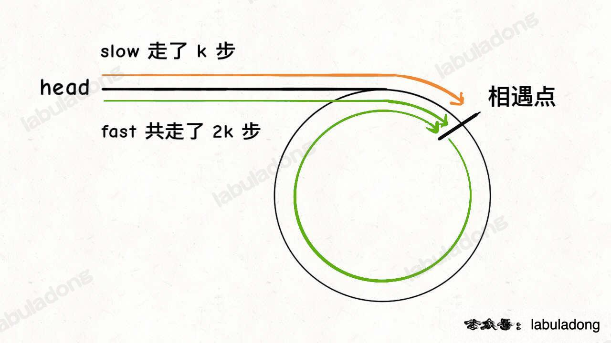

## 2. 两数相加

根据拉神的思路，这道题因为是逆序存储所以还算友好，遍历链表时可以直接从个位开始，如果是正序存储，会比现在还要麻烦

这道题思路的两个重点在于双链表和加法运算中进位的处理

另外这里也用了虚拟头节点技巧，可以避免处理初始空指针的情况，降低代码复杂度

第一种解法：双指针解法

如果这里看起来有点绕感觉不太好理解因为涉及到进位，可以参考[这位大神](https://leetcode.cn/problems/add-two-numbers/solution/2-liang-shu-xiang-jia-by-chen-wei-f-ctnc/)的动画演示，个人感觉比硬看代码中进位处理稍微好理解一点点

时间复杂度超过 98.41% 提交，空间复杂度超过 86.06% 提交，时间复杂度是 O(max(m, n))，其中 m 和 n 分别是两个链表的长度，要遍历两个链表的全部位置，处理每个位置只需要 O(1) 的时间，空间复杂度是 O(1)

```js
var addTwoNumbers = function(l1, l2) {
	let dummy = new ListNode(-1) // 虚拟头结点
	let p = dummy // 指针 p 负责构建新链表
	let p1 = l1, p2 = l2 // 在两条链表上的指针
	let carry = 0 // 记录进位
	// 开始执行加法，两条链表走完且没有进位时才能结束循环
	while (p1 != null || p2 != null || carry > 0) {
		let val = carry // 先加上上次进位
		if (p1 != null) {
			val += p1.val
			p1 = p1.next
		}
		if (p2 != null) {
			val += p2.val
			p2 = p2.next
		}
		// 处理进位情况，除 10 的值作为下一次的进位
		carry = Math.floor(val / 10)
		val = val % 10 // 余数为当前新节点的值
		// 构建新节点
		p.next = new ListNode(val)
		p = p.next
	}
	return dummy.next // 返回结果链表的头结点（去除虚拟头结点）
}
```

## 19. 删除链表的倒数第 N 个结点

* 这道题的解法可由「简单组 剑指 Offer 22 题」引申而来，如果是先看到这里可以先去简单组看一下那道题再来哦
* 要删除倒数第 `n` 个节点，就得获得倒数第 `n + 1` 个节点的引用，可以用上题实现的 `getKthFromEnd` 来操作
* 注意这里又使用了虚拟头结点的技巧，也是为了防止出现空指针的情况
  * 比如说链表总共有 5 个节点，题目就让删除倒数第 5 个节点，也就是第一个节点，那按照算法逻辑，应该首先找到倒数第 6 个节点，但第一个节点前面已经没有节点了，这就会出错
  * 但有了虚拟节点 `dummy` 的存在，就避免了这个问题，能够对这种情况进行正确的删除
* 时间复杂度超过 97.75% 提交，空间复杂度超过 29.57% 提交

```js
var removeNthFromEnd = function(head, n) {
  const getKthFromEnd = (head, k) => {
    let p1 = head
    for (let i = 0; i < k; i++) {
      p1 = p1.next // p1 先走 k 步
    }
    let p2 = head
    while (p1 != null) {
      p1 = p1.next
      p2 = p2.next // p1 和 p2 同时走 n - k 步
    }
    return p2 // p2 现在指向第 n - k + 1 个节点，即倒数第 k 个节点
  }
  let dummy = new ListNode(-1) // 虚拟头结点
  dummy.next = head
  let x = getKthFromEnd(dummy, n + 1) // 删除倒数第 n 个，要先找倒数第 n + 1 个节点
  x.next = x.next.next // 删掉倒数第 n 个节点
  return dummy.next
}
```

## 24. 两两交换链表中的节点

* 第一种：把解决困难组 #25「K 个一组翻转链表」的解法直接拿过来
  * 这样做是因为拉神在讲解时以 K 个为例讲解，那道题看懂后直接把里面的 k 换成 2 就行了，所以先去刷那道题也不错我觉得。。。
  * 时间复杂度超过 99.85% 提交，空间复杂度超过 89.74% 提交

```js
var swapPairs = function(head) {
  if (head == null) return head;
  const reverse = (head, tail) => {
    let prev = null, curr = head
    while (curr !== tail) {
      const temp = curr.next
      curr.next = prev
      prev = curr
      curr = temp
    }
    return prev
  }
  let a = head, b = head
  for (let i = 0; i < 2; i++) {
    if (b == null) return head;
    b = b.next
  }
  let newHead = reverse(a, b)
  a.next = swapPairs(b, 2)
  return newHead
};
```

* 第二种：迭代
  * 这个解法的思路就是通过多指针，遍历一遍的同时把每两个节点翻转，但细节较多，写起来也需要注意一些
  * 这里的详细动画示意可以参考[官方的题解](https://leetcode.cn/problems/swap-nodes-in-pairs/solution/liang-liang-jiao-huan-lian-biao-zhong-de-jie-di-91/)，非常清晰易懂，方便需要的朋友们理解
  * 时间复杂度超过 98.97% 提交，空间复杂度超过 11.79% 提交，时间复杂度是 O(n)，空间复杂度是 O(1)

```js
var swapPairs = function(head) {
  // 这里也用到虚拟头节点，可以节省非空判定
  let dummy = new ListNode(-1)
  dummy.next = head
  let p = dummy
  // 结束遍历的条件是 p 的后面没有节点或只有一个节点，则没有更多的节点需要交换
  while (p.next != null && p.next.next != null) {
    let one = p.next, two = p.next.next
    // 交换之前的顺序是 p -> one -> two，交换后的顺序是 p -> two -> one
    p.next = two
    one.next = two.next
    two.next = one
    p = one // 结束后让 p 指向 one，开始下一轮遍历
  }
  return dummy.next // 返回新链表的头节点
}
```

* 第三种：递归
  * 递归解法的核心就是要明确递归函数的定义嘛，这里的函数定义应该就是「输入一个头结点 `head`，将 `head` 和它相邻的节点两两交换，返回反转后新的链表的头节点」
  * 如果是从简单组 #206 和中等组 #92 的拉神递归讲解一路看过来的话，理解这道题的解法感觉会相对好理解一些，那我自己感觉递归的解法就是得绕着弯的想，不是咱们人类正常思路那样一下就能理解，也就只能多看多理解多练是吧
  * 这里借鉴[大安老师的例子](https://leetcode.cn/problems/swap-nodes-in-pairs/solution/die-dai-fa-jie-jue-ju-li-shuo-ming-fei-c-1m5v/)以 `[1,2,3,4]` 代入进去的话，感觉可能帮得上有需要的朋友理解
  * 时间复杂度超过 44.82% 提交，空间复杂度超过 87.15% 提交，时间复杂度是 O(n)，空间复杂度是 O(n)

```js
var swapPairs = function(head) {
  // base case 递归的终止条件是链表中没有节点，或者链表中只有一个节点，此时无法进行交换
  if (head == null || head.next == null) return head;
  const second = head.next // 用 second 表示新链表的头结点，原链表的第二个节点，就是例子里的 2
  head.next = swapPairs(second.next) // 递归函数返回反转后的头节点，用 head.next 接收，就是 1 -> 4 -> 3
  second.next = head // 最后交换前两个节点，变为 2 -> 1 -> 4 -> 3
  return second // 返回新的头节点 2
}
```

## 86. 分隔链表

* 这道题的思路是将链表一分为二，具体来说，可以把原链表分成两个小链表，一个链表中的元素大小都小于 `x`，另一个链表中的元素都大于等于 `x`，最后再把这两条链表接到一起
* 时间复杂度超过 95.29% 提交，空间复杂度超过 29.22% 提交

```js
var partition = function(head, x) {
  let dummy1 = new ListNode(-1) // 存放小于 x 的链表的虚拟头结点
  let dummy2 = new ListNode(-1) // 存放大于等于 x 的链表的虚拟头结点
  let p1 = dummy1, p2 = dummy2 // p1, p2 指针负责生成结果链表
  let p = head // p 负责遍历原链表，类似合并两个有序链表的逻辑，这里是将一个链表分解成两个链表
  while (p != null) {
    if (p.val < x) {
      p1.next = p
      p1 = p1.next
    } else {
      p2.next = p
      p2 = p2.next
    }
    let temp = p.next // 用一个变量暂存下一个节点
    p.next = null // 断开原链表中每个节点的 next 指针
    p = temp // 将 p 指向下一个节点
  }
  p1.next = dummy2.next // 连接两个链表
  
  return dummy1.next
}
```

## 92. 反转链表 II

* 这道题在迭代和递归的解法上都从简单组 #206 引申而来，如果是按题号顺序第一次刷到这道题没刷过 #206 的朋友建议过去刷一下哈

* 第一种：断链 + 迭代解法

  * 这道题的思路感觉总体分为两块，第一块是把需要反转的链表从整个链表中分离开即断链，然后套用 #206 的反转函数，第二块是把反转好的链表接回到原链表中，感觉其中细节还是很多的，包括从哪里断，最后怎么再接起来，拉神也说这种解法「思路看起来虽然简单，但是细节问题很多的，反而不容易写对」
  * 具体的逐步思路分析个人感觉可以参考[官方题解](https://leetcode.cn/problems/reverse-linked-list-ii/solution/fan-zhuan-lian-biao-ii-by-leetcode-solut-teyq/)，是看一圈下来讲的比较清晰易懂的，方便需要的朋友们参考理解
  * 时间复杂度超过 69.06% 提交，空间复杂度超过 66.19% 提交，时间复杂度是 O(n)，空间复杂度是 O(1)

  ```js
  var reverseBetween = function(head, left, right) {
    // 第一步：定义一个反转整个链表的函数（其实就是 #206 那个，所以要先去刷那道题对吧）
    const reverseList = (head) => {
      let prev = null, curr = head
      while (curr) {
        const temp = curr.next
        curr.next = prev
        prev = curr
        curr = temp
      }
    }
    // 第二步：使用虚拟头结点避免处理空指针的情况
    let dummy = new ListNode(-1)
    dummy.next = head
    let p = dummy
    // 第三步：从虚拟头节点走 left - 1 步，来到 left 节点的前一个节点，建议使用 for 循环而不是 while 循环写
    for (let i = 0; i < left - 1; i++) {
      p = p.next
    }
    // 第四步：再从 p 走 right - left + 1 步，来到 right 节点
    let r = p // 注意这里起变量名不能叫 right 可以叫 rightNode 等避免变量同名报错
    for (let i = 0; i < right - left + 1; i++) {
      r = r.next
    }
    // 第五步：将 left 到 right 这部分链表从整个链表中断开
    let l = p.next
    let temp = r.next
    p.next = null
    r.next = null
    // 第六步：调用第一步的函数把子链反转
    reverseList(l)
    // 第七步：把反转好的子链接回到原链表中，这里推荐最好用纸和笔画一个图，记下各个变量的位置，要不感觉容易糊涂（变量有点多了嗷）
    p.next = r
    l.next = temp
    return dummy.next
  }
  ```

* 第二种：递归解法

  * 不用多说，递归的思路肯定是[拉神](https://labuladong.gitee.io/algo/2/19/19/)讲的最好，这个就有点属于无脑个人崇拜了哈，还有很多很好的讲解，我自己是因为特别欣赏拉神的这句话：「不要跳进递归，而是利用明确的定义来实现算法逻辑」

  * 这里在解决本题之前，拉神还给了一个引子题，即「将链表的前 n 个节点反转（n <= 链表长度）」，秉承循序渐进的原则，先看下这个好了，也有助于解决本题嘛
  * 解决反转前 n 个节点的思路和 #206 反转整个链表的思路大同小异，稍加修改一下

  ```js
  var reverseN = function(head, n) {
    let succ = null // 后驱节点
    // base case 变为 n === 1，即反转一个元素就是其本身，但同时也要『记录后驱节点』
    if (n === 1) {
      // 记录第 n + 1 个节点
      succ = head.next
      return head
    }
    // 以 head.next 为起点，需要反转前 n - 1 个节点
    let last = reverseN(head.next, n - 1)
    head.next.next = head
    // #206 中这里 head.next = null 是因为整个链表反转后原来的 head 变为整个链表的最后一个节点
    // 现在 head 节点在递归反转之后不一定是最后一个节点了，所以要通过后驱节点（第 n + 1 个）succ 将 head 连接上
    head.next = succ // 让反转之后的 head 节点和后面的节点连起来
    return last
  }
  ```

  * 回到本题，就可以借助上面的 `reverseN` 函数完成，给一个索引区间 `[m, n]`（索引从 1 开始），仅仅反转区间中的链表元素
  * 如果 `m == 1`，就相当于反转链表开头的 `n` 个元素，就可以直接用上面的函数完成

  ```js
  var reverseBetween = function(head, m, n) {
    // base case
    if (m === 1) return reverseN(head, n)
  }
  ```

  * 如果 `m != 1` ，首先把 `head` 的索引视为 1，就是要从第 `m` 个元素开始反转，如果把 `head.next` 的索引视为 1 ，那么相对于 `head.next`，反转的区间应该是从第 `m - 1` 个元素开始的，以此类推，对于 `head.next.next` 也是同理。。。
  * 上面的递归思想初次看会感觉有点绕，我就看了有一阵。。。看懂后把 `m` 和 `n` 替换成题目中的 `left` 和 `right` 这道题就可以了
  * 时间复杂度超过 69.06% 提交，空间复杂度超过 71.40% 提交，时间复杂度是 O(n)，空间复杂度是 O(n)

  ```js
  var reverseBetween = function(head, left, right) {
    let succ = null
    // 这里直接把上面的拿过来是吧
    const reverseN = (head, n) => {
      if (n === 1) {
        succ = head.next
        return head
      }
      let last = reverseN(head.next, n - 1)
      head.next.next = head
      head.next = succ
      return last
    }
    // base case 相当于反转前 right 个元素
    if (left === 1) return reverseN(head, right)
    // 一直前进到反转的起点触发 base case
    head.next = reverseBetween(head.next, left - 1, right - 1)
    return head
  }
  ```

## 142. 环形链表 II

* 这道题是简单组 #141 的进阶版，总体思路是当快慢指针相遇时，让其中任一个指针指向头节点，然后让它俩以相同速度前进，再次相遇时所在的节点位置就是环开始的位置
* 假设快慢指针相遇时，慢指针 `slow` 走了 `k` 步，那么快指针 `fast` 一定走了 `2k` 步，`fast` 一定比 `slow` 多走了 `k` 步，这多走的 `k` 步其实就是 `fast` 指针在环里转圈圈，所以 `k` 的值就是环长度的「整数倍」



* 假设相遇点距环的起点的距离为 `m`，那么结合上图的 `slow` 指针，环的起点距头结点 `head` 的距离为 `k - m`，也就是说如果从 `head` 前进 `k - m` 步就能到达环起点
* 巧的是，如果从相遇点继续前进 `k - m` 步，也恰好到达环起点，结合上图的 `fast` 指针，从相遇点开始走 k 步可以转回到相遇点，那走 `k - m` 步肯定就走到环起点了


* 所以，只要把快慢指针中的任一个重新指向 `head`，然后两个指针同速前进，`k - m` 步后一定会相遇，相遇之处就是环的起点了
* 时间复杂度超过 97.62% 提交，空间复杂度超过 74.63% 提交

```js
var detectCycle = function(head) {
  let slow = head, fast = head
  while (fast != null && fast.next != null) {
    slow = slow.next
    fast = fast.next.next
    if (slow == fast) { // 快慢指针相遇，说明含有环
      fast = head // fast 重新指向头结点
      while (fast != slow) { // 快慢指针同步前进
        fast = fast.next
        slow = slow.next
      }
      return fast // 相交点就是环起点
    }
  }
  return null // 不包含环
}
```

## 148. 排序链表

这道题我坦白因为对归并排序还不够熟悉想不到，所以一开始没思路，直接去看题解了

这道题的讲解如果看我絮叨的这些觉得没讲明白可以参考[组长的手画图解](https://leetcode.cn/problems/sort-list/solution/shou-hua-tu-jie-gui-bing-pai-xu-148-lian-biao-pai-/)，良心推荐

第一种：归并排序

首先想说的还是归并排序这种思路肯定要会，不管是面试直接上来让手写一个归并排序还是像这种题变着法的考归并排序，这个啃下来肯定不亏

其次这道题有简单组两道题的影子，分别是 #876 链表的中间结点一题的双指针解法和 # 21 合并两个有序链表的双指针拉拉链解法，如果先刷了那两题再看下面的代码是不是感觉似曾相识哈哈

时间复杂度超过 51.60% 提交，空间复杂度超过 30.54% 提交，时间复杂度是 O(n logn)，空间复杂度是 O(logn)

```js
var sortList = function(head) {
  // merge 函数其实就是 #21 合并两个有序链表的拉拉链代码
  const merge = (l1, l2) => {
    let dummy = new ListNode(-1) // 虚拟头结点，可以避免处理空指针的情况
    let p = dummy
    
    while (l1 != null && l2 != null) {
      // 比较 l1 和 l2 两个指针,将值较小的的节点接到 p 指针
      if (l1.val > l2.val) {
        p.next = l2
        l2 = l2.next
      } else {
        p.next = l1
        l1 = l1.next
      }
      p = p.next
    }
    // 如果其中一条已经接完，将另一条剩下的（不为空）接到末尾
    if (l1 != null) p.next = l1;
    if (l2 != null) p.next = l2;
    
    return dummy.next
  }
  
  if (head == null || head.next == null) return head;
  // 这几行就是 #876 的快慢指针解法
  let slow = head, fast = head.next // 注意这里跟 #876 的区别是快指针初始化为头节点的下一个节点
  while (fast != null && fast.next != null) {
    slow = slow.next
    fast = fast.next.next
  }
  // 将原链表从中间节点断开，一分为二
  let rightHalf = slow.next
  slow.next = null
  // 分别对左半和右半链表进行归并排序
  const l = sortList(head)
  const r = sortList(rightHalf)
  
  // 在递归出栈时将有序的两个链表合并起来（递归压栈中将左右链表一分为二到只有每个链表一个节点也是有序的）
  return merge(l, r)
}
```

## 237. 删除链表中的节点

这道题一开始我也和题解里的同志们一样懵了，说啥呢搁这，压根没看懂，我也纳闷函数定义里只传一个参数吗？啥叫无法访问第一个节点？

但是人菜又不服，我硬着头皮点开官方题解然后捂住下面不看答案，我寻思最起码得把题要干啥看懂自己试吧试吧先

引用[官方题解的解释](https://leetcode.cn/problems/delete-node-in-a-linked-list/solution/shan-chu-lian-biao-zhong-de-jie-dian-by-x656s/)是这样的，「删除链表中的节点的常见的方法是定位到待删除节点的上一个节点，修改上一个节点的 `next` 指针，使其指向待删除节点的下一个节点，即可完成删除操作。这道题中，传入的参数 `node` 为要被删除的节点，无法定位到该节点的上一个节点」

那就是就给这么个中间的节点，后面的可以自己遍历出来，但是这个节点的前面啥都不知道，那就只能往后看，这里就有一个小技巧性的地方，没看答案自己反正也憋出来了。。。

第一种：稍微脑筋急转弯解法

跟所有题解一样，既然只能往后看，那就看后面俩先，可以移花接木似的先把下一个节点的值复制给现在的要删除的传入的这个节点，然后再让传入的这个节点指向自身的下一个的再下一个，所以其实就相当于删除了传入节点的下一个，但最后值一样就行呗

时间复杂度超过 20.22% 提交，空间复杂度超过 39.79% 提交，时间复杂度是 O(1)，空间复杂度是 O(1)

```js
var deleteNode = function(node) {
  // 就这两行，所想即所得，这样看中等难度中等在那个小急转弯上了哈
  node.val = node.next.val
  node.next = node.next.next
};
```

