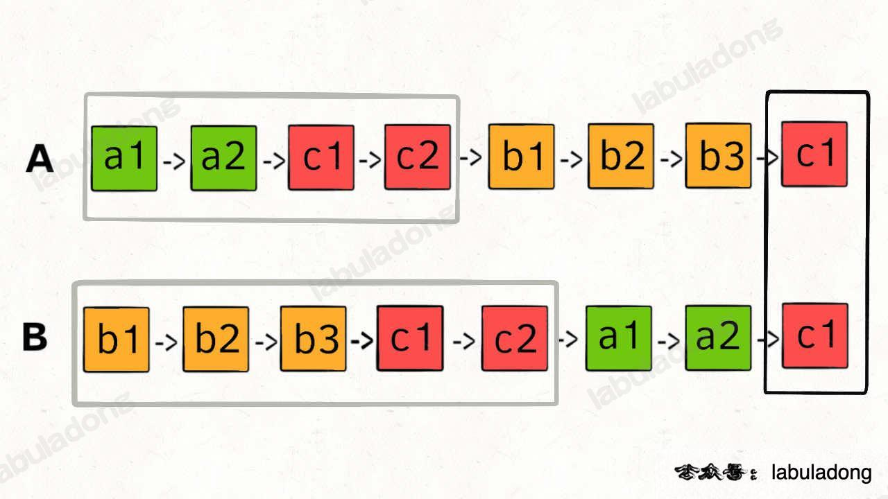
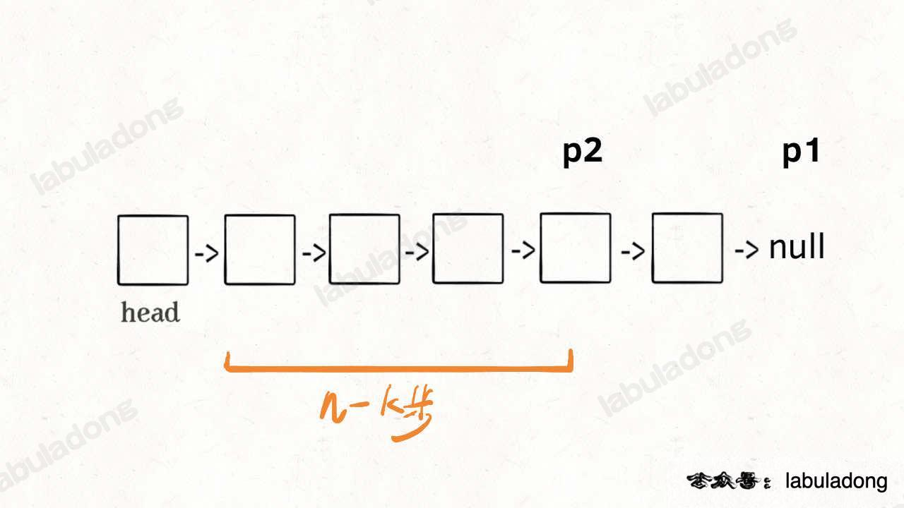

## 21. 合并两个有序链表

* 这道题可以简单理解为合并两个递增数组的链表版本，感觉也是基础必会系列
* 第一种：双指针拉拉链
  * 拉拉链这个就是拉神 [链表双指针技巧](https://labuladong.gitee.io/algo/2/19/18/) 这篇中讲到的方法，非常形象直观易懂，需要注意的点我觉得就是「虚拟头结点」这里，也就是 `dummy` 节点，这个技巧在链表题中都很实用
  * 时间复杂度超过 44.33% 提交，空间复杂度超过 62.39% 提交

```js
var mergeTwoLists = function(l1, l2) {
  let dummy = new ListNode(-1) // 虚拟头结点，可以避免处理空指针的情况
  let p = dummy
  
  while (l1 != null && l2 != null) {
    // 比较 l1 和 l2 两个指针,将值较小的的节点接到 p 指针
    if (l1.val > l2.val) {
      p.next = l2
      l2 = l2.next
    } else {
      p.next = l1
      l1 = l1.next
    }
    p = p.next
  }
  // 如果其中一条已经接完，将另一条剩下的（不为空）接到末尾
  if (l1 != null) p.next = l1;
  if (l2 != null) p.next = l2
  
  return dummy.next
}
```

* 第二种：递归
  * 这个解法的详细讲解可以参考力扣上这位大神的[讲解](https://leetcode.cn/problems/merge-two-sorted-lists/solution/chao-xiang-xi-tu-jie-di-gui-zhi-xing-guo-cheng-21h/)，把递归的每一步都列了出来，方便需要的朋友们解惑
  * 时间复杂度超过 83.39% 提交，空间复杂度超过 22.93% 提交，时间复杂度是 O(m + n)，m 和 n 分别是 l1 和 l2 的元素个数

```js
var mergeTwoLists = function(l1, l2) {
  // 递归的结束条件，如果 l1 和 l2 中有一个为空就返回
  if (l1 == null || l2 == null) {
    return l1 == null ? l2: l1
  }
  // 如果 l1 的值 <= l2 的值，就继续递归，比较 l1.next 的值和 l2 的值
  if (l1.val <= l2.val) {
    // l1.next 和 l2 比较完后，会产生一个更小的节点 x，将 x 加到当前 l1 的后面
    l1.next = mergeTwoLists(l1.next, l2)
    return l1
  } else {
    // 如果 l1 的值 > l2 的值，就继续递归，比较 l1 的值和 l2.next 的值
    l2.next = mergeTwoLists(l1, l2.next)
    return l2
  }
}
```

## 83. 删除排序链表中的重复元素

* 这道题就是拉神讲数组双指针中快慢指针时第一个例子「#26 删除有序数组中的重复项」的[单链表版本](https://labuladong.gitee.io/algo/2/20/23/#一快慢指针技巧)


* 双指针快慢指针解法
  * 时间复杂度超过 99.16% 提交，空间复杂度超过 61.87% 提交

```js
var deleteDuplicates = function(head) {
	if (head == null) return null;
  let slow = head, fast = head
  while (fast != null) {
    if (fast.val !== slow.val) {
      slow.next = fast
      slow = slow.next
    }
    fast = fast.next
  }
  slow.next = null // 断开与后面重复元素的连接
  return head
};
```

* 使用虚拟头结点优化，可以免去非空判定

```js
var deleteDuplicates = function(head) {
  // 区别只在这两行
  let dummy = new ListNode(-1)
  let slow = dummy, fast = dummy
  
  while (fast != null) {
    if (fast.val !== slow.val) {
      slow.next = fast
      slow = slow.next
    }
    fast = fast.next
  }
  slow.next = null // 断开与后面重复元素的连接
  return head
}
```

## 141. 环形链表

* 这道题也是拉神讲链表双指针时的例子，是从下面 #876 稍加修改引申而来，所以如果从上往下读可以先去 #876 哦
  * 每当慢指针 `slow` 前进一步，快指针 `fast` 就前进两步，如果 `fast` 最终遇到空指针，说明链表中没有环
  * 如果 `fast` 最终和 `slow` 相遇，那肯定是 `fast` 超过了 `slow` 一圈，说明链表中含有环
  * 时间复杂度超过 87.31% 提交，空间复杂度超过 87.38% 提交

```js
var hasCycle = function(head) {
  let slow = head, fast = head
  while (fast != null && fast.next != null) {
    slow = slow.next
    fast = fast.next.next
    if (slow == fast) return true; // 快慢指针相遇，说明含有环
  }
  return false // 不包含环
}
```

## 160. 相交链表

* 这道题还是拉神讲链表双指针时的例子，个人觉得拉神的配图超级直观易懂，拉神，yyds！

  * 如果不用额外的空间，只使用两个指针，由于两条链表的长度可能不同，两条链表之间的节点无法对应
    * 两个指针 `p1` 和 `p2` 分别在两条链表上前进，并不能**同时**走到公共节点，也就无法得到相交节点 `c1`
  * 因此通过下图这种方式，让 `p1` 和 `p2` 能够同时到达相交节点 `c1`
    * 让 `p1` 遍历完链表 `A` 之后开始遍历链表 `B`，让 `p2` 遍历完链表 `B` 之后开始遍历链表 `A`，这样进行拼接，就可以让 `p1` 和 `p2` 同时进入公共部分，也就是同时到达相交节点 `c1`

  

  * 同时如果两个链表没有相交点 ，相当于 `c1` 节点是 null 空指针，也能够正确的返回 null
  * 时间复杂度超过 73.27% 提交，空间复杂度超过 49.51% 提交，时间复杂度为 `O(N)`，空间复杂度为 `O(1)`

```js
var getIntersectionNode = function(headA, headB) {
  let p1 = headA, p2 = headB // p1 指向 A 链表头结点，p2 指向 B 链表头结点
  while (p1 != p2) {
    if (p1 == null) p1 = headB; // p1 走一步，如果走到 A 链表末尾，转到 B 链表
    else p1 = p1.next;
    if (p2 == null) p2 = headA; // p2 走一步，如果走到 B 链表末尾，转到 A 链表
    else p2 = p2.next;
  }
  return p1
}
```

## 203. 移除链表元素

* 第一种：遍历解法
  * 这个的思路和中等组 #19 的思路有相似之处，使用虚拟头结点的用法都是一样的，但需要注意 while 循环里 if 语句的判断条件，是 `p.next.val` 和 `val` 的判定，而不是 `p.val`，我就在这想错了
  * 由于链表的头节点可能就需要被删除，因此创建这个虚拟头结点 `dummy`，让 `dummy.next = head` ，再初始化指针 `p = dummy`，最后返回的 `dummy.next` 就是最终的头节点
  * 时间复杂度超过 65.25% 提交，空间复杂度超过 68.80% 提交，时间复杂度是 O(n)，空间复杂度是 O(1)

```js
var removeElements = function(head, val) {
  let dummy = new ListNode(-1) // 虚拟头结点
  dummy.next = head
  let p = dummy
  while (p.next != null) {
    if (p.next.val === val) {
      p.next = p.next.next
    } else {
      p = p.next
    }
  }
  return dummy.next
}
```

* 第二种：递归解法

  * 这里递归的思路是先从头结点的 `next` 开始递归，最后再判断 `head` 的值，也就是先套娃进链表尾部，再调头往左，不是从左向右从头结点开始，否则这个是想不通的哈，这里借鉴[晨神的详解](https://leetcode.cn/problems/remove-linked-list-elements/solution/203-yi-chu-lian-biao-yuan-su-by-chen-wei-6bgp/)方便需要的朋友理解

  ```js
  例：0->1->2->3  val=2
  level1: 0.next = removeElements(1, 2);			return 1					0->1->3->null
  level2: 1.next = removeElements(2, 2);			return 3					1->3->null
  level3: 2.next = removeElements(3, 2);			return 3					2->3->null
  level4: 3.next = removeElements(null, 2); 	return null;    	3->null
  ```

  * 时间复杂度超过 65.25% 提交，空间复杂度超过 18.22% 提交，时间复杂度是 O(n)，空间复杂度是 O(n)

```js
var removeElements = function(head, val) {
  // 递归的终止条件是 head 为空，直接返回 head
  if (head == null) return head;
  // 当 head 不为空时，递归进行删除操作
  head.next = removeElements(head.next, val)
  // 判断当前节点的值是否等于 val，如果等于 val 就返回下一个节点，否则返回当前节点
  return head.val === val ? head.next : head
}
```

## 206. 反转链表

* 好多题解都提到这道题是前端面试最常考的题，我个人也遇到过一次，所以这题画个重点不过分吧感觉

* 第一种：迭代解法

  * 这个的思路就是从左往右一步一步反转一个节点，但是需要两个指针 `prev` 和 `curr` 来完成这件事，每次让 `curr.next` 指向 `prev`，然后让两个指针同时向前移动一个位置，重复上述过程直到 `curr` 到达链表尾部，返回 `prev`
  * 迭代思路的图解可以参考力扣上[这位大神](https://leetcode.cn/problems/reverse-linked-list/solution/206-fan-zhuan-lian-biao-by-alexer-660/)，简单易懂，方便需要的朋友们理解
  * 时间复杂度超过 11.95% 提交，空间复杂度超过 61.56% 提交，时间复杂度是 O(n)，空间复杂度是 O(1)

  ```js
  var reverseList = function(head) {
    // 由于节点没有引用其前一个节点，因此必须事先存储其前一个节点
    let prev = null, curr = head
    while (curr != null) {
      // 在更改引用之前，还需要临时存储后一个节点，因为 head.next 可能不存在，在循环中定义 temp，如果 head 为空就不会进入循环
      const temp = curr.next
      curr.next = prev // 反转链表
      prev = curr // 两个指针分别向前移动一个位置
      curr = temp
    }
    return prev // 这里返回 prev 是因为原来表示前一个节点，反转之后就表示最后面的节点了
  }
  ```

  * 这种解法在力扣上还看到有种更简洁的大神写法，这里借鉴膜拜一下

  ```js
  var reverseList = function(head) {
    let [prev, curr] = [null, head]
    while (curr) {
      [curr.next, prev, curr] = [prev, curr, curr.next]
    }
    return prev
  }
  ```

* 第二种：尾递归解法

  * 这个思路就是把第一种的逻辑用递归的方式写出来，个人感觉属于锦上添花，写出来更惊艳面试官，写不出来也不会扣分的那种
  * 时间复杂度超过 21.55% 提交，空间复杂度超过 5.04% 提交，时间复杂度是 O(n)，空间复杂度是 O(1)

  ```js
  var reverseList = function(head) {
    let reverse = (prev, curr) => {
      if (!curr) return prev;
      const temp = curr.next
      curr.next = prev
      return reverse(curr, temp)
    }
    return reverse(null, head)
  }
  ```

* 第三种：递归解法

  * 这个的思路当然是[拉神的经典讲解](https://labuladong.gitee.io/algo/2/19/19/)，234123 分推荐，**对于递归算法，最重要的就是明确递归函数的定义，reverse 函数的定义是这样的，输入一个节点 `head`，将「以 `head` 为起点」的链表反转，并返回反转之后的头节点**
  * 时间复杂度超过 44.34% 提交，空间复杂度超过 5.04% 提交，时间复杂度是 O(n)，空间复杂度是 O(n)，空间复杂度主要取决于递归调用的栈空间，最多为 n 层

  ```js
  var reverseList = function(head) {
    // 递归函数要有 base case，意思是如果链表为空或者只有一个节点的时候，反转结果就是它自己，直接返回即可
    if (head == null || head.next == null) return head;
    let last = reverseList(head.next) // 根据函数定义，reverse 函数会返回反转之后的头节点，用变量 last 接收
    head.next.next = head
    head.next = null
    return last // 当链表递归反转之后，新的头结点是 last，而之前的 head 变成了最后一个节点，链表的末尾要指向 null
  }
  ```

## 234. 回文链表

## 876. 链表的中间结点

* 第一种：暴力解法
  * 先遍历一遍链表，得出链表的长度 n，然后再遍历一遍链表，得到第 `n / 2` 个节点，也就是中间节点
  * 时间复杂度超过 84.54% 提交，空间复杂度超过 54.99% 提交，这种思路就是简单粗暴，但不够优雅

```js
var middleNode = function(head) {
  let n = 0, i = 0, p = head
  while (p != null) {
    n++
    p = p.next
  }
  while (head != null) {
    if (i === Math.floor(n / 2)) return head;
    i++
    // 上面两行在写法上还可以用移位运算符优化一下
    // if (i++ === n >> 1) return head;
    head = head.next
  }
  return head
}
```

* 第二种：双指针快慢指针解法

  * 这道题的快慢指针解法只要稍加修改就可以用来做 #141 环形链表了，使用快慢指针可以只遍历一次就得到中间节点
  * 让两个指针 `slow` 和 `fast` 分别指向链表头结点 `head`，每当慢指针 `slow` 前进一步，快指针 `fast` 就前进两步，这样，当 `fast` 走到链表末尾时，`slow` 就指向了链表中点
  * 如果链表长度为偶数，也就是说中点有两个的时候，返回的节点也是题目要求的靠后的那个节点

  * 时间复杂度超过 84.54% 提交，空间复杂度超过 76.14% 提交

  ```js
  var middleNode = function(head) {
    let slow = head, fast = head
    while (fast != null && fast.next != null) { // 快指针走到末尾时停止
      slow = slow.next
      fast = fast.next.next
    }
    return slow // 慢指针指向中点
  }
  ```


## 剑指 Offer 22. 链表中倒数第 k 个节点

* 第一种：暴力解法

  * 从前往后寻找单链表的第 `k` 个节点很简单，一个 for 循环遍历过去就找到了，但是寻找从后往前数的第 `k` 个节点，需要遍历两次链表才能得到出倒数第 `k` 个节点
  * 假设链表有 `n` 个节点，倒数第 `k` 个节点就是正数第 `n - k + 1` 个节点，但是题目一般只给一个 `ListNode` 头结点代表一条单链表，不能直接得出这条链表的长度 `n`
  * 因此需要先遍历一遍链表算出 `n` 的值，然后再遍历链表计算第 `n - k + 1` 个节点
  * 时间复杂度超过 77.17% 提交，空间复杂度超过 94.35% 提交，时间复杂度是 O(n)

  ```js
  var getKthFromEnd = function(head, k) {
    // i 从 1 开始是因为题目写明从 1 开始计数
    let n = 0, i = 1, p = head
    while (p != null) {
      n++
      p = p.next
    }
    while (head != null) {
      if (i === n - k + 1) return head;
      i++
      head = head.next
    }
    return head
  };
  ```

* 第二种：双指针快慢指针解法

  * 要做到**只遍历一次链表**就算出倒数第 `k` 个节点，假设 `k = 2`，首先先让一个指针 `p1` 指向链表的头节点 `head`，然后走 `k` 步，现在 `p1` 只要再走 `n - k` 步，就能走到链表末尾的空指针了

  

  * 这个时候，再用一个指针 `p2` 指向链表头节点 `head`

  

  * 接下来，让 `p1` 和 `p2` 同时向前走，`p1` 走到链表末尾的空指针时前进了 `n - k` 步，`p2` 也从 `head` 开始前进了 `n - k` 步，`p2` 停留在第 `n - k + 1` 个节点上，即恰好停在链表的倒数第 `k` 个节点上

  

  * 这样，只遍历了一次链表，就获得了倒数第 `k` 个节点 `p2`
  * 时间复杂度超过 77.17% 提交，空间复杂度超过 78.10% 提交，无论遍历一次链表和遍历两次链表的时间复杂度都是 `O(N)`，但上述这个算法更有技巧性

  ```js
  var getKthFromEnd = function(head, k) {
    let p1 = head
  	for (let i = 0; i < k; i++) {
      p1 = p1.next // p1 先走 k 步
    }
    let p2 = head
  	while (p1 != null) {
      p1 = p1.next
      p2 = p2.next // p1 和 p2 同时走 n - k 步
    }
    return p2 // p2 现在指向第 n - k + 1 个节点，即倒数第 k 个节点
  }
  ```

  